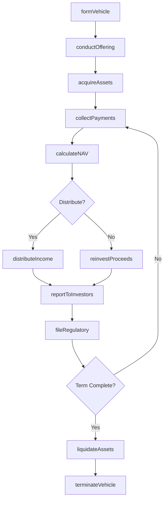
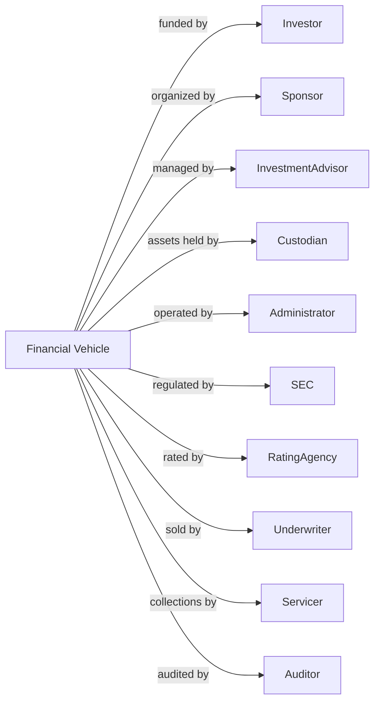

# Other Financial Vehicles

> Business-as-Code definition for specialty investment vehicle operations. Models closed-end funds, REITs, and structured products from formation through asset acquisition, income distribution, and investor reporting.

## Overview

Other financial vehicles are legal entities including closed-end investment funds, mortgage real estate investment trusts (REITs), collateralized mortgage obligations, unit investment trusts, and special purpose financial vehicles. These structures pool capital for specific investment strategies with defined terms. This definition exposes actions for capital formation, asset acquisition, distribution management, and regulatory compliance, enabling programmatic access to structured investment operations.

## Actors

| Actor | Description |
|-------|-------------|
| Investor | Party providing capital to the vehicle |
| Sponsor | Entity organizing and promoting the vehicle |
| InvestmentAdvisor | Professional managing vehicle assets |
| Custodian | Bank safekeeping vehicle assets |
| Administrator | Provider handling fund operations |
| SEC | Securities and Exchange Commission regulating offerings |
| RatingAgency | Firm assessing creditworthiness of securities |
| Underwriter | Firm marketing initial offering |
| Servicer | Entity collecting payments on underlying assets |
| Auditor | Firm verifying financial statements |

## Roles

| Role | Description |
|------|-------------|
| PortfolioManager | Professional selecting vehicle investments |
| AssetManager | Staff managing underlying property or loans |
| DistributionManager | Staff processing investor payments |
| ComplianceOfficer | Specialist ensuring regulatory adherence |
| InvestorRelations | Staff communicating with investors |
| StructuringAnalyst | Professional designing vehicle terms |

## Entities

| Entity | Description |
|--------|-------------|
| ClosedEndFund | Investment company with fixed share count |
| REIT | Real estate investment trust structure |
| CMO | Collateralized mortgage obligation |
| UIT | Unit investment trust with fixed portfolio |
| SPV | Special purpose vehicle for securitization |
| Tranche | Slice of structured product with specific risk profile |
| Distribution | Payment to investors |
| NAV | Net asset value of vehicle |
| Prospectus | Offering document describing vehicle |
| AssetPool | Collection of underlying investments |

## Actions

| Action | Description |
|--------|-------------|
| formVehicle | Establish legal entity and structure |
| conductOffering | Market and sell investor interests |
| acquireAssets | Purchase underlying investments |
| collectPayments | Receive income from underlying assets |
| calculateNAV | Compute net asset value |
| distributeIncome | Pay periodic distributions to investors |
| reinvestProceeds | Deploy returned capital into new assets |
| manageAssets | Oversee underlying property or loans |
| reportToInvestors | Provide periodic performance updates |
| fileRegulatory | Submit required SEC and tax filings |
| liquidateAssets | Sell underlying investments |
| terminateVehicle | Wind down and dissolve entity |

## Events

| Event | Description |
|-------|-------------|
| vehicleFormed | Entity established |
| offeringConducted | Investor interests sold |
| assetsAcquired | Investments purchased |
| paymentsCollected | Income received from assets |
| navCalculated | Net asset value computed |
| incomeDistributed | Payments made to investors |
| proceedsReinvested | Capital deployed to new assets |
| assetsManaged | Underlying investments overseen |
| investorsReported | Performance updates provided |
| regulatoryFiled | Required filings submitted |
| assetsLiquidated | Investments sold |
| vehicleTerminated | Entity dissolved |

## Searches

| Search | Description |
|--------|-------------|
| findVehicles | List vehicles by type, sponsor, or status |
| getAssetPool | Retrieve underlying investments |
| getTrancheStructure | Retrieve payment waterfall and priorities |
| getDistributionHistory | List payments by investor or period |
| getNAVHistory | Retrieve historical valuations |
| getPerformance | Calculate returns by vintage or strategy |
| findMaturingAssets | Identify assets approaching payoff |

## Workflow



## Actor Relationships



## Usage

### Calling Actions

```typescript
import { poolInvestments } from '@headlessly/pool-investments'

const vehicle = poolInvestments()

// Form mortgage REIT
const reit = await vehicle.formVehicle({
  vehicleType: 'mortgageREIT',
  name: 'Residential Mortgage Trust I',
  targetSize: 500000000,
  strategy: 'agencyMBS',
  distributionFrequency: 'quarterly'
})

// Conduct initial offering
const offering = await vehicle.conductOffering({
  vehicleId: reit.id,
  sharePrice: 25.00,
  sharesOffered: 20000000,
  underwriters: ['firm-001', 'firm-002']
})

// Acquire mortgage-backed securities
await vehicle.acquireAssets({
  vehicleId: reit.id,
  assets: [
    { type: 'agencyMBS', cusip: '31415926535', principal: 100000000 },
    { type: 'agencyMBS', cusip: '27182818284', principal: 150000000 }
  ]
})

// Distribute quarterly income
await vehicle.distributeIncome({
  vehicleId: reit.id,
  distributionDate: '2024-03-31',
  perShare: 0.45,
  taxCharacter: { ordinary: 0.90, returnOfCapital: 0.10 }
})
```

### Event-Driven Automation

```typescript
// Auto-reinvest prepayments
vehicle.paymentsCollected(async ({ vehicleId, paymentType, amount }) => {
  if (paymentType === 'prepayment') {
    const strategy = await getVehicleStrategy(vehicleId)
    await vehicle.acquireAssets({
      vehicleId,
      acquisitionCriteria: strategy.reinvestmentGuidelines,
      maxAmount: amount
    })
  }
})

// Generate investor reports on distribution
vehicle.incomeDistributed(async ({ vehicleId, distributionDate }) => {
  await vehicle.reportToInvestors({
    vehicleId,
    reportType: 'quarterly',
    asOfDate: distributionDate,
    includePortfolioDetail: true,
    includePerformanceAttribution: true
  })
})
```
