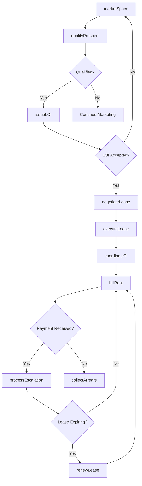
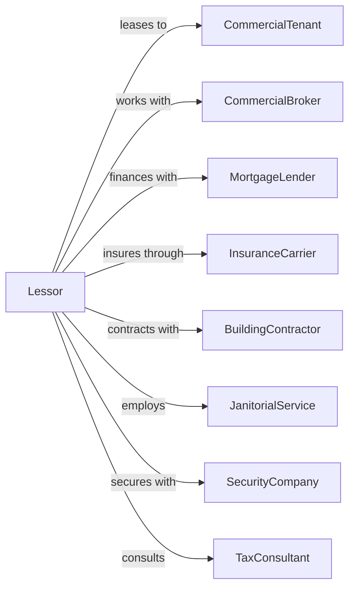

# Lessors of Nonresidential Buildings (except Miniwarehouses)

> Business-as-Code definition for commercial property leasing operations. Models the complete commercial tenant lifecycle from prospecting through lease termination.

## Overview

Commercial lessors own and lease office buildings, retail centers, industrial facilities, and other nonresidential properties to business tenants. This definition exposes actions for space marketing, tenant qualification, lease negotiation, CAM reconciliation, and tenant improvement coordination, with events enabling automated workflow triggers throughout the commercial tenancy lifecycle.

## Actors

| Actor | Description |
|-------|-------------|
| CommercialTenant | Business entity leasing commercial space |
| CommercialBroker | Represents tenants or landlords in lease transactions |
| MortgageLender | Provides commercial property financing |
| InsuranceCarrier | Provides property, liability, and umbrella coverage |
| BuildingContractor | Performs tenant improvements and build-outs |
| JanitorialService | Provides cleaning and maintenance services |
| SecurityCompany | Provides building security and access control |
| TaxConsultant | Advises on property tax appeals and strategies |
| EnvironmentalConsultant | Conducts Phase I/II assessments and compliance |

## Roles

| Role | Description |
|------|-------------|
| AssetManager | Oversees property performance and investment returns |
| LeasingDirector | Manages tenant prospecting and lease negotiations |
| PropertyEngineer | Maintains building systems and infrastructure |
| TenantCoordinator | Manages tenant relations and service requests |
| AccountingManager | Handles CAM reconciliation and financial reporting |

## Entities

| Entity | Description |
|--------|-------------|
| Property | Commercial building or complex owned by the lessor |
| Suite | Individual leasable space within a property |
| Lease | Commercial lease agreement with terms and conditions |
| Tenant | Business entity occupying leased space |
| LOI | Letter of intent outlining proposed lease terms |
| CAMBudget | Common area maintenance expense budget |
| TIAllowance | Tenant improvement construction allowance |
| RentSchedule | Base rent escalation schedule over lease term |
| OperatingExpense | Building operating costs passed through to tenants |
| Certificate | Estoppel or SNDA certificate for lender or buyer |

## Actions

| Action | Description |
|--------|-------------|
| marketSpace | Advertise available suites to prospective tenants |
| qualifyProspect | Evaluate tenant financial strength and creditworthiness |
| negotiateLease | Conduct lease term negotiations with tenant or broker |
| issueLOI | Send letter of intent with proposed lease terms |
| executeLease | Finalize and sign commercial lease agreement |
| coordinateTI | Manage tenant improvement construction process |
| billRent | Invoice tenant for base rent and additional rent |
| reconcileCAM | Calculate and bill actual vs estimated CAM charges |
| processEscalation | Apply annual rent increases per lease terms |
| issueEstoppel | Provide estoppel certificate for sale or financing |
| amendLease | Modify existing lease terms via amendment |
| renewLease | Extend lease with negotiated renewal terms |
| terminateLease | Process lease termination and space surrender |
| collectArrears | Pursue collection of past-due tenant balances |

## Events

| Event | Description |
|-------|-------------|
| spaceMarketed | Suite has been listed for lease |
| prospectQualified | Tenant financial qualification completed |
| loiIssued | Letter of intent sent to prospect |
| loiAccepted | Prospect accepted LOI terms |
| leaseExecuted | Commercial lease signed by all parties |
| tiCompleted | Tenant improvement construction finished |
| tenantOccupied | Tenant has taken possession of space |
| rentBilled | Monthly rent invoice generated |
| paymentReceived | Rent payment processed |
| camReconciled | Annual CAM reconciliation completed |
| escalationApplied | Rent increase applied per schedule |
| leaseExpiring | Lease term ending within notice period |
| renewalExercised | Tenant exercised renewal option |
| leaseTerminated | Tenancy has ended |

## Searches

| Search | Description |
|--------|-------------|
| findAvailableSpace | List vacant suites by property, size, or rate |
| getTenantRoster | Retrieve all tenants and lease terms for property |
| getExpirationSchedule | List leases expiring within date range |
| getARAgingReport | Show outstanding tenant receivables by age |
| getCAMVariance | Compare budgeted vs actual operating expenses |
| findProspects | List active tenant prospects in pipeline |
| getStackingPlan | View property floor plan with tenant occupancy |

## Workflow



## Actor Relationships



## Usage

### Calling Actions

```typescript
import { leaseCommercial } from '@headlessly/lease-commercial'

const lessor = leaseCommercial()

// Market available office space
const listing = await lessor.marketSpace({
  propertyId: 'downtown-tower',
  suiteNumber: '1500',
  squareFeet: 15000,
  askingRate: 42.50,
  rateType: 'fullService',
  availableDate: '2024-06-01'
})

// Issue letter of intent
const loi = await lessor.issueLOI({
  prospectId: 'acme-corp',
  suiteId: 'downtown-tower-1500',
  proposedRate: 41.00,
  termYears: 7,
  tiAllowance: 65.00,
  freeRentMonths: 6
})

// Execute the lease
await lessor.executeLease({
  suiteId: 'downtown-tower-1500',
  tenantId: 'acme-corp',
  commencementDate: '2024-06-01',
  termMonths: 84,
  baseRent: 51250,
  annualEscalation: 0.03
})
```

### Event-Driven Automation

```typescript
// Auto-reconcile CAM at year end
lessor.camReconciled(async ({ propertyId, year, tenants }) => {
  for (const tenant of tenants) {
    const variance = tenant.actualCAM - tenant.estimatedCAM

    if (variance > 0) {
      await lessor.billRent({
        tenantId: tenant.id,
        chargeType: 'camReconciliation',
        amount: variance,
        dueDate: addDays(new Date(), 30)
      })
    }
  }
})

// Auto-notify of upcoming lease expirations
lessor.leaseExpiring(async ({ leaseId, tenantId, expirationDate }) => {
  const monthsRemaining = differenceInMonths(expirationDate, new Date())

  if (monthsRemaining === 12) {
    await sendRenewalProposal({
      tenantId,
      leaseId,
      proposedTerms: await generateRenewalTerms(leaseId)
    })
  }
})
```
