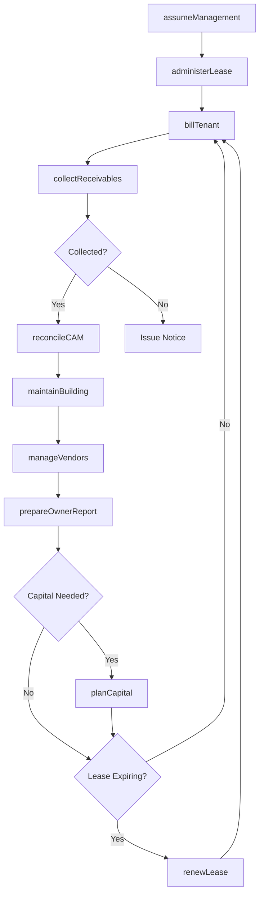
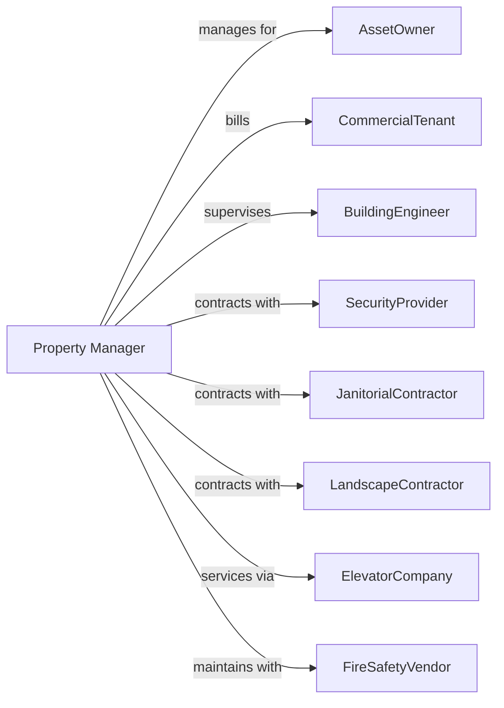

# Nonresidential Property Managers

> Business-as-Code definition for commercial property management operations. Models the complete management lifecycle from owner engagement through ongoing asset optimization.

## Overview

Nonresidential property managers oversee office buildings, retail centers, industrial properties, and mixed-use developments on behalf of property owners and investors. This definition exposes actions for tenant relations, lease administration, CAM management, and capital planning, with events enabling automated workflow triggers throughout the commercial property management lifecycle.

## Actors

| Actor | Description |
|-------|-------------|
| AssetOwner | REIT, fund, or individual owning the property |
| CommercialTenant | Business occupying leased space |
| BuildingEngineer | Technician maintaining building systems |
| SecurityProvider | Guards and monitors building security |
| JanitorialContractor | Provides cleaning services |
| LandscapeContractor | Maintains exterior grounds |
| ElevatorCompany | Services vertical transportation systems |
| FireSafetyVendor | Maintains fire and life safety systems |
| UtilityCompany | Provides electricity, gas, and water |

## Roles

| Role | Description |
|------|-------------|
| GeneralManager | Oversees all property operations |
| AssetManager | Manages financial performance and owner relations |
| LeaseAdministrator | Handles lease compliance and billing |
| ChiefEngineer | Supervises building systems and maintenance |
| TenantServicesCoordinator | Manages tenant requests and relations |

## Entities

| Entity | Description |
|--------|-------------|
| Building | Managed commercial property |
| Suite | Individual tenant space within building |
| Tenant | Business entity occupying leased space |
| Lease | Commercial lease agreement with terms |
| CAMBudget | Common area maintenance expense budget |
| ServiceContract | Vendor agreement for building services |
| CapitalProject | Major building improvement or repair |
| OwnerReport | Monthly management report for asset owner |
| BuildingSystem | HVAC, electrical, plumbing infrastructure |
| Certificate | Insurance certificates and compliance documents |

## Actions

| Action | Description |
|--------|-------------|
| assumeManagement | Take over property management from prior manager |
| administerLease | Manage lease terms, options, and compliance |
| billTenant | Invoice for rent, CAM, and other charges |
| collectReceivables | Process tenant payments and pursue arrears |
| reconcileCAM | Calculate actual vs estimated operating expenses |
| maintainBuilding | Oversee preventive and reactive maintenance |
| manageVendors | Procure, supervise, and evaluate service providers |
| coordinateTI | Manage tenant improvement construction |
| prepareOwnerReport | Generate monthly financial and operational reports |
| planCapital | Develop capital improvement budgets and schedules |
| handleEmergency | Respond to building emergencies and incidents |
| renewLease | Negotiate tenant lease renewals |
| conductInspection | Assess property and tenant space conditions |
| manageCertificates | Track tenant insurance and compliance documents |

## Events

| Event | Description |
|-------|-------------|
| managementAssumed | Property transitioned to management |
| tenantBilled | Monthly invoice generated |
| paymentReceived | Tenant payment processed |
| paymentDelinquent | Tenant payment past due |
| camReconciled | Annual CAM true-up completed |
| workOrderCreated | Maintenance request logged |
| workOrderCompleted | Repair or service finished |
| vendorContracted | New service agreement executed |
| ownerReportDelivered | Monthly report sent to owner |
| capitalApproved | Capital project authorized |
| emergencyOccurred | Building incident reported |
| leaseRenewed | Tenant renewed lease |
| certificateExpiring | Insurance or compliance document expiring |

## Searches

| Search | Description |
|--------|-------------|
| getTenantRoster | List all tenants and lease details |
| getARAgingReport | Show receivables by aging bucket |
| findExpiringLeases | List leases expiring within date range |
| getWorkOrders | Find open maintenance requests |
| getVendorContracts | List active service agreements |
| getCAMVariance | Compare budget vs actual expenses |
| getCertificateStatus | Check expiring tenant certificates |

## Workflow



## Actor Relationships



## Usage

### Calling Actions

```typescript
import { manageCommercial } from '@headlessly/manage-commercial'

const manager = manageCommercial()

// Assume management of a property
const property = await manager.assumeManagement({
  buildingId: 'plaza-tower-one',
  ownerId: 'blackstone-fund-iv',
  effectiveDate: '2024-03-01',
  managementFee: 0.035,
  leasingFee: 0.04
})

// Bill a tenant
await manager.billTenant({
  tenantId: 'acme-corp',
  charges: [
    { type: 'baseRent', amount: 45000 },
    { type: 'camEstimate', amount: 8500 },
    { type: 'utilities', amount: 2100 }
  ],
  dueDate: '2024-03-01'
})

// Reconcile CAM at year end
const reconciliation = await manager.reconcileCAM({
  buildingId: 'plaza-tower-one',
  year: 2023,
  actualExpenses: 1250000,
  grossLeasableArea: 150000
})
```

### Event-Driven Automation

```typescript
// Auto-track certificate expirations
manager.certificateExpiring(async ({ tenantId, certificateType, expirationDate }) => {
  const daysUntilExpiry = differenceInDays(expirationDate, new Date())

  if (daysUntilExpiry <= 30) {
    await notifyTenant({
      tenantId,
      subject: `${certificateType} Certificate Expiring`,
      message: `Please provide updated certificate before ${expirationDate}`
    })
  }
})

// Auto-generate owner report monthly
manager.paymentReceived(async ({ buildingId, month }) => {
  const endOfMonth = lastDayOfMonth(parseISO(`${month}-01`))

  if (isToday(endOfMonth)) {
    await manager.prepareOwnerReport({
      buildingId,
      month,
      sections: ['financial', 'leasing', 'operations', 'capital']
    })
  }
})
```
