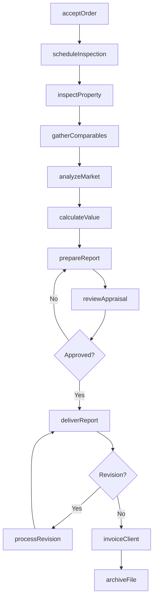
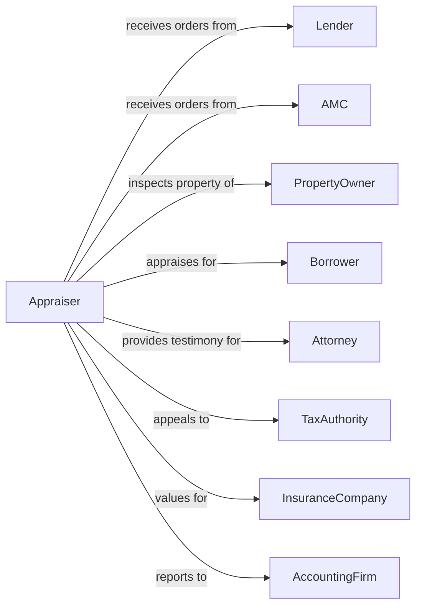

# Offices of Real Estate Appraisers

> Business-as-Code definition for real estate appraisal operations. Models the complete appraisal lifecycle from engagement through report delivery.

## Overview

Real estate appraisers estimate the fair market value of residential and commercial properties for lending, tax, estate, and litigation purposes. This definition exposes actions for order management, property inspection, valuation analysis, and report preparation, with events enabling automated workflow triggers throughout the appraisal engagement lifecycle.

## Actors

| Actor | Description |
|-------|-------------|
| Lender | Bank or mortgage company ordering appraisals |
| AMC | Appraisal management company placing orders |
| PropertyOwner | Owner of property being appraised |
| Borrower | Loan applicant for mortgage transaction |
| Attorney | Legal counsel ordering litigation appraisals |
| TaxAuthority | Government agency for assessment appeals |
| InsuranceCompany | Carrier ordering loss valuation |
| AccountingFirm | CPA firm needing estate or business valuations |
| RealEstateAgent | Agent providing market data access |

## Roles

| Role | Description |
|------|-------------|
| ChiefAppraiser | Senior appraiser overseeing quality and compliance |
| StaffAppraiser | Licensed appraiser conducting valuations |
| TraineeAppraiser | Appraiser in training under supervision |
| OrderCoordinator | Manages incoming orders and scheduling |
| QualityReviewer | Reviews appraisals for accuracy and compliance |

## Entities

| Entity | Description |
|--------|-------------|
| Appraisal | Valuation engagement and report |
| Property | Real estate subject to appraisal |
| Order | Client request for appraisal services |
| Comparable | Similar property used in valuation analysis |
| Adjustment | Value modification applied to comparable |
| Report | Written appraisal document and opinion |
| Inspection | Physical examination of subject property |
| License | State appraiser certification and credentials |
| Fee | Appraisal service charge |
| Revision | Correction or update to delivered report |

## Actions

| Action | Description |
|--------|-------------|
| acceptOrder | Receive and confirm appraisal engagement |
| scheduleInspection | Arrange property viewing with contact |
| inspectProperty | Conduct physical examination of subject |
| gatherComparables | Research and select comparable sales |
| analyzeMarket | Assess market conditions and trends |
| calculateValue | Apply valuation approaches and reconcile |
| prepareReport | Draft appraisal report document |
| reviewAppraisal | Quality check report for accuracy |
| deliverReport | Submit completed appraisal to client |
| processRevision | Address client questions and corrections |
| invoiceClient | Bill for appraisal services |
| archiveFile | Store completed appraisal workfile |
| appealAssessment | Support property tax appeal proceedings |
| certifyValue | Provide expert testimony on valuation |

## Events

| Event | Description |
|-------|-------------|
| orderReceived | New appraisal request received |
| orderAccepted | Engagement confirmed with client |
| inspectionScheduled | Property viewing appointment set |
| inspectionCompleted | Physical property examination finished |
| comparablesSelected | Comparable properties identified |
| analysisCompleted | Valuation calculations finished |
| reportDrafted | Initial report prepared |
| reportReviewed | Quality review completed |
| reportDelivered | Final appraisal submitted to client |
| revisionRequested | Client requested changes or clarification |
| revisionCompleted | Updated report delivered |
| invoiceSent | Bill sent to client |
| paymentReceived | Appraisal fee collected |

## Searches

| Search | Description |
|--------|-------------|
| findComparables | Search sold properties by criteria |
| getOrderStatus | Track appraisal order progress |
| getPendingOrders | List orders awaiting completion |
| getAppraisalHistory | Retrieve past appraisals for property |
| findAvailableAppraiser | Get appraisers by location and competency |
| getMarketTrends | Analyze price trends for area |
| getRevisionQueue | List reports requiring revision |

## Workflow



## Actor Relationships



## Usage

### Calling Actions

```typescript
import { manageValues } from '@headlessly/manage-values'

const appraiser = manageValues()

// Accept a new appraisal order
const order = await appraiser.acceptOrder({
  clientId: 'first-national-bank',
  propertyAddress: '123 Main Street',
  propertyType: 'singleFamily',
  loanPurpose: 'purchase',
  loanAmount: 400000,
  dueDate: '2024-02-20'
})

// Schedule the property inspection
await appraiser.scheduleInspection({
  orderId: order.id,
  contactName: 'John Smith',
  contactPhone: '555-123-4567',
  preferredDate: '2024-02-12',
  accessInstructions: 'Lockbox code 1234'
})

// Calculate property value
const valuation = await appraiser.calculateValue({
  orderId: order.id,
  approaches: ['salesComparison', 'cost'],
  comparables: ['comp-1', 'comp-2', 'comp-3'],
  adjustments: {
    'comp-1': { sqft: -5000, garage: 3000, condition: -2000 },
    'comp-2': { sqft: 2000, age: -3000 },
    'comp-3': { location: 5000, pool: -8000 }
  }
})
```

### Event-Driven Automation

```typescript
// Auto-notify client when report delivered
appraiser.reportDelivered(async ({ orderId, clientId, propertyAddress }) => {
  await notifyClient({
    clientId,
    subject: `Appraisal Completed - ${propertyAddress}`,
    message: 'Your appraisal report is ready for download',
    attachmentUrl: getReportUrl(orderId)
  })

  await appraiser.invoiceClient({
    orderId,
    dueDate: addDays(new Date(), 30)
  })
})

// Auto-archive after payment
appraiser.paymentReceived(async ({ orderId }) => {
  await appraiser.archiveFile({
    orderId,
    retentionYears: 5,
    includeWorkfile: true
  })
})
```
