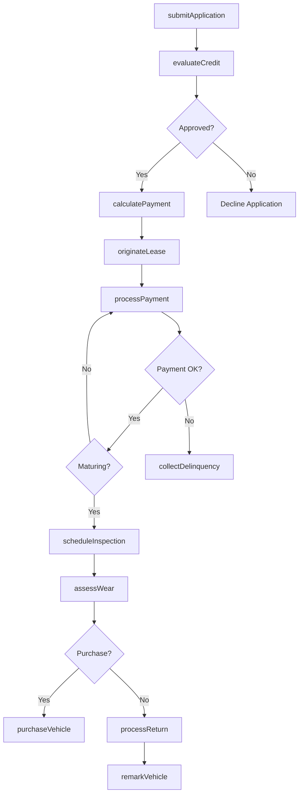
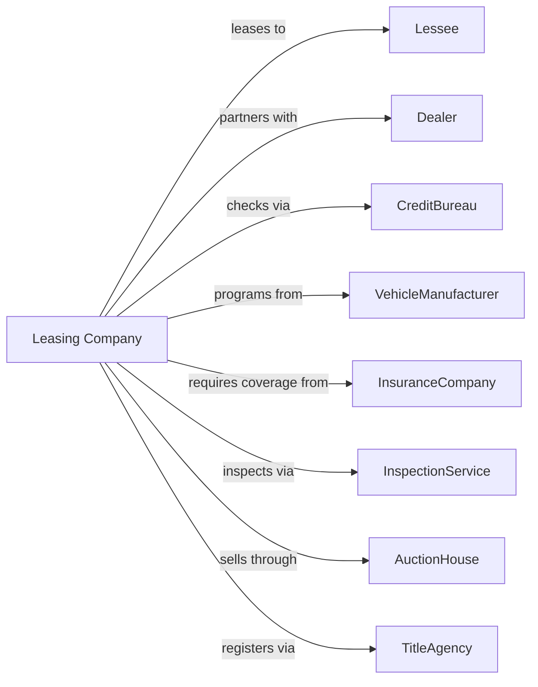

# Passenger Car Leasing

> Business-as-Code definition for passenger car leasing operations. Models the complete lease lifecycle from application through lease termination.

## Overview

Passenger car leasing companies provide long-term vehicle leases to consumers and businesses, typically for 24-48 month terms. This definition exposes actions for credit approval, lease origination, payment processing, and lease-end disposition, with events enabling automated workflow triggers throughout the vehicle leasing lifecycle.

## Actors

| Actor | Description |
|-------|-------------|
| Lessee | Individual or business leasing a vehicle |
| Dealer | Automotive dealership originating leases |
| CreditBureau | Provides credit reports for underwriting |
| VehicleManufacturer | Provides captive financing programs |
| InsuranceCompany | Provides required liability coverage |
| InspectionService | Conducts lease-end vehicle inspections |
| AuctionHouse | Sells off-lease vehicles |
| TitleAgency | Handles vehicle registration and titling |
| CollectionsAgency | Pursues delinquent lease payments |

## Roles

| Role | Description |
|------|-------------|
| LeaseOriginator | Processes new lease applications |
| CreditAnalyst | Evaluates applicant creditworthiness |
| AccountManager | Manages active lease accounts |
| AssetManager | Oversees vehicle residual values |
| MaturitySpecialist | Handles lease-end processes |

## Entities

| Entity | Description |
|--------|-------------|
| LeaseAgreement | Long-term vehicle lease contract |
| Vehicle | Car, SUV, or van under lease |
| Application | Credit application for lease approval |
| MonthlyPayment | Scheduled lease payment |
| ResidualValue | Estimated vehicle value at lease end |
| MileageAllowance | Contracted annual mileage limit |
| ExcessWear | Damage beyond normal wear standards |
| Disposition | Lease-end return or purchase decision |
| BuyoutQuote | Price to purchase leased vehicle |
| TurnIn | Returned off-lease vehicle |

## Actions

| Action | Description |
|--------|-------------|
| submitApplication | Process new lease credit application |
| evaluateCredit | Underwrite applicant creditworthiness |
| calculatePayment | Determine monthly lease payment |
| originateLease | Fund and book new lease agreement |
| processPayment | Collect monthly lease payment |
| modifyLease | Change payment date or mileage terms |
| quoteBuyout | Calculate lease purchase option price |
| scheduleInspection | Arrange lease-end vehicle inspection |
| assessWear | Evaluate excess wear and damage charges |
| processReturn | Handle lease-end vehicle turn-in |
| purchaseVehicle | Execute lessee buyout of vehicle |
| remarkVehicle | Prepare and sell off-lease vehicle |
| collectDelinquency | Pursue past-due lease payments |
| terminateEarly | Process early lease termination |

## Events

| Event | Description |
|-------|-------------|
| applicationSubmitted | New lease application received |
| creditApproved | Applicant approved for lease |
| creditDeclined | Applicant not approved |
| leaseOriginated | New lease funded and booked |
| paymentDue | Monthly payment due date |
| paymentReceived | Lease payment processed |
| paymentLate | Payment past due date |
| leaseMaturing | Lease approaching end of term |
| inspectionScheduled | Lease-end inspection arranged |
| inspectionCompleted | Vehicle inspection finished |
| wearAssessed | Excess wear charges determined |
| vehicleReturned | Off-lease vehicle turned in |
| vehiclePurchased | Lessee bought leased vehicle |
| vehicleRemarked | Off-lease vehicle sold at auction |

## Searches

| Search | Description |
|--------|-------------|
| getLeasePortfolio | List active leases by status |
| findMaturingLeases | List leases ending within date range |
| getPaymentHistory | Retrieve payment records for lessee |
| getDelinquentAccounts | List past-due lease accounts |
| findOffLeaseInventory | List vehicles pending remarketing |
| getResidualPerformance | Analyze residual value accuracy |
| getApplicationPipeline | Track pending lease applications |

## Workflow



## Actor Relationships



## Usage

### Calling Actions

```typescript
import { rentVehicles } from '@headlessly/rent-vehicles'

const leasing = rentVehicles()

// Submit a lease application
const application = await leasing.submitApplication({
  applicantId: 'app-12345',
  vehicleVIN: '1HGBH41JXMN109186',
  msrp: 35000,
  termMonths: 36,
  mileagePerYear: 12000,
  downPayment: 2500
})

// Originate the lease
const lease = await leasing.originateLease({
  applicationId: application.id,
  dealerId: 'dealer-abc',
  fundingDate: '2024-03-01',
  firstPaymentDate: '2024-04-01'
})

// Quote a buyout
const buyout = await leasing.quoteBuyout({
  leaseId: lease.id,
  quoteDate: '2027-02-01',
  includeTaxes: true
})
```

### Event-Driven Automation

```typescript
// Auto-send maturity notice
leasing.leaseMaturing(async ({ leaseId, lesseeId, maturityDate }) => {
  const daysToMaturity = differenceInDays(maturityDate, new Date())

  if (daysToMaturity === 90) {
    await sendMaturityNotice({
      lesseeId,
      options: ['return', 'purchase', 'newLease'],
      maturityDate
    })

    await leasing.scheduleInspection({
      leaseId,
      preferredDate: subDays(maturityDate, 14)
    })
  }
})

// Auto-process excess wear charges
leasing.inspectionCompleted(async ({ leaseId, excessWearItems }) => {
  if (excessWearItems.length > 0) {
    const charges = await leasing.assessWear({
      leaseId,
      items: excessWearItems
    })

    await notifyLessee({
      leaseId,
      subject: 'Lease-End Wear Charges',
      charges
    })
  }
})
```
