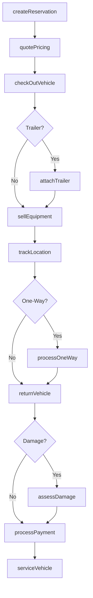
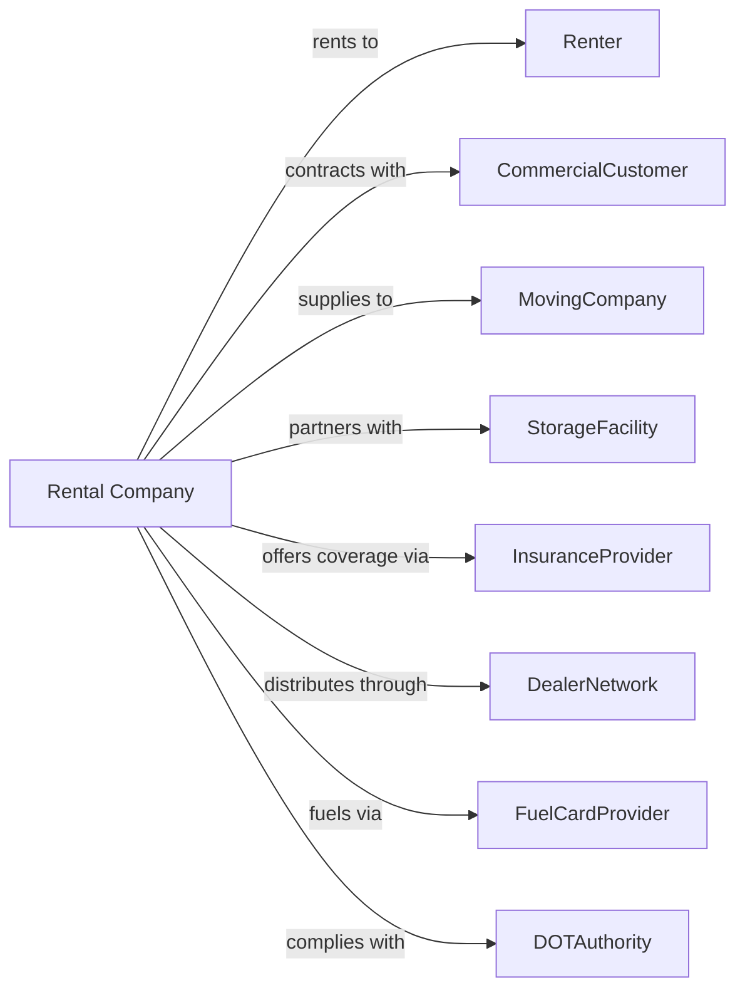

# Truck, Utility Trailer, and RV (Recreational Vehicle) Rental and Leasing

> Business-as-Code definition for truck, trailer, and RV rental operations. Models the complete rental lifecycle from reservation through vehicle return.

## Overview

Truck and RV rental companies provide moving trucks, cargo vans, utility trailers, and recreational vehicles for short-term consumer and commercial use. This definition exposes actions for fleet management, one-way rentals, mileage tracking, and equipment maintenance, with events enabling automated workflow triggers throughout the truck and trailer rental lifecycle.

## Actors

| Actor | Description |
|-------|-------------|
| Renter | Individual renting truck or RV |
| CommercialCustomer | Business with recurring truck needs |
| MovingCompany | Professional mover renting trucks |
| StorageFacility | Partner location for rentals |
| InsuranceProvider | Offers rental protection coverage |
| DealerNetwork | Provides authorized rental locations |
| FuelCardProvider | Manages fleet fueling program |
| DOTAuthority | Regulates commercial vehicle compliance |
| TelematicsVendor | Provides vehicle tracking systems |

## Roles

| Role | Description |
|------|-------------|
| LocationManager | Oversees rental location operations |
| ReservationAgent | Handles bookings and customer inquiries |
| FleetCoordinator | Manages truck allocation and repositioning |
| MaintenanceTech | Services and repairs vehicles |
| ComplianceOfficer | Ensures DOT and safety compliance |

## Entities

| Entity | Description |
|--------|-------------|
| Truck | Moving truck or cargo van for rent |
| Trailer | Utility or car trailer for rent |
| RV | Recreational vehicle for rent |
| Reservation | Booking for vehicle rental |
| RentalAgreement | Contract for vehicle use |
| Mileage | Distance traveled during rental |
| Equipment | Dollies, pads, and moving supplies |
| OneWay | Rental returned to different location |
| Damage | Vehicle damage requiring repair |
| Location | Rental pickup and return point |

## Actions

| Action | Description |
|--------|-------------|
| createReservation | Book truck, trailer, or RV rental |
| quotePricing | Calculate rental rate with mileage and fees |
| checkOutVehicle | Process rental start and handoff |
| attachTrailer | Add trailer rental to truck reservation |
| sellEquipment | Add moving supplies to rental |
| trackLocation | Monitor vehicle GPS position |
| processOneWay | Handle drop-off at different location |
| returnVehicle | Process vehicle return and inspection |
| assessDamage | Document and price vehicle damage |
| processPayment | Charge rental fees and mileage |
| repositionFleet | Move vehicles between locations |
| serviceVehicle | Perform maintenance and repairs |
| retireVehicle | Remove vehicle from rental fleet |
| extendRental | Add days to active rental |

## Events

| Event | Description |
|-------|-------------|
| reservationCreated | New rental booking confirmed |
| vehicleCheckedOut | Rental started and vehicle departed |
| trailerAttached | Trailer added to truck rental |
| locationUpdated | Vehicle GPS position changed |
| oneWayDropped | Vehicle returned at destination |
| vehicleReturned | Rental completed at location |
| damageReported | New damage documented |
| paymentProcessed | Rental charges collected |
| mileageExceeded | Rental exceeded included miles |
| vehicleServiced | Maintenance completed |
| lowInventoryAlert | Location below target fleet level |
| vehicleRepositioned | Fleet moved between locations |

## Searches

| Search | Description |
|--------|-------------|
| findAvailableVehicles | Search trucks and trailers by size and location |
| getReservations | List bookings by date or location |
| trackVehicles | View real-time fleet positions |
| getOneWayAvailability | Check one-way rental routes |
| getFleetInventory | List vehicles by location and status |
| getMileageReport | Analyze mileage by rental and vehicle |
| getMaintenanceSchedule | List vehicles due for service |

## Workflow



## Actor Relationships



## Usage

### Calling Actions

```typescript
import { rentTrucks } from '@headlessly/rent-trucks'

const rental = rentTrucks()

// Create a one-way moving truck reservation
const reservation = await rental.createReservation({
  customerId: 'cust-12345',
  vehicleType: 'movingTruck',
  size: '26ft',
  pickupLocation: 'chicago-main',
  returnLocation: 'denver-south',
  pickupDate: '2024-04-01T08:00:00',
  returnDate: '2024-04-05T17:00:00',
  estimatedMiles: 1000
})

// Check out with trailer and equipment
const agreement = await rental.checkOutVehicle({
  reservationId: reservation.id,
  vehicleId: 'TRK-45678',
  addOns: ['carTrailer', 'dolly', 'movingPads'],
  insurance: 'safeMoveProtection'
})

// Process one-way return
await rental.processOneWay({
  agreementId: agreement.id,
  returnMileage: 1087,
  fuelLevel: 0.5,
  returnLocation: 'denver-south'
})
```

### Event-Driven Automation

```typescript
// Auto-reposition when inventory low
rental.lowInventoryAlert(async ({ locationId, vehicleType, currentCount }) => {
  const nearbyLocations = await findSurplusLocations(vehicleType, locationId)

  if (nearbyLocations.length > 0) {
    await rental.repositionFleet({
      fromLocation: nearbyLocations[0].id,
      toLocation: locationId,
      vehicleType,
      quantity: Math.min(3, nearbyLocations[0].surplus)
    })
  }
})

// Auto-schedule service after high-mileage rental
rental.vehicleReturned(async ({ vehicleId, tripMileage }) => {
  if (tripMileage > 500) {
    await rental.serviceVehicle({
      vehicleId,
      serviceType: 'postTripInspection',
      priority: 'normal'
    })
  }
})
```
