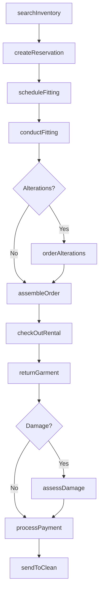
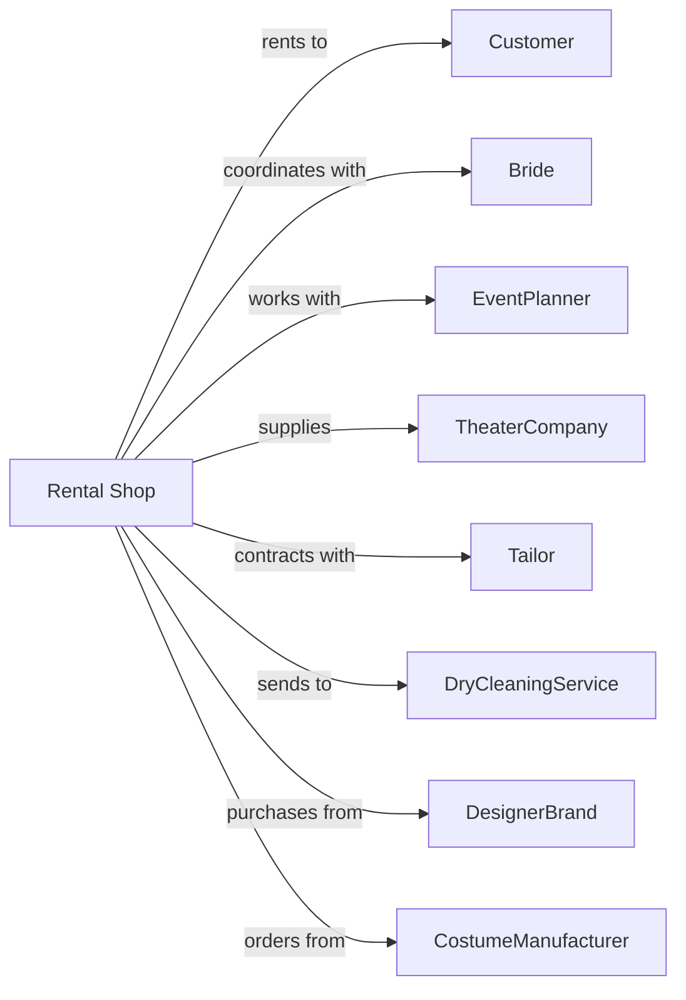

# Formal Wear and Costume Rental

> Business-as-Code definition for formal wear and costume rental operations. Models the complete rental lifecycle from fitting through garment return.

## Overview

Formal wear and costume rental shops provide tuxedos, suits, gowns, and theatrical costumes for weddings, proms, parties, and performances. This definition exposes actions for inventory management, fitting appointments, alterations, and garment care, with events enabling automated workflow triggers throughout the rental lifecycle.

## Actors

| Actor | Description |
|-------|-------------|
| Customer | Individual renting formal wear or costume |
| Bride | Wedding customer coordinating party rentals |
| EventPlanner | Professional coordinating group rentals |
| TheaterCompany | Production company renting costumes |
| Tailor | Performs alterations and fitting adjustments |
| DryCleaningService | Cleans and presses garments |
| DesignerBrand | Supplies formal wear inventory |
| CostumeManufacturer | Provides theatrical and specialty costumes |
| WeddingVenue | Refers customers and coordinates events |

## Roles

| Role | Description |
|------|-------------|
| StoreManager | Oversees rental shop operations |
| FittingSpecialist | Conducts measurements and fittings |
| Seamstress | Performs alterations and repairs |
| InventoryCoordinator | Manages garment stock and availability |
| EventCoordinator | Handles group and wedding rentals |

## Entities

| Entity | Description |
|--------|-------------|
| Garment | Formal wear or costume item |
| Rental | Agreement for garment use |
| Fitting | Measurement and try-on appointment |
| Alteration | Garment modification for fit |
| Reservation | Hold on garment for future event |
| Group | Wedding party or event group |
| Accessory | Tie, cummerbund, or complementary item |
| Cleaning | Garment cleaning and pressing service |
| Damage | Tear, stain, or other garment damage |
| Style | Design, color, and cut specifications |

## Actions

| Action | Description |
|--------|-------------|
| searchInventory | Find available garments by style and size |
| createReservation | Book garments for upcoming event |
| scheduleFitting | Arrange measurement appointment |
| conductFitting | Measure customer and select garments |
| orderAlterations | Request garment modifications |
| assembleOrder | Gather all garments and accessories |
| checkOutRental | Process rental pickup |
| extendRental | Add days to active rental |
| returnGarment | Process garment return and inspection |
| assessDamage | Evaluate and price garment damage |
| processPayment | Charge rental and accessory fees |
| sendToClean | Submit garment for cleaning |
| retireGarment | Remove worn item from inventory |
| coordinateGroup | Manage wedding party or group rentals |

## Events

| Event | Description |
|-------|-------------|
| reservationCreated | Garments booked for event |
| fittingScheduled | Measurement appointment set |
| fittingCompleted | Customer measurements taken |
| alterationsOrdered | Garment modifications requested |
| alterationsCompleted | Modifications finished |
| orderAssembled | Complete order ready for pickup |
| rentalCheckedOut | Garments picked up by customer |
| rentalReturned | Garments returned to store |
| damageDetected | Issue found during inspection |
| garmentCleaned | Garment cleaned and pressed |
| garmentRetired | Item removed from circulation |
| paymentProcessed | Rental fees collected |
| groupConfirmed | Wedding or event group confirmed |

## Searches

| Search | Description |
|--------|-------------|
| findAvailableStyles | Search garments by style and date |
| getReservations | List bookings by date or customer |
| getFittingSchedule | View upcoming fitting appointments |
| getGroupOrders | List wedding party and group rentals |
| getAlterationsQueue | Find garments awaiting alterations |
| getReturnsDue | List rentals due back today |
| getInventoryStatus | Check garment availability by size |

## Workflow



## Actor Relationships



## Usage

### Calling Actions

```typescript
import { rentCostumes } from '@headlessly/rent-costumes'

const shop = rentCostumes()

// Create a wedding party reservation
const group = await shop.coordinateGroup({
  eventType: 'wedding',
  eventDate: '2024-06-15',
  members: [
    { name: 'Groom', role: 'groom', style: 'classic-black' },
    { name: 'Best Man', role: 'groomsman', style: 'classic-black' },
    { name: 'Groomsman 1', role: 'groomsman', style: 'classic-black' }
  ],
  accessories: ['ties', 'cufflinks', 'boutonnieres']
})

// Schedule fitting appointments
for (const member of group.members) {
  await shop.scheduleFitting({
    reservationId: member.reservationId,
    preferredDate: '2024-05-01',
    duration: 30
  })
}

// Check out the order
await shop.checkOutRental({
  groupId: group.id,
  pickupDate: '2024-06-13',
  returnDate: '2024-06-17'
})
```

### Event-Driven Automation

```typescript
// Auto-send to cleaning after return
shop.rentalReturned(async ({ rentalId, garmentIds }) => {
  for (const garmentId of garmentIds) {
    await shop.sendToClean({
      garmentId,
      serviceType: 'standard',
      priority: 'normal'
    })
  }
})

// Auto-reminder before fitting
shop.fittingScheduled(async ({ customerId, fittingDate }) => {
  scheduleTask(subDays(fittingDate, 1), async () => {
    await sendReminder({
      customerId,
      subject: 'Fitting Appointment Tomorrow',
      appointmentTime: fittingDate
    })
  })
})
```
