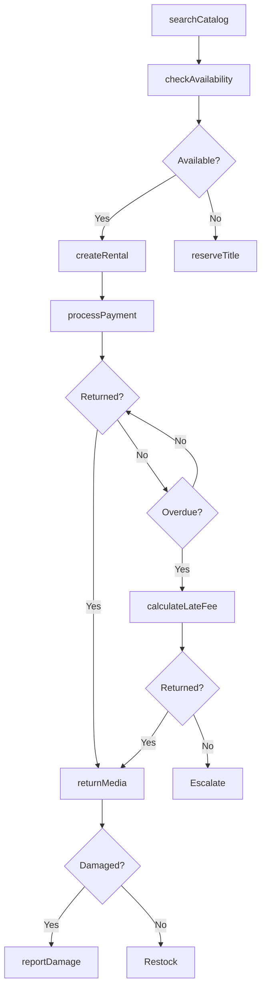
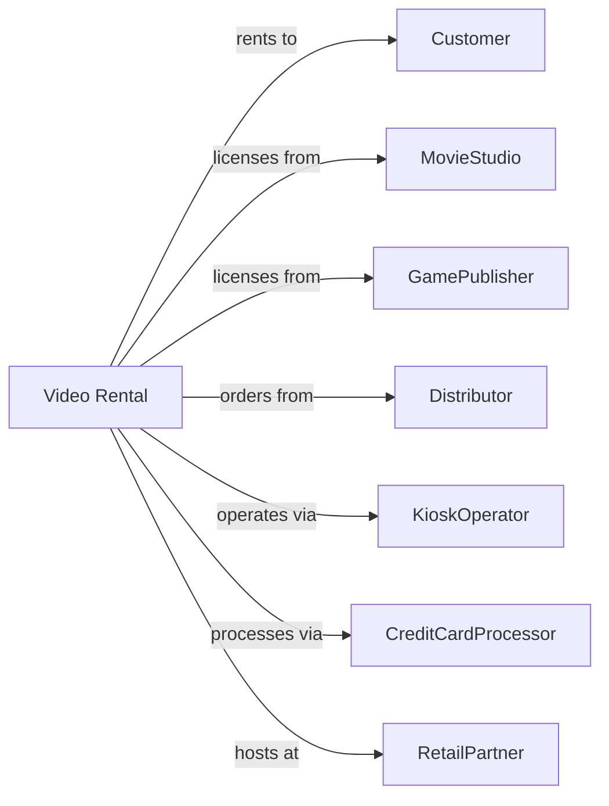

# Video Tape and Disc Rental

> Business-as-Code definition for video rental operations. Models the complete rental lifecycle from title search through media return.

## Overview

Video rental establishments provide movies and games on physical media including DVDs, Blu-ray discs, and video games through retail locations or automated kiosks. This definition exposes actions for catalog management, checkout processing, late fee handling, and inventory replenishment, with events enabling automated workflow triggers throughout the rental lifecycle.

## Actors

| Actor | Description |
|-------|-------------|
| Customer | Individual renting video content |
| MovieStudio | Distributes film content for rental |
| GamePublisher | Supplies video game titles |
| Distributor | Wholesaler providing media inventory |
| KioskOperator | Manages automated rental machines |
| CreditCardProcessor | Handles rental payments |
| ContentRatingBoard | Provides age ratings for titles |
| RetailPartner | Hosts kiosk locations |
| RecyclingService | Disposes of damaged media |

## Roles

| Role | Description |
|------|-------------|
| StoreManager | Oversees retail location operations |
| ClerkAssociate | Processes rentals and returns |
| InventoryBuyer | Selects and orders new titles |
| KioskTechnician | Maintains automated kiosk machines |
| CustomerService | Handles disputes and account issues |

## Entities

| Entity | Description |
|--------|-------------|
| Title | Movie or game available for rent |
| Copy | Physical disc or tape in inventory |
| Rental | Checkout record for media item |
| Customer | Member with rental account |
| LateFee | Charge for overdue return |
| Reservation | Hold on upcoming or popular title |
| Genre | Content category for browsing |
| Rating | Age appropriateness classification |
| Kiosk | Automated rental machine |
| Membership | Customer account with rental history |

## Actions

| Action | Description |
|--------|-------------|
| searchCatalog | Find titles by name, genre, or actor |
| checkAvailability | Verify copy in stock for rental |
| createRental | Process media checkout |
| extendRental | Add days to active rental |
| returnMedia | Process item return |
| calculateLateFee | Determine overdue charges |
| waiveLateFee | Remove late charges from account |
| reserveTitle | Hold copy for customer pickup |
| updateMembership | Modify customer account details |
| orderInventory | Purchase new titles for catalog |
| retireMedia | Remove damaged or obsolete copies |
| processPayment | Charge rental and late fees |
| reportDamage | Document damaged or missing media |
| syncKiosk | Update kiosk inventory and status |

## Events

| Event | Description |
|-------|-------------|
| rentalCreated | Media checked out to customer |
| rentalReturned | Media returned to location |
| rentalOverdue | Media not returned by due date |
| lateFeeAssessed | Overdue charge added to account |
| reservationCreated | Title held for customer |
| reservationReady | Reserved title available for pickup |
| newTitleAdded | New movie or game added to catalog |
| mediaRetired | Copy removed from inventory |
| mediaDamaged | Copy reported as damaged |
| membershipCreated | New customer account opened |
| paymentProcessed | Rental charges collected |
| kioskServiced | Kiosk maintenance completed |

## Searches

| Search | Description |
|--------|-------------|
| findTitles | Search catalog by various criteria |
| getNewReleases | List recently added titles |
| getTopRentals | Show most popular titles |
| getCustomerHistory | Retrieve past rentals for member |
| findOverdueRentals | List rentals past due date |
| getReservations | List pending title holds |
| getKioskInventory | Check stock at specific kiosk |

## Workflow



## Actor Relationships



## Usage

### Calling Actions

```typescript
import { rentVideos } from '@headlessly/rent-videos'

const rental = rentVideos()

// Search for a movie
const results = await rental.searchCatalog({
  query: 'action movies',
  releaseYear: 2024,
  rating: ['PG-13', 'R'],
  format: 'bluray'
})

// Create a rental
const checkout = await rental.createRental({
  customerId: 'member-12345',
  copies: ['COPY-78901', 'COPY-78902'],
  rentalDays: 5,
  locationId: 'store-downtown'
})

// Process return
await rental.returnMedia({
  rentalId: checkout.id,
  returnLocation: 'store-downtown',
  condition: 'good'
})
```

### Event-Driven Automation

```typescript
// Auto-notify when reserved title available
rental.reservationReady(async ({ customerId, titleId, locationId }) => {
  await notifyCustomer({
    customerId,
    subject: 'Your Reserved Title is Ready',
    message: `Pick up at ${locationId} within 48 hours`,
    titleId
  })
})

// Auto-charge late fees when overdue
rental.rentalOverdue(async ({ rentalId, customerId, daysLate }) => {
  const fee = await rental.calculateLateFee({
    rentalId,
    daysOverdue: daysLate
  })

  if (daysLate >= 3) {
    await rental.processPayment({
      customerId,
      amount: fee,
      chargeType: 'lateFee'
    })
  }
})
```
