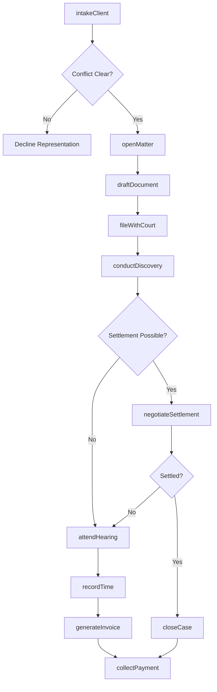
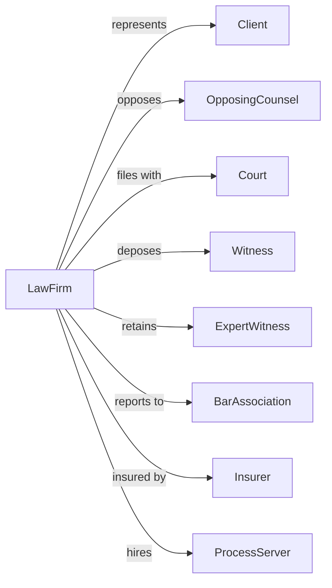

# Offices of Lawyers

> Business-as-Code definition for legal practice operations. Models the complete client engagement lifecycle from intake through case resolution.

## Overview

Law offices provide legal representation and counsel across practice areas including litigation, corporate transactions, family law, estate planning, and intellectual property. This definition exposes actions for case management, client communications, and legal document workflows, with events for automation of deadlines and compliance requirements.

## Actors

| Actor | Description |
|-------|-------------|
| Client | Individual or entity seeking legal representation or counsel |
| OpposingCounsel | Attorney representing the adverse party in litigation or negotiations |
| Court | Judicial body that adjudicates disputes and issues rulings |
| Witness | Person providing testimony or evidence in legal proceedings |
| ExpertWitness | Specialist providing professional opinions on technical matters |
| Insurer | Provides malpractice coverage and may fund litigation |
| BarAssociation | Professional body governing attorney licensing and ethics |
| ProcessServer | Delivers legal documents to parties in proceedings |
| CourtReporter | Creates official transcripts of depositions and hearings |

## Roles

| Role | Description |
|------|-------------|
| ManagingPartner | Senior attorney overseeing firm operations and strategy |
| AssociateAttorney | Licensed attorney handling cases under partner supervision |
| Paralegal | Legal professional assisting with research and document preparation |
| LegalSecretary | Administrative support for attorneys and case management |
| OfficeManager | Oversees firm administration, billing, and operations |
| LawClerk | Law student or recent graduate assisting with research |

## Entities

| Entity | Description |
|--------|-------------|
| Case | A legal matter with associated parties, documents, and deadlines |
| Client | The represented party with contact and billing information |
| Document | Legal filings, contracts, briefs, and correspondence |
| Invoice | Billing statement for legal services rendered |
| TimeEntry | Record of billable hours worked on a matter |
| Deadline | Court-imposed or statutory date requiring action |
| Trust Account | Client funds held in escrow per bar requirements |
| Retainer | Advance payment securing legal services |
| Pleading | Formal written statement filed with the court |
| Discovery | Evidence and information exchanged between parties |

## Actions

| Action | Description |
|--------|-------------|
| intakeClient | Conduct initial consultation and conflict check for new client |
| openMatter | Create new case file with parties, jurisdiction, and matter type |
| draftDocument | Prepare legal document such as contract, brief, or motion |
| fileWithCourt | Submit pleading or motion to court electronically or in person |
| conductDiscovery | Issue or respond to interrogatories, document requests, and depositions |
| researchLaw | Investigate statutes, case law, and regulations relevant to matter |
| negotiateSettlement | Engage opposing counsel to reach mutually acceptable resolution |
| attendHearing | Appear before judge or tribunal for oral argument or proceeding |
| recordTime | Log billable hours and expenses to client matter |
| generateInvoice | Create and send billing statement to client |
| collectPayment | Process client payment and apply to outstanding balance |
| closeCase | Archive matter upon resolution and send closing letter |
| maintainTrust | Manage client funds in IOLTA or trust account per bar rules |

## Events

| Event | Description |
|-------|-------------|
| clientIntaked | New client has completed conflict check and engagement letter |
| matterOpened | Case file created and assigned to responsible attorney |
| documentDrafted | Legal document prepared and ready for review |
| documentFiled | Pleading or motion submitted to court |
| discoveryServed | Discovery requests delivered to opposing party |
| discoveryReceived | Discovery requests received requiring response |
| deadlineApproaching | Statutory or court deadline within warning threshold |
| hearingScheduled | Court date set for appearance or argument |
| settlementReached | Parties agreed to resolve matter without trial |
| invoiceSent | Billing statement delivered to client |
| paymentReceived | Client payment processed and applied |
| caseClosed | Matter resolved and archived |
| trustDeposited | Funds received into client trust account |

## Searches

| Search | Description |
|--------|-------------|
| findCases | List matters with filters for client, status, practice area, or attorney |
| getDeadlines | Retrieve upcoming deadlines across all active matters |
| searchDocuments | Full-text search of case documents and correspondence |
| getTimeEntries | Retrieve billable time for matter, attorney, or date range |
| findClients | List clients with filters for name, matter type, or status |
| getOutstandingBalances | Retrieve accounts receivable by client or matter |
| getTrustBalance | Get current balance in client trust account |

## Workflow



## Actor Relationships



## Usage

### Calling Actions

```typescript
import { practiceLaw } from '@headlessly/practice-law'

const firm = practiceLaw()

// Intake new client with conflict check
const intake = await firm.intakeClient({
  name: 'Acme Corporation',
  contactEmail: 'legal@acme.com',
  matterType: 'corporate',
  conflictParties: ['Acme Corporation', 'John Smith CEO']
})

// Open matter after engagement
const matter = await firm.openMatter({
  clientId: intake.clientId,
  title: 'Series B Financing',
  practiceArea: 'corporate',
  jurisdiction: 'Delaware',
  responsibleAttorney: 'partner-123'
})

// Draft and file document
const doc = await firm.draftDocument({
  matterId: matter.id,
  type: 'stockPurchaseAgreement',
  template: 'spa-standard',
  variables: { shares: 1000000, pricePerShare: 2.50 }
})
```

### Event-Driven Automation

```typescript
// Alert when deadlines approach
firm.deadlineApproaching(async ({ matterId, deadline, daysRemaining }) => {
  if (daysRemaining <= 3) {
    await firm.notifyAttorney({
      matterId,
      message: `Deadline in ${daysRemaining} days: ${deadline.description}`,
      priority: 'urgent'
    })
  }
})

// Auto-generate invoice on case close
firm.caseClosed(async ({ matterId, clientId }) => {
  const unbilled = await firm.getTimeEntries({ matterId, billed: false })

  if (unbilled.totalHours > 0) {
    await firm.generateInvoice({
      clientId,
      matterId,
      entries: unbilled.entries,
      type: 'final'
    })
  }
})
```
