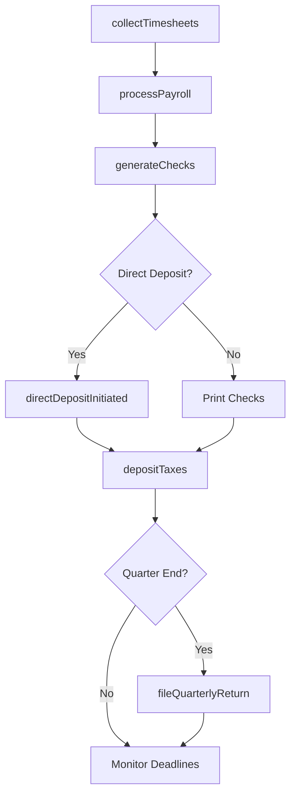
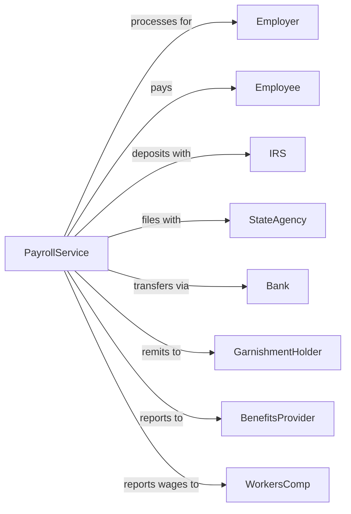

# Payroll Services

> Business-as-Code definition for payroll processing operations. Models the complete pay cycle from time collection through tax filing.

## Overview

Payroll services collect employee hours and compensation data, calculate wages and deductions, generate paychecks, and file employment taxes. This definition exposes actions for payroll processing, tax deposit, and compliance reporting, with events for pay cycle automation and deadline tracking.

## Actors

| Actor | Description |
|-------|-------------|
| Employer | Business client outsourcing payroll processing |
| Employee | Worker receiving wages through payroll service |
| IRS | Federal agency receiving employment tax deposits |
| StateAgency | State department collecting income and unemployment taxes |
| Bank | Financial institution for direct deposits and tax payments |
| GarnishmentHolder | Creditor with court order for wage withholding |
| BenefitsProvider | Insurance or retirement plan administrator |
| WorkersComp | Insurance carrier requiring wage reporting |

## Roles

| Role | Description |
|------|-------------|
| PayrollSpecialist | Processes client payrolls and handles inquiries |
| TaxCompliance | Prepares and files employment tax returns |
| AccountManager | Primary contact for client relationship |
| Implementation | Onboards new clients and configures systems |
| CustomerService | Handles employee and employer questions |

## Entities

| Entity | Description |
|--------|-------------|
| Payroll | Calculated wages, taxes, and deductions for pay period |
| Timesheet | Record of hours worked by employee |
| Paycheck | Payment issued to employee for wages earned |
| W4 | Employee withholding certificate for tax calculation |
| DirectDeposit | Electronic wage payment to employee bank account |
| TaxDeposit | Payment of withheld and employer taxes |
| Garnishment | Court-ordered wage deduction for debt |
| Form941 | Quarterly federal employment tax return |
| W2 | Annual wage and tax statement for employee |
| PayStub | Itemized record of earnings and deductions |

## Actions

| Action | Description |
|--------|-------------|
| onboardClient | Set up new employer with company and employee data |
| collectTimesheets | Receive hours and attendance data from client |
| processPayroll | Calculate wages, taxes, deductions, and net pay |
| generateChecks | Produce paychecks or initiate direct deposits |
| depositTaxes | Remit withheld taxes to federal and state agencies |
| fileQuarterlyReturn | Submit Form 941 and state quarterly returns |
| processGarnishment | Calculate and remit court-ordered withholdings |
| generateW2 | Produce annual wage statements for employees |
| handleNewHire | Add employee with W4 and direct deposit setup |
| processTermination | Handle final pay and benefit calculations |
| runReport | Generate payroll, tax, or labor reports for client |
| amendPayroll | Correct errors in previously processed payroll |

## Events

| Event | Description |
|-------|-------------|
| clientOnboarded | New employer setup completed |
| timesheetsReceived | Hours data collected from client |
| payrollProcessed | Wages and deductions calculated |
| checksGenerated | Paychecks produced and ready for distribution |
| directDepositInitiated | Electronic wage transfers submitted |
| taxesDeposited | Employment taxes remitted to agencies |
| quarterlyFiled | Quarterly tax returns submitted |
| w2Generated | Annual wage statements produced |
| garnishmentProcessed | Court-ordered deduction remitted |
| newHireAdded | Employee added to payroll |
| terminationProcessed | Final pay calculated and issued |
| deadlineApproaching | Tax deposit or filing deadline nearing |

## Searches

| Search | Description |
|--------|-------------|
| findPayrolls | List processed payrolls by client, date, or status |
| getEmployeeHistory | Retrieve pay history for specific employee |
| getTaxLiabilities | Get current tax deposit obligations |
| findDeadlines | List upcoming tax deposit and filing deadlines |
| getYTDTotals | Retrieve year-to-date wages and taxes by employee |
| searchGarnishments | Find active garnishment orders by employee |
| getQuarterlyTotals | Retrieve quarterly wage and tax totals |

## Workflow



## Actor Relationships



## Usage

### Calling Actions

```typescript
import { auditPayroll } from '@headlessly/audit-payroll'

const payroll = auditPayroll()

// Process regular payroll
const result = await payroll.processPayroll({
  clientId: 'client-123',
  payPeriod: { start: '2024-01-01', end: '2024-01-15' },
  payDate: '2024-01-19',
  timesheets: [
    { employeeId: 'emp-001', regularHours: 80, overtimeHours: 5 },
    { employeeId: 'emp-002', regularHours: 80, overtimeHours: 0 },
    { employeeId: 'emp-003', salary: true }
  ]
})

// Generate and submit direct deposits
await payroll.generateChecks({
  payrollId: result.id,
  deliveryMethod: 'directDeposit',
  submitDate: '2024-01-17'
})

// Deposit employment taxes
await payroll.depositTaxes({
  payrollId: result.id,
  federalTax: result.federalWithholding,
  socialSecurity: result.socialSecurityTotal,
  medicare: result.medicareTotal,
  stateTax: result.stateWithholding
})
```

### Event-Driven Automation

```typescript
// Auto-deposit taxes after payroll
payroll.payrollProcessed(async ({ payrollId, clientId, taxes }) => {
  if (taxes.total > 0) {
    await payroll.depositTaxes({
      payrollId,
      ...taxes,
      depositDate: calculateDepositDeadline(taxes.total)
    })
  }
})

// Alert when deposit deadline approaching
payroll.deadlineApproaching(async ({ clientId, deadline, type, amount }) => {
  await payroll.notifyClient({
    clientId,
    message: `${type} deposit of $${amount} due ${deadline}`,
    priority: 'high'
  })
})
```
