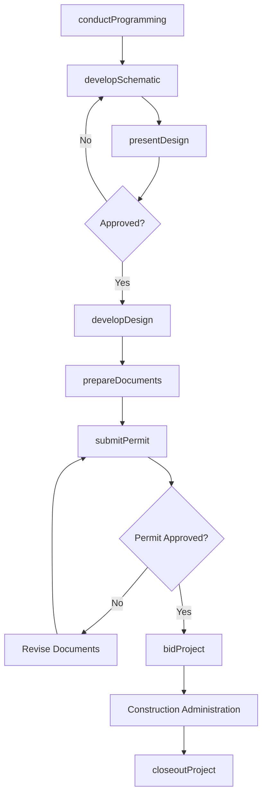
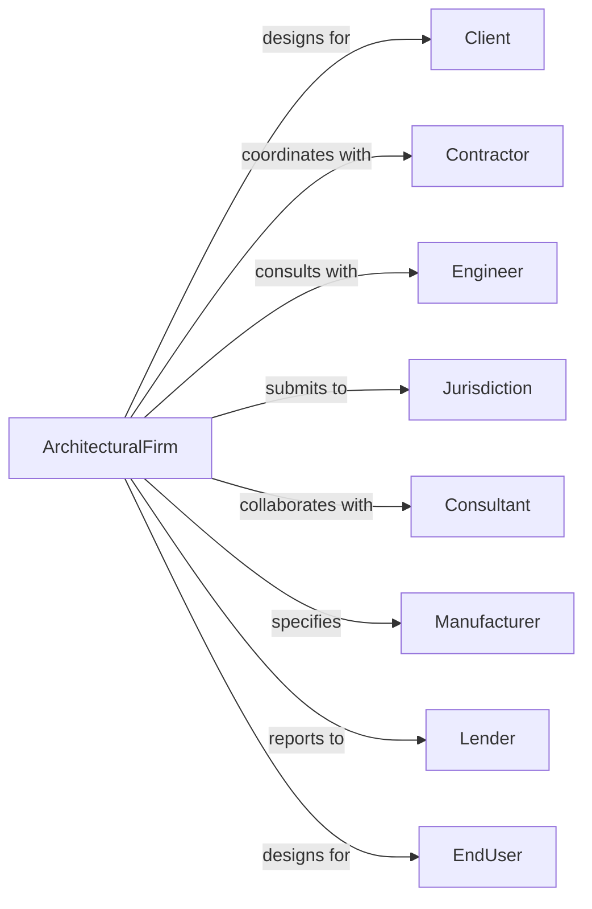

# Architectural Services

> Business-as-Code definition for architectural practice operations. Models the complete design lifecycle from programming through construction administration.

## Overview

Architectural services firms plan and design residential, commercial, institutional, and industrial buildings. This definition exposes actions for client programming, schematic design, design development, construction documentation, and construction administration, with events for project milestone tracking and regulatory compliance.

## Actors

| Actor | Description |
|-------|-------------|
| Client | Building owner or developer commissioning architectural services |
| Contractor | General contractor building the designed project |
| Engineer | Structural, mechanical, or electrical consultant |
| Jurisdiction | Building department reviewing and permitting designs |
| Consultant | Specialized design professional such as acoustics or lighting |
| Manufacturer | Product supplier providing specifications and samples |
| Lender | Financial institution funding project construction |
| EndUser | Occupant or operator of completed building |

## Roles

| Role | Description |
|------|-------------|
| PrincipalArchitect | Licensed architect leading design and client relationships |
| ProjectArchitect | Licensed professional managing project design and documentation |
| Designer | Staff member developing design concepts and drawings |
| Drafter | Technical staff producing construction documents |
| SpecificationWriter | Professional preparing technical specifications |
| ProjectManager | Coordinator handling schedules, budgets, and communications |

## Entities

| Entity | Description |
|--------|-------------|
| Project | Building design engagement with scope and deliverables |
| Program | Documentation of client requirements and spatial needs |
| SchematicDesign | Initial design concepts and massing studies |
| DesignDevelopment | Refined design with systems and materials defined |
| ConstructionDocuments | Detailed drawings and specifications for building |
| Permit | Government approval to construct designed building |
| Specification | Written description of materials and workmanship |
| Submittal | Contractor material samples for architect review |
| RFI | Request for information from contractor during construction |
| ChangeOrder | Modification to construction scope or cost |

## Actions

| Action | Description |
|--------|-------------|
| conductProgramming | Document client requirements, budget, and site constraints |
| developSchematic | Create initial design concepts and spatial layouts |
| presentDesign | Review design progress with client for approval |
| developDesign | Refine design with structural and MEP coordination |
| prepareDocuments | Produce construction drawings and specifications |
| submitPermit | File drawings with jurisdiction for approval |
| bidProject | Issue documents for contractor pricing |
| reviewSubmittals | Evaluate contractor material and shop drawing submittals |
| respondToRFI | Answer contractor questions during construction |
| conductSiteVisit | Observe construction progress and quality |
| reviewPayApplication | Approve contractor payment requests |
| closeoutProject | Complete punch list and final documentation |

## Events

| Event | Description |
|-------|-------------|
| programmingCompleted | Client requirements documented and approved |
| schematicApproved | Initial design concept accepted by client |
| designDevelopmentCompleted | Refined design ready for documentation |
| documentsCompleted | Construction drawings and specs finished |
| permitSubmitted | Drawings filed with building department |
| permitApproved | Jurisdiction approved construction |
| contractAwarded | Contractor selected for construction |
| constructionStarted | Building construction commenced |
| submittalReceived | Contractor material submission received |
| rfiReceived | Contractor question requiring response |
| substantialCompletion | Building ready for occupancy |
| projectClosed | Final documentation and punch list complete |

## Searches

| Search | Description |
|--------|-------------|
| findProjects | List projects by status, client, or project type |
| getProjectSchedule | Retrieve milestones and deadlines for project |
| searchDrawings | Find drawings by project, sheet type, or revision |
| getSubmittals | List submittals by status or specification section |
| findRFIs | Retrieve RFIs by project, status, or responder |
| getChangeOrders | List change orders by project or cost impact |
| checkPermitStatus | Verify permit review status with jurisdiction |

## Workflow



## Actor Relationships



## Usage

### Calling Actions

```typescript
import { designBuildings } from '@headlessly/design-buildings'

const arch = designBuildings()

// Start new project with programming
const project = await arch.conductProgramming({
  clientId: 'client-123',
  projectName: 'Downtown Office Tower',
  projectType: 'commercial',
  siteAddress: '100 Main Street, Seattle, WA',
  programArea: 250000,
  budget: 75000000,
  targetCompletion: '2026-06-01'
})

// Develop schematic design
const schematic = await arch.developSchematic({
  projectId: project.id,
  concepts: ['tower-a', 'tower-b', 'tower-c'],
  massing: { floors: 20, footprint: 12500 },
  parking: { underground: 200, surface: 0 }
})

// Submit for permit after documents complete
await arch.submitPermit({
  projectId: project.id,
  jurisdiction: 'seattle-dci',
  permitType: 'newConstruction',
  drawings: schematic.documentSet,
  fees: 125000
})
```

### Event-Driven Automation

```typescript
// Auto-notify when RFI received
arch.rfiReceived(async ({ projectId, rfiNumber, question, contractor }) => {
  await arch.assignRFI({
    projectId,
    rfiNumber,
    assignee: getResponsibleArchitect(question),
    dueDate: addBusinessDays(new Date(), 5)
  })
})

// Alert on permit approval
arch.permitApproved(async ({ projectId, permitNumber }) => {
  await arch.notifyTeam({
    projectId,
    message: `Permit ${permitNumber} approved - ready to bid`,
    milestone: 'permitApproval'
  })
})
```
