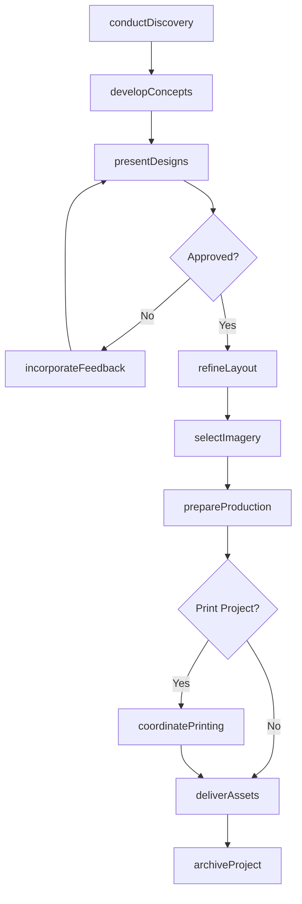
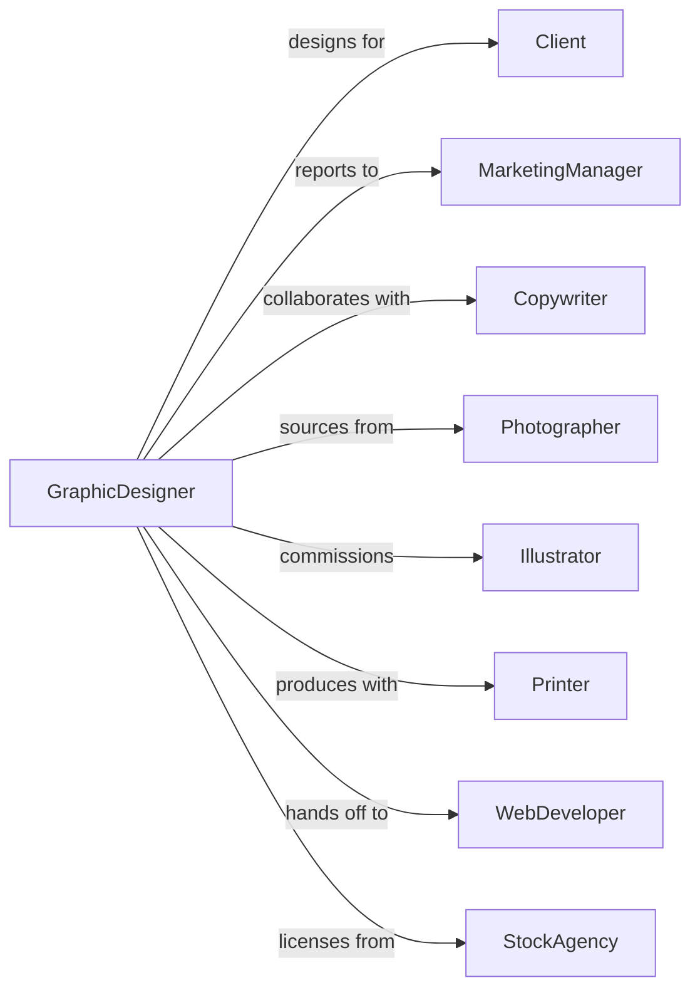

# Graphic Design Services

> Business-as-Code definition for graphic design operations. Models the complete visual design lifecycle from brief through final delivery.

## Overview

Graphic design services plan and produce visual communications including branding, marketing materials, packaging, and digital assets. This definition exposes actions for concept development, design execution, revision management, and production support, with events for approval workflows and deadline tracking.

## Actors

| Actor | Description |
|-------|-------------|
| Client | Business or organization commissioning design work |
| MarketingManager | Client stakeholder directing brand and marketing |
| Copywriter | Writer providing text content for designs |
| Photographer | Professional providing images for layouts |
| Illustrator | Artist creating custom illustrations |
| Printer | Vendor producing printed materials |
| WebDeveloper | Technical partner implementing digital designs |
| StockAgency | Provider of licensed images and assets |

## Roles

| Role | Description |
|------|-------------|
| CreativeDirector | Senior designer leading creative vision and quality |
| GraphicDesigner | Staff designer creating visual solutions |
| ProductionArtist | Specialist preparing files for print and digital |
| BrandDesigner | Designer focused on identity and brand systems |
| MotionDesigner | Specialist creating animated graphics |
| ProjectManager | Coordinates schedules, budgets, and client communications |

## Entities

| Entity | Description |
|--------|-------------|
| Project | Design engagement with scope and deliverables |
| Brief | Documentation of design requirements and objectives |
| Concept | Initial design direction with visual explorations |
| Layout | Arrangement of elements on page or screen |
| BrandGuidelines | Standards for visual identity application |
| Logo | Core brand mark and identity symbol |
| Mockup | Visual representation of design in context |
| ArtFile | Production-ready design file |
| Revision | Updated version incorporating feedback |
| StyleGuide | Documentation of design standards and usage |

## Actions

| Action | Description |
|--------|-------------|
| conductDiscovery | Understand client goals, audience, and requirements |
| developConcepts | Create initial design directions and explorations |
| presentDesigns | Review concepts with client for feedback |
| incorporateFeedback | Revise designs based on client input |
| refineLayout | Finalize composition and typography |
| selectImagery | Choose photographs and illustrations |
| prepareProduction | Create print-ready and digital files |
| coordinatePrinting | Manage print vendor and press checks |
| deliverAssets | Provide final files to client |
| createStyleGuide | Document brand standards and usage rules |
| archiveProject | Store final files and documentation |
| supportImplementation | Assist with design application and rollout |

## Events

| Event | Description |
|-------|-------------|
| discoveryCompleted | Client requirements and context understood |
| conceptsPresented | Initial design directions shown to client |
| conceptApproved | Design direction selected for development |
| feedbackReceived | Client comments requiring revisions |
| revisionsCompleted | Design updated per feedback |
| layoutFinalized | Composition and details confirmed |
| productionReady | Files prepared for output |
| printApproved | Client signed off on press proof |
| assetsDelivered | Final files provided to client |
| styleGuideCompleted | Brand documentation finished |
| projectArchived | Files stored for future reference |
| deadlineApproaching | Project milestone within warning threshold |

## Searches

| Search | Description |
|--------|-------------|
| findProjects | List projects by status, client, or designer |
| getDesignVersions | Retrieve revision history for project |
| searchAssets | Find images and graphics by keyword or project |
| getBrandAssets | Access logo files and brand elements |
| findDeliverables | List final files by project or format |
| getProjectTimeline | Retrieve milestones and deadlines |
| checkVendorStatus | Verify print and production status |

## Workflow



## Actor Relationships



## Usage

### Calling Actions

```typescript
import { designGraphics } from '@headlessly/design-graphics'

const design = designGraphics()

// Conduct discovery and brief development
const brief = await design.conductDiscovery({
  clientId: 'client-123',
  projectName: 'Brand Refresh',
  projectType: 'brand-identity',
  deliverables: ['logo', 'businessCards', 'letterhead', 'brandGuidelines'],
  budget: 15000,
  deadline: '2024-04-30'
})

// Develop and present logo concepts
const concepts = await design.developConcepts({
  projectId: brief.projectId,
  deliverable: 'logo',
  directions: 3,
  styles: ['modern-minimal', 'bold-geometric', 'refined-classic']
})

// Prepare production files
await design.prepareProduction({
  projectId: brief.projectId,
  deliverables: ['logo', 'businessCards'],
  formats: {
    logo: ['ai', 'eps', 'svg', 'png'],
    businessCards: ['pdf-x1a', 'indd']
  },
  colorSpaces: ['cmyk', 'rgb', 'pantone']
})
```

### Event-Driven Automation

```typescript
// Notify when feedback received
design.feedbackReceived(async ({ projectId, feedbackSource, urgency }) => {
  await design.notifyDesigner({
    projectId,
    message: `Client feedback received - ${urgency} priority`,
    assignTo: getProjectDesigner(projectId)
  })
})

// Auto-archive after delivery
design.assetsDelivered(async ({ projectId, deliverables }) => {
  await design.archiveProject({
    projectId,
    deliverables,
    retentionYears: 5,
    includeWorkingFiles: true
  })
})
```
