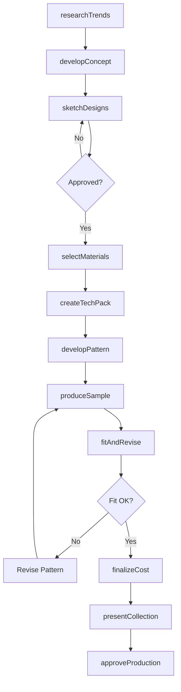
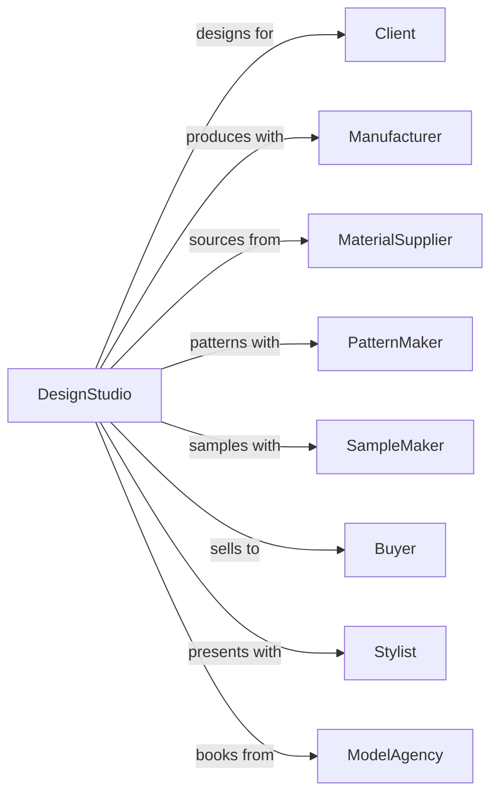

# Other Specialized Design Services

> Business-as-Code definition for specialized design operations. Models the complete design lifecycle for fashion, jewelry, lighting, and other specialty design disciplines.

## Overview

Other specialized design services provide professional design for fashion, costumes, jewelry, lighting, textiles, and other specialty areas. This definition exposes actions for concept development, technical design, sample creation, and production support, with events for collection development and client approval workflows.

## Actors

| Actor | Description |
|-------|-------------|
| Client | Brand, manufacturer, or individual commissioning designs |
| Manufacturer | Factory producing designed items |
| MaterialSupplier | Provider of fabrics, metals, or specialty materials |
| PatternMaker | Specialist creating production patterns |
| SampleMaker | Craftsperson creating prototypes and samples |
| Buyer | Retail or wholesale purchaser of designed products |
| Stylist | Professional coordinating design presentation |
| ModelAgency | Provider of models for presentations and photography |

## Roles

| Role | Description |
|------|-------------|
| DesignDirector | Lead designer setting creative direction |
| Designer | Staff member creating design concepts and details |
| TechnicalDesigner | Specialist translating designs for production |
| SketchArtist | Staff producing concept illustrations |
| CADSpecialist | Technical staff creating digital patterns and models |
| ProductionCoordinator | Manages sampling and manufacturing |

## Entities

| Entity | Description |
|--------|-------------|
| Project | Design engagement with scope and deliverables |
| Collection | Coordinated group of related designs |
| Sketch | Hand or digital illustration of design concept |
| TechPack | Technical documentation for manufacturing |
| Sample | Physical prototype of designed item |
| Pattern | Template for cutting and constructing item |
| Colorway | Specific color variation of design |
| MaterialSpec | Specification of fabrics, metals, or components |
| CostSheet | Breakdown of production costs |
| LineSheet | Catalog of designs for sales presentation |

## Actions

| Action | Description |
|--------|-------------|
| researchTrends | Study market, cultural, and consumer trends |
| developConcept | Create design direction and inspiration |
| sketchDesigns | Illustrate design ideas and variations |
| selectMaterials | Choose fabrics, metals, or components |
| createTechPack | Document technical specifications for production |
| developPattern | Create cutting and construction templates |
| produceSample | Build physical prototype for evaluation |
| fitAndRevise | Test sample and refine design |
| finalizeCost | Calculate production cost and margin |
| presentCollection | Show designs to buyers or clients |
| approveProduction | Authorize manufacturing of final designs |
| coordinateManufacturing | Manage production with factory |

## Events

| Event | Description |
|-------|-------------|
| trendResearchCompleted | Market and style research finished |
| conceptApproved | Design direction confirmed |
| sketchesPresented | Design illustrations shown to client |
| materialsSelected | Fabrics and components chosen |
| techPackIssued | Manufacturing documentation released |
| sampleReceived | Physical prototype delivered |
| fitApproved | Sample passed fitting evaluation |
| costFinalized | Production pricing confirmed |
| collectionPresented | Designs shown to buyers |
| ordersReceived | Purchase orders placed for designs |
| productionStarted | Manufacturing commenced |
| deliveryScheduled | Finished goods shipment planned |

## Searches

| Search | Description |
|--------|-------------|
| findProjects | List projects by status, client, or season |
| getCollectionDesigns | Retrieve designs within collection |
| searchMaterials | Find materials by type, supplier, or properties |
| getSamples | List samples by status or design |
| getTechPacks | Access manufacturing documentation |
| getOrders | Retrieve purchase orders by design or buyer |
| checkProductionStatus | Verify manufacturing progress |

## Workflow



## Actor Relationships



## Usage

### Calling Actions

```typescript
import { designDesigns } from '@headlessly/design-designs'

const studio = designDesigns()

// Develop fashion collection concept
const concept = await studio.developConcept({
  clientId: 'brand-123',
  collectionName: 'Fall 2024',
  designType: 'fashion',
  categories: ['dresses', 'separates', 'outerwear'],
  targetMarket: 'contemporary',
  inspirations: ['architectural-minimalism', 'nature-textures']
})

// Create tech pack for production
const techPack = await studio.createTechPack({
  projectId: concept.projectId,
  styleNumber: 'FW24-001',
  designName: 'Structured Blazer',
  measurements: { bust: 36, waist: 28, length: 26 },
  construction: ['double-faced-wool', 'unlined', 'notch-lapel'],
  colorways: ['black', 'camel', 'navy']
})

// Produce and evaluate sample
await studio.produceSample({
  techPackId: techPack.id,
  sampleSize: 'medium',
  manufacturer: 'sample-factory-001',
  rushFee: false
})
```

### Event-Driven Automation

```typescript
// Schedule fit when sample received
studio.sampleReceived(async ({ projectId, styleNumber, sampleId }) => {
  await studio.scheduleFitting({
    projectId,
    sampleId,
    fitModel: getFitModel(styleNumber),
    attendees: ['designer', 'technical-designer']
  })
})

// Notify on orders received
studio.ordersReceived(async ({ collectionId, totalUnits, buyers }) => {
  await studio.notifyTeam({
    collectionId,
    message: `Orders received: ${totalUnits} units from ${buyers.length} buyers`,
    triggerProduction: totalUnits >= minimumOrder
  })
})
```
