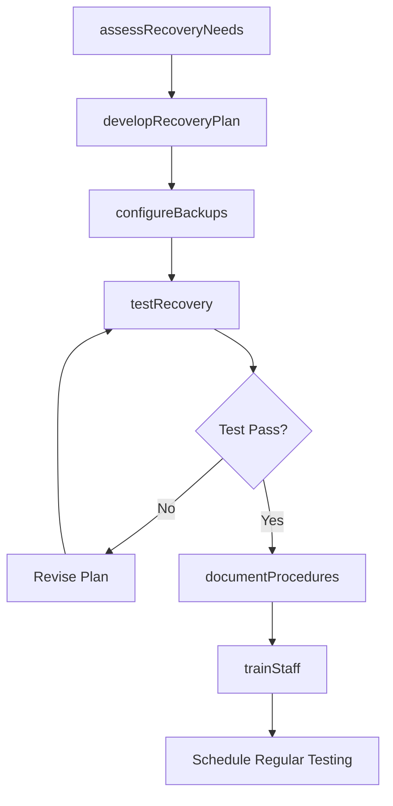
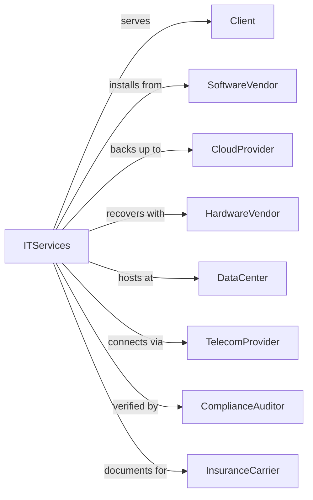

# Other Computer Related Services

> Business-as-Code definition for specialized IT services operations. Models disaster recovery, software installation, and related technical support services.

## Overview

Other computer related services provide disaster recovery planning, software installation, data conversion, and specialized technical support. This definition exposes actions for backup and recovery, software deployment, data migration, and IT consulting, with events for service delivery tracking and incident management.

## Actors

| Actor | Description |
|-------|-------------|
| Client | Organization requiring specialized IT services |
| SoftwareVendor | Provider of applications requiring installation |
| CloudProvider | Infrastructure for backup and recovery services |
| HardwareVendor | Supplier of equipment for recovery sites |
| DataCenter | Facility providing colocation and recovery services |
| TelecomProvider | Network connectivity for recovery operations |
| ComplianceAuditor | Assessor verifying recovery capabilities |
| InsuranceCarrier | Provider requiring proof of recovery readiness |

## Roles

| Role | Description |
|------|-------------|
| DisasterRecoverySpecialist | Plans and tests business continuity solutions |
| DeploymentEngineer | Installs and configures software applications |
| DataMigrationSpecialist | Converts and transfers data between systems |
| TechnicalConsultant | Provides expert guidance on IT solutions |
| SupportTechnician | Delivers technical assistance and troubleshooting |
| ProjectManager | Coordinates service delivery and timelines |

## Entities

| Entity | Description |
|--------|-------------|
| Project | Service engagement with scope and deliverables |
| DisasterRecoveryPlan | Documentation of recovery procedures and priorities |
| BackupSchedule | Defined timing for data protection operations |
| RecoverySite | Alternate location for business continuity |
| Deployment | Software installation project |
| DataMigration | Conversion and transfer of information between systems |
| TestPlan | Strategy for validating recovery or deployment |
| Runbook | Step-by-step procedures for IT operations |
| SupportTicket | Request for technical assistance |
| Assessment | Analysis of current state or requirements |

## Actions

| Action | Description |
|--------|-------------|
| assessRecoveryNeeds | Analyze business continuity requirements |
| developRecoveryPlan | Create disaster recovery procedures and documentation |
| configureBackups | Set up data protection schedules and targets |
| testRecovery | Validate recovery procedures work as planned |
| installSoftware | Deploy applications and configure settings |
| convertData | Transform data between formats or structures |
| migrateData | Transfer data from source to target system |
| provideConsulting | Deliver expert technical guidance |
| resolveTicket | Address user technical support request |
| conductAssessment | Analyze current state and provide recommendations |
| documentProcedures | Create runbooks and operational guides |
| trainStaff | Educate client personnel on systems and procedures |

## Events

| Event | Description |
|-------|-------------|
| needsAssessed | Requirements analyzed and documented |
| recoveryPlanCreated | Disaster recovery procedures documented |
| backupsConfigured | Data protection schedule established |
| recoveryTested | Business continuity validation completed |
| softwareInstalled | Application deployment finished |
| dataConverted | Information transformation completed |
| dataMigrated | Information transfer to target completed |
| consultingDelivered | Expert guidance provided |
| ticketResolved | Support request addressed |
| assessmentCompleted | Analysis and recommendations delivered |
| proceduresDocumented | Runbooks and guides created |
| staffTrained | Client personnel education completed |

## Searches

| Search | Description |
|--------|-------------|
| findProjects | List projects by status, client, or service type |
| getRecoveryPlans | Retrieve disaster recovery documentation |
| searchBackups | Find backup jobs by status or schedule |
| getTestResults | Retrieve recovery test outcomes |
| findDeployments | List software installations by status |
| getMigrationStatus | Check data transfer progress |
| getTickets | Retrieve support requests by status |

## Workflow



## Actor Relationships



## Usage

### Calling Actions

```typescript
import { developIT } from '@headlessly/develop-it'

const itServices = developIT()

// Develop disaster recovery plan
const drPlan = await itServices.developRecoveryPlan({
  clientId: 'client-123',
  criticalSystems: ['erp', 'email', 'crm'],
  rto: { erp: 4, email: 1, crm: 8 }, // hours
  rpo: { erp: 1, email: 0.5, crm: 4 }, // hours
  recoverySite: 'azure-secondary-region',
  testFrequency: 'quarterly'
})

// Configure backup schedules
await itServices.configureBackups({
  clientId: 'client-123',
  targets: [
    { system: 'production-db', frequency: 'hourly', retention: 30 },
    { system: 'file-server', frequency: 'daily', retention: 90 },
    { system: 'email', frequency: '15min', retention: 14 }
  ],
  destination: 'azure-backup-vault'
})

// Test recovery procedures
const test = await itServices.testRecovery({
  planId: drPlan.id,
  testType: 'tabletop',
  scenario: 'datacenter-failure',
  participants: ['it-team', 'business-owners'],
  documentResults: true
})
```

### Event-Driven Automation

```typescript
// Alert on backup failures
itServices.backupsConfigured(async ({ clientId, jobs }) => {
  for (const job of jobs) {
    itServices.monitorBackupJob({
      jobId: job.id,
      alertOnFailure: true,
      escalateAfter: 2 // consecutive failures
    })
  }
})

// Schedule regular recovery tests
itServices.recoveryPlanCreated(async ({ planId, testFrequency }) => {
  await itServices.scheduleRecurringTest({
    planId,
    frequency: testFrequency,
    notifyDaysBefore: 14,
    autoRemind: true
  })
})
```
