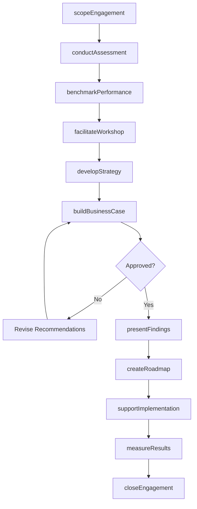
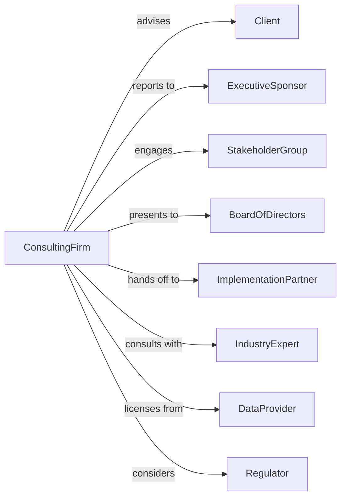

# Administrative Management and General Management Consulting Services

> Business-as-Code definition for management consulting operations. Models the complete engagement lifecycle from assessment through implementation support.

## Overview

Management consulting services provide strategic and operational advice to businesses on administrative management, financial planning, organizational development, and business process improvement. This definition exposes actions for assessment, strategy development, and change implementation, with events for engagement tracking and deliverable management.

## Actors

| Actor | Description |
|-------|-------------|
| Client | Organization commissioning consulting services |
| ExecutiveSponsor | Senior leader championing the engagement |
| StakeholderGroup | Employees and managers affected by recommendations |
| BoardOfDirectors | Governance body approving strategic changes |
| ImplementationPartner | Firm executing recommended changes |
| IndustryExpert | Subject matter specialist providing insights |
| DataProvider | Source of market and benchmark information |
| Regulator | Authority affecting strategic options |

## Roles

| Role | Description |
|------|-------------|
| EngagementPartner | Senior consultant leading client relationship |
| ProjectManager | Coordinates engagement activities and deliverables |
| ManagementConsultant | Analyst performing research and developing recommendations |
| SubjectMatterExpert | Specialist providing domain expertise |
| ChangeManager | Facilitates organizational adoption of recommendations |
| Researcher | Gathers and analyzes data supporting recommendations |

## Entities

| Entity | Description |
|--------|-------------|
| Engagement | Consulting project with scope, timeline, and deliverables |
| Assessment | Analysis of current state and opportunities |
| Strategy | Recommended approach to achieve objectives |
| BusinessCase | Financial justification for recommended changes |
| Roadmap | Phased implementation plan |
| Presentation | Visual communication of findings and recommendations |
| Report | Written documentation of analysis and conclusions |
| Workshop | Facilitated session with client stakeholders |
| Benchmark | Comparison to industry standards or peers |
| KPI | Key performance indicator for measuring success |

## Actions

| Action | Description |
|--------|-------------|
| scopeEngagement | Define project objectives, boundaries, and deliverables |
| conductAssessment | Analyze current state through interviews and data |
| benchmarkPerformance | Compare client to industry standards and peers |
| developStrategy | Create recommendations to achieve objectives |
| buildBusinessCase | Document financial impact and ROI of recommendations |
| facilitateWorkshop | Lead stakeholder sessions for input and alignment |
| presentFindings | Communicate analysis and recommendations to leadership |
| createRoadmap | Develop phased implementation plan |
| supportImplementation | Guide execution of recommended changes |
| measureResults | Track outcomes against defined success metrics |
| transferKnowledge | Educate client team on methodologies and tools |
| closeEngagement | Complete final deliverables and conduct retrospective |

## Events

| Event | Description |
|-------|-------------|
| engagementScoped | Project objectives and boundaries defined |
| assessmentCompleted | Current state analysis finished |
| benchmarkCompleted | Peer and industry comparison finished |
| strategyDeveloped | Recommendations created and documented |
| businessCaseApproved | Financial justification accepted |
| workshopConducted | Stakeholder session completed |
| findingsPresented | Analysis shared with leadership |
| roadmapCreated | Implementation plan developed |
| implementationStarted | Execution of changes commenced |
| milestoneAchieved | Key implementation target reached |
| resultsMeasured | Outcome metrics collected and analyzed |
| engagementClosed | Project completed with final deliverables |

## Searches

| Search | Description |
|--------|-------------|
| findEngagements | List projects by status, client, or type |
| getDeliverables | Retrieve documents and presentations by engagement |
| searchBenchmarks | Find industry comparisons by metric or sector |
| getKPIs | Retrieve success metrics by engagement |
| findWorkshops | List scheduled and completed sessions |
| getTimeline | Retrieve engagement milestones and deadlines |
| getTeamUtilization | Check consultant availability and allocation |

## Workflow



## Actor Relationships



## Usage

### Calling Actions

```typescript
import { consultStrategy } from '@headlessly/consult-strategy'

const consulting = consultStrategy()

// Scope new engagement
const engagement = await consulting.scopeEngagement({
  clientId: 'client-123',
  projectName: 'Digital Transformation Strategy',
  objectives: ['cost-reduction', 'customer-experience', 'agility'],
  scope: ['operations', 'technology', 'organization'],
  duration: 12, // weeks
  team: ['partner-001', 'manager-002', 'consultant-003', 'consultant-004']
})

// Conduct current state assessment
const assessment = await consulting.conductAssessment({
  engagementId: engagement.id,
  methods: ['executive-interviews', 'process-mapping', 'data-analysis'],
  areas: ['cost-structure', 'customer-journey', 'technology-stack'],
  interviewCount: 25
})

// Develop strategic recommendations
await consulting.developStrategy({
  engagementId: engagement.id,
  assessment: assessment.id,
  recommendations: [
    { area: 'operations', initiative: 'process-automation', impact: 'high' },
    { area: 'technology', initiative: 'cloud-migration', impact: 'high' },
    { area: 'organization', initiative: 'agile-transformation', impact: 'medium' }
  ]
})
```

### Event-Driven Automation

```typescript
// Schedule follow-up when milestone achieved
consulting.milestoneAchieved(async ({ engagementId, milestone, date }) => {
  await consulting.scheduleMeeting({
    engagementId,
    purpose: `Review ${milestone} progress`,
    attendees: ['executive-sponsor', 'project-team'],
    scheduleDays: 7
  })
})

// Alert on engagement closing
consulting.engagementClosed(async ({ engagementId, clientId, outcomes }) => {
  await consulting.createCaseStudy({
    engagementId,
    clientId,
    outcomes,
    publishable: outcomes.satisfaction >= 4
  })
})
```
