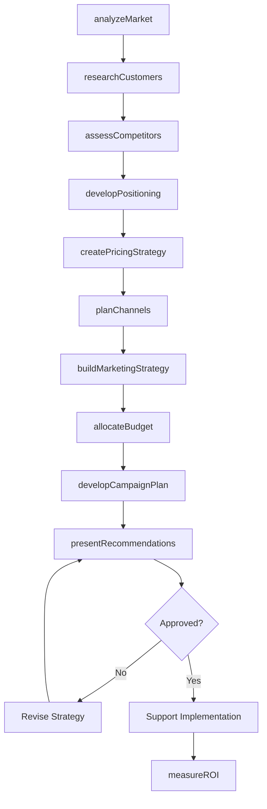
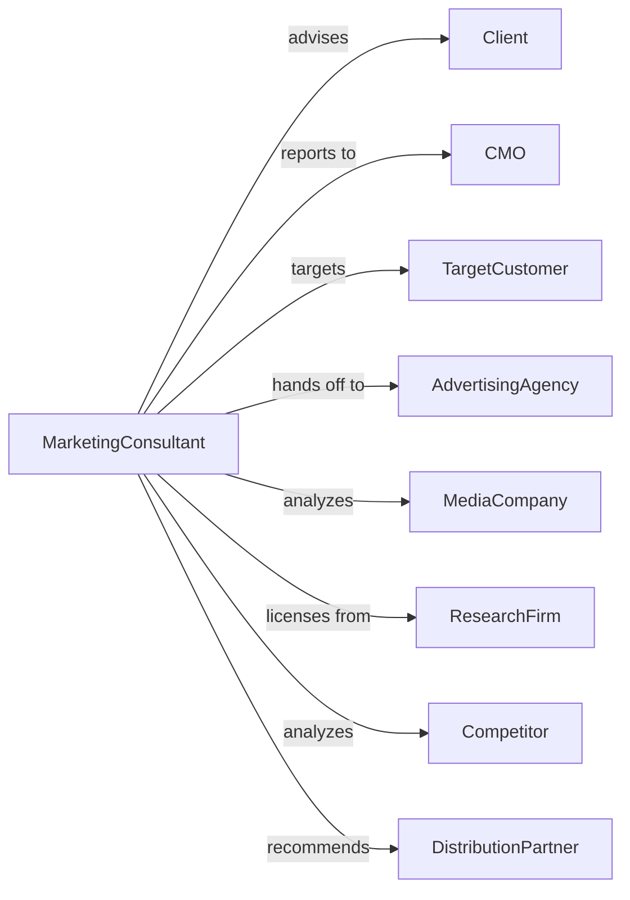

# Marketing Consulting Services

> Business-as-Code definition for marketing consulting operations. Models the complete engagement lifecycle from market analysis through strategy implementation.

## Overview

Marketing consulting services provide advice on marketing objectives, product positioning, pricing strategy, distribution channels, and customer acquisition. This definition exposes actions for market research, strategy development, and campaign planning, with events for engagement tracking and performance measurement.

## Actors

| Actor | Description |
|-------|-------------|
| Client | Organization commissioning marketing consulting |
| CMO | Chief Marketing Officer sponsoring engagement |
| TargetCustomer | Consumer segment being analyzed and targeted |
| AdvertisingAgency | Partner executing marketing campaigns |
| MediaCompany | Platform for advertising and content |
| ResearchFirm | Provider of market and consumer data |
| Competitor | Market rival being analyzed |
| DistributionPartner | Channel partner for product placement |

## Roles

| Role | Description |
|------|-------------|
| EngagementPartner | Senior consultant leading client relationship |
| MarketingConsultant | Specialist developing marketing recommendations |
| MarketResearcher | Analyst studying markets and consumers |
| BrandStrategist | Expert in positioning and identity |
| DigitalStrategist | Specialist in online marketing channels |
| PricingAnalyst | Expert in pricing strategy and optimization |

## Entities

| Entity | Description |
|--------|-------------|
| Engagement | Marketing consulting project with deliverables |
| MarketAnalysis | Study of market size, segments, and trends |
| CustomerResearch | Analysis of target customer needs and behaviors |
| CompetitiveAnalysis | Assessment of rival strategies and positioning |
| MarketingStrategy | Recommended approach to achieve marketing objectives |
| PositioningStatement | Definition of brand differentiation |
| PricingStrategy | Recommended pricing approach and structure |
| ChannelStrategy | Plan for distribution and sales channels |
| CampaignPlan | Tactical marketing execution roadmap |
| MarketingBudget | Financial allocation for marketing activities |

## Actions

| Action | Description |
|--------|-------------|
| analyzeMarket | Study market size, growth, and segmentation |
| researchCustomers | Investigate target customer needs and behaviors |
| assessCompetitors | Analyze rival positioning and strategies |
| developPositioning | Create brand differentiation strategy |
| createPricingStrategy | Design pricing approach and structure |
| planChannels | Develop distribution and sales strategy |
| buildMarketingStrategy | Create comprehensive marketing approach |
| developCampaignPlan | Design tactical marketing execution |
| allocateBudget | Recommend marketing investment allocation |
| measureROI | Track marketing return on investment |
| optimizeMarketing | Refine strategies based on performance |
| presentRecommendations | Share findings and strategies with leadership |

## Events

| Event | Description |
|-------|-------------|
| marketAnalyzed | Market study completed |
| customersResearched | Customer analysis finished |
| competitorsAssessed | Rival analysis completed |
| positioningDeveloped | Brand strategy created |
| pricingStrategyCreated | Pricing approach defined |
| channelsPlanned | Distribution strategy developed |
| strategyCompleted | Marketing strategy finished |
| campaignPlanned | Tactical execution designed |
| budgetAllocated | Marketing investments defined |
| roiMeasured | Performance tracked and analyzed |
| recommendationsPresented | Strategies shared with leadership |
| engagementClosed | Project completed |

## Searches

| Search | Description |
|--------|-------------|
| findEngagements | List projects by status, client, or type |
| getMarketData | Retrieve market size and trend analysis |
| searchCustomerInsights | Find customer research findings |
| getCompetitorProfiles | Access competitive intelligence |
| findStrategies | Retrieve marketing strategies by client |
| getCampaignPerformance | Access marketing effectiveness data |
| getBudgetAllocation | Retrieve marketing spend by channel |

## Workflow



## Actor Relationships



## Usage

### Calling Actions

```typescript
import { consultMarketing } from '@headlessly/consult-marketing'

const marketing = consultMarketing()

// Analyze market opportunity
const market = await marketing.analyzeMarket({
  clientId: 'client-123',
  category: 'premium-skincare',
  geography: 'north-america',
  segments: ['anti-aging', 'natural-organic', 'clinical'],
  horizon: 5 // years
})

// Research target customers
const customers = await marketing.researchCustomers({
  engagementId: market.engagementId,
  segments: ['affluent-millennials', 'skincare-enthusiasts'],
  methods: ['surveys', 'focus-groups', 'social-listening'],
  sampleSize: 1200
})

// Build comprehensive marketing strategy
await marketing.buildMarketingStrategy({
  engagementId: market.engagementId,
  objectives: ['market-share-growth', 'brand-awareness', 'customer-acquisition'],
  positioning: 'science-backed-luxury',
  channels: ['digital', 'retail', 'derm-professional'],
  budget: 5000000
})
```

### Event-Driven Automation

```typescript
// Track ROI after campaign launch
marketing.campaignPlanned(async ({ engagementId, campaign, launchDate }) => {
  await marketing.scheduleROIReview({
    engagementId,
    campaign,
    reviewDate: addMonths(launchDate, 3),
    metrics: ['awareness', 'consideration', 'conversion', 'ltv']
  })
})

// Trigger optimization recommendations
marketing.roiMeasured(async ({ engagementId, performance, benchmarks }) => {
  if (performance.roi < benchmarks.target) {
    await marketing.optimizeMarketing({
      engagementId,
      underperforming: identifyUnderperformers(performance),
      recommendations: generateOptimizations(performance)
    })
  }
})
```
