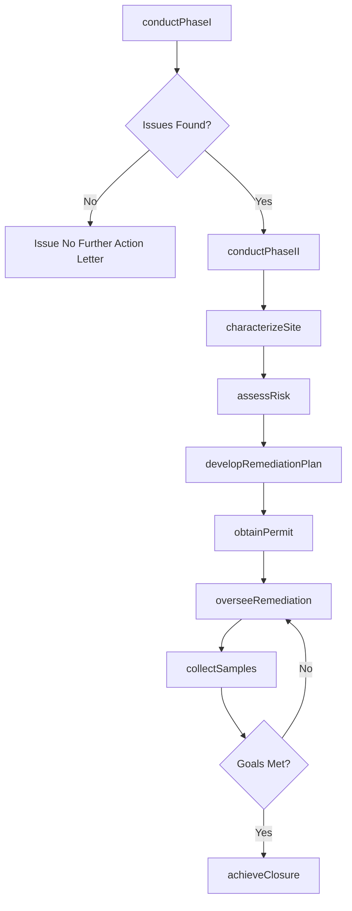
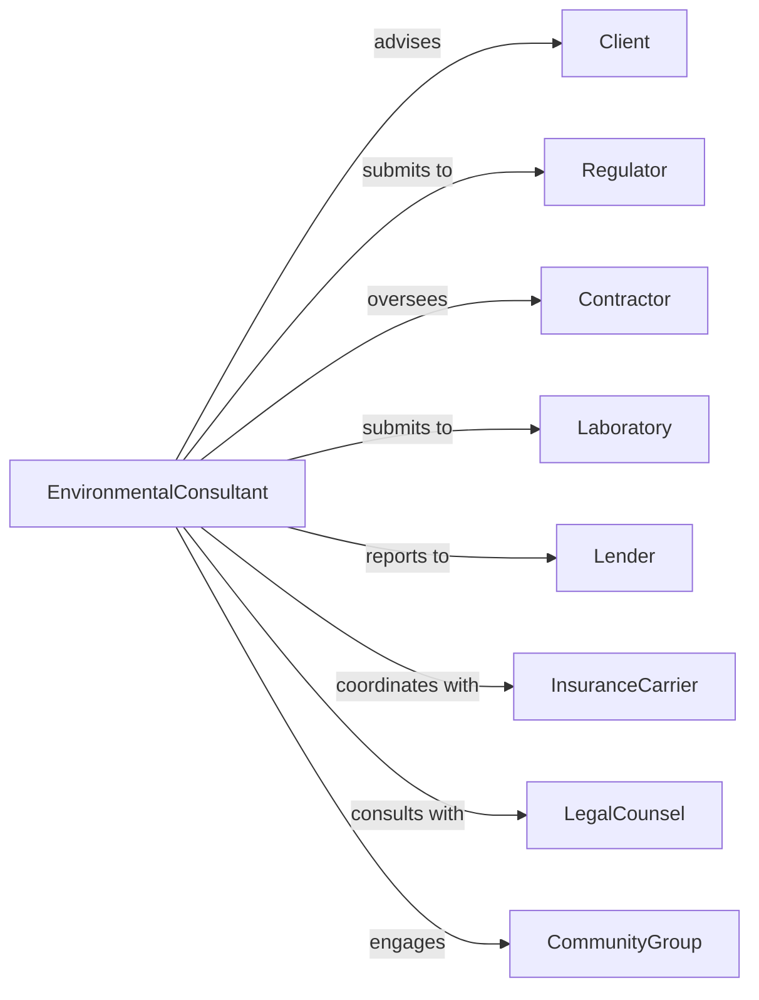

# Environmental Consulting Services

> Business-as-Code definition for environmental consulting operations. Models site assessments, remediation planning, and regulatory compliance services.

## Overview

Environmental consulting services provide advice on contamination control, hazardous materials management, regulatory compliance, and sustainability. This definition exposes actions for site assessment, risk evaluation, and remediation planning, with events for project tracking and compliance monitoring.

## Actors

| Actor | Description |
|-------|-------------|
| Client | Property owner or organization requiring environmental services |
| Regulator | EPA, state agency, or local authority enforcing standards |
| Contractor | Firm performing remediation or abatement work |
| Laboratory | Facility analyzing environmental samples |
| Lender | Financial institution requiring environmental due diligence |
| InsuranceCarrier | Provider of environmental liability coverage |
| LegalCounsel | Attorney advising on environmental liability |
| CommunityGroup | Local stakeholders affected by environmental conditions |

## Roles

| Role | Description |
|------|-------------|
| PrincipalConsultant | Senior environmental professional leading projects |
| EnvironmentalScientist | Specialist conducting assessments and analysis |
| Geologist | Expert in subsurface conditions and groundwater |
| ToxicologistConsultant | Specialist in health risk assessment |
| ProjectManager | Coordinates field work and deliverables |
| FieldTechnician | Collects samples and conducts field testing |

## Entities

| Entity | Description |
|--------|-------------|
| Project | Environmental consulting engagement |
| PhaseIAssessment | Historical review and site reconnaissance |
| PhaseIIAssessment | Subsurface investigation with sampling |
| SiteCharacterization | Full delineation of contamination extent |
| RiskAssessment | Evaluation of human health and ecological risks |
| RemediationPlan | Strategy for addressing contamination |
| ComplianceAudit | Review of regulatory adherence |
| Sample | Environmental media collected for analysis |
| Report | Documentation of findings and recommendations |
| Permit | Regulatory authorization for activities |

## Actions

| Action | Description |
|--------|-------------|
| conductPhaseI | Perform historical review and site inspection |
| conductPhaseII | Collect and analyze subsurface samples |
| characterizeSite | Delineate full extent of contamination |
| assessRisk | Evaluate health and ecological hazards |
| developRemediationPlan | Design contamination cleanup strategy |
| auditCompliance | Review adherence to environmental regulations |
| collectSamples | Gather soil, groundwater, or air samples |
| analyzeData | Interpret laboratory results and field data |
| prepareReport | Document findings and recommendations |
| obtainPermit | Secure regulatory approvals for activities |
| overseeRemediation | Manage cleanup contractor activities |
| achieveClosure | Obtain regulatory sign-off on completed work |

## Events

| Event | Description |
|-------|-------------|
| phaseICompleted | Historical assessment finished |
| phaseIICompleted | Subsurface investigation finished |
| siteCharacterized | Contamination extent defined |
| riskAssessed | Health and ecological evaluation completed |
| remediationPlanApproved | Cleanup strategy accepted by regulator |
| complianceAudited | Regulatory review completed |
| samplesCollected | Environmental media gathered |
| dataAnalyzed | Laboratory results interpreted |
| reportDelivered | Documentation provided to client |
| permitObtained | Regulatory authorization secured |
| remediationComplete | Cleanup activities finished |
| closureAchieved | Regulatory sign-off obtained |

## Searches

| Search | Description |
|--------|-------------|
| findProjects | List projects by status, client, or site |
| getAssessments | Retrieve Phase I or Phase II reports |
| searchRegulations | Find applicable environmental requirements |
| getSampleResults | Access laboratory analytical data |
| findContaminants | List detected chemicals by site |
| getPermitStatus | Check regulatory authorization status |
| getRemediationProgress | Track cleanup milestone completion |

## Workflow



## Actor Relationships



## Usage

### Calling Actions

```typescript
import { consultEnvironment } from '@headlessly/consult-environment'

const environmental = consultEnvironment()

// Conduct Phase I Environmental Site Assessment
const phaseI = await environmental.conductPhaseI({
  clientId: 'client-123',
  siteAddress: '1234 Industrial Parkway',
  propertySize: 15, // acres
  currentUse: 'manufacturing',
  transactionType: 'acquisition',
  standard: 'ASTM-E1527-21'
})

// Conduct Phase II investigation if issues found
if (phaseI.recognizedEnvironmentalConditions.length > 0) {
  const phaseII = await environmental.conductPhaseII({
    projectId: phaseI.projectId,
    concernAreas: phaseI.recognizedEnvironmentalConditions,
    samplingPlan: {
      soilBorings: 12,
      monitoringWells: 4,
      indoorAir: true
    },
    targetContaminants: ['petroleum', 'chlorinated-solvents']
  })
}

// Develop remediation strategy
await environmental.developRemediationPlan({
  projectId: phaseI.projectId,
  contaminants: ['tce', 'pce'],
  remediationTechnology: 'in-situ-chemical-oxidation',
  timeframe: 24, // months
  estimatedCost: 850000
})
```

### Event-Driven Automation

```typescript
// Alert on contamination detection
environmental.phaseIICompleted(async ({ projectId, results }) => {
  if (results.exceedances.length > 0) {
    await environmental.notifyStakeholders({
      projectId,
      recipients: ['client', 'lender', 'legal'],
      findings: results.exceedances,
      recommendedActions: generateRecommendations(results)
    })
  }
})

// Schedule follow-up sampling
environmental.remediationComplete(async ({ projectId, finalResults }) => {
  await environmental.scheduleConfirmatorySampling({
    projectId,
    samplingRounds: 4,
    frequency: 'quarterly',
    targetContaminants: finalResults.targetContaminants
  })
})
```
