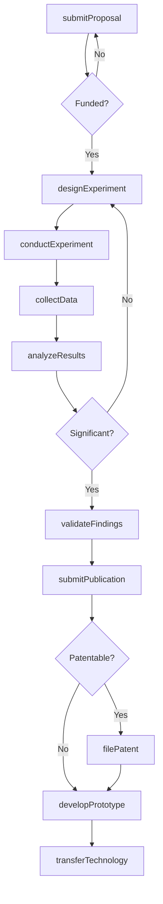
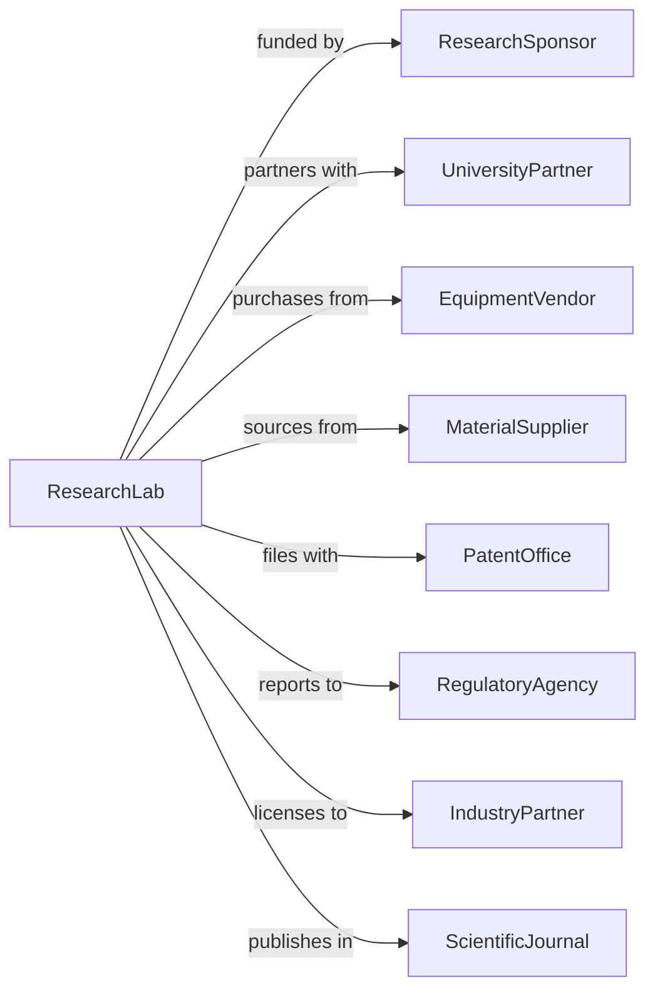

# Research and Development in the Physical, Engineering, and Life Sciences (except Nanotechnology and Biotechnology)

> Business-as-Code definition for physical and engineering sciences R&D. Models research programs in physics, chemistry, engineering, and life sciences.

## Overview

Physical, engineering, and life sciences R&D conducts research in electronics, materials, chemistry, physics, agriculture, medicine, and environmental sciences. This definition exposes actions for experimental research, prototype development, and technology commercialization, with events for milestone tracking and publication management.

## Actors

| Actor | Description |
|-------|-------------|
| ResearchSponsor | Government agency or corporation funding research |
| UniversityPartner | Academic institution collaborating on projects |
| EquipmentVendor | Supplier of scientific instruments and tools |
| MaterialSupplier | Provider of chemicals and research materials |
| PatentOffice | Authority granting intellectual property protection |
| RegulatoryAgency | Authority overseeing safety and compliance |
| IndustryPartner | Company commercializing research outcomes |
| ScientificJournal | Publisher of peer-reviewed research |

## Roles

| Role | Description |
|------|-------------|
| PrincipalInvestigator | Senior scientist leading research program |
| ResearchScientist | Expert conducting experiments and analysis |
| ResearchEngineer | Specialist in applied engineering research |
| LabTechnician | Supports experimental work and equipment |
| DataScientist | Analyzes research data and models |
| ProjectManager | Coordinates research activities and budgets |

## Entities

| Entity | Description |
|--------|-------------|
| ResearchProgram | Funded project with scientific objectives |
| Grant | Financial award supporting research |
| Experiment | Controlled scientific investigation |
| Prototype | Functional demonstration of technology |
| Dataset | Collection of experimental observations |
| Publication | Peer-reviewed documentation of findings |
| Patent | Intellectual property protection |
| Equipment | Scientific instruments and apparatus |
| Sample | Material collected or created for analysis |
| Collaboration | Partnership with external entities |

## Actions

| Action | Description |
|--------|-------------|
| submitProposal | Apply for research funding |
| designExperiment | Plan controlled scientific investigation |
| conductExperiment | Execute research protocol |
| collectData | Gather experimental observations |
| analyzeResults | Interpret data and draw conclusions |
| developPrototype | Create functional technology demonstration |
| validateFindings | Confirm results through replication |
| submitPublication | Prepare and submit peer-reviewed paper |
| filePatent | Apply for intellectual property protection |
| transferTechnology | License innovations for commercialization |
| collaborateExternal | Partner with universities or companies |
| reportProgress | Update sponsors on milestones |

## Events

| Event | Description |
|-------|-------------|
| proposalSubmitted | Funding application completed |
| grantAwarded | Research funding secured |
| experimentDesigned | Investigation protocol created |
| experimentConducted | Research protocol executed |
| dataCollected | Observations gathered |
| resultsAnalyzed | Data interpreted and validated |
| prototypeCompleted | Technology demonstration finished |
| findingsValidated | Results confirmed through replication |
| publicationAccepted | Paper accepted for publication |
| patentFiled | IP application submitted |
| technologyTransferred | Commercial licensing executed |
| progressReported | Sponsor update delivered |

## Searches

| Search | Description |
|--------|-------------|
| findPrograms | List research programs by status or field |
| getGrants | Retrieve funding awards and terms |
| searchExperiments | Find investigations by topic or method |
| getDatasets | Access experimental data collections |
| findPublications | List papers by author or topic |
| getPatents | Retrieve intellectual property filings |
| getPrototypes | Access technology demonstrations |

## Workflow



## Actor Relationships



## Usage

### Calling Actions

```typescript
import { researchScience } from '@headlessly/research-science'

const lab = researchScience()

// Design materials science experiment
const experiment = await lab.designExperiment({
  programId: 'prog-123',
  field: 'materials-science',
  objective: 'develop-high-temperature-superconductor',
  hypothesis: 'copper-oxide-perovskite-doping-improves-tc',
  methodology: 'systematic-composition-variation',
  equipment: ['arc-melter', 'xrd', 'squid-magnetometer'],
  duration: 12 // months
})

// Conduct synthesis and characterization
const results = await lab.conductExperiment({
  experimentId: experiment.id,
  samples: 48,
  variables: ['dopant-concentration', 'annealing-temperature'],
  measurements: ['crystal-structure', 'critical-temperature', 'critical-current']
})

// Develop prototype device
await lab.developPrototype({
  programId: 'prog-123',
  findings: results.significantFindings,
  prototypeType: 'superconducting-cable',
  targetSpecs: {
    criticalCurrent: 1000, // amperes
    operatingTemperature: 77, // kelvin
    length: 1 // meter
  }
})
```

### Event-Driven Automation

```typescript
// Flag breakthrough results
lab.resultsAnalyzed(async ({ experimentId, results, benchmarks }) => {
  if (results.improvement > 0.5) { // 50% improvement
    await lab.flagBreakthrough({
      experimentId,
      improvement: results.improvement,
      notifyPI: true,
      scheduleReview: true
    })
  }
})

// Coordinate validation studies
lab.findingsValidated(async ({ experimentId, validation }) => {
  if (validation.confirmed) {
    await lab.initiatePublicationDraft({
      experimentId,
      targetJournal: selectJournal(validation.significance),
      coauthors: validation.contributors
    })
  }
})
```
