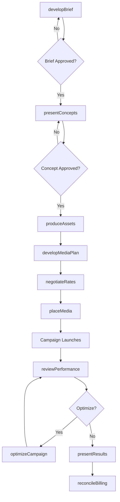
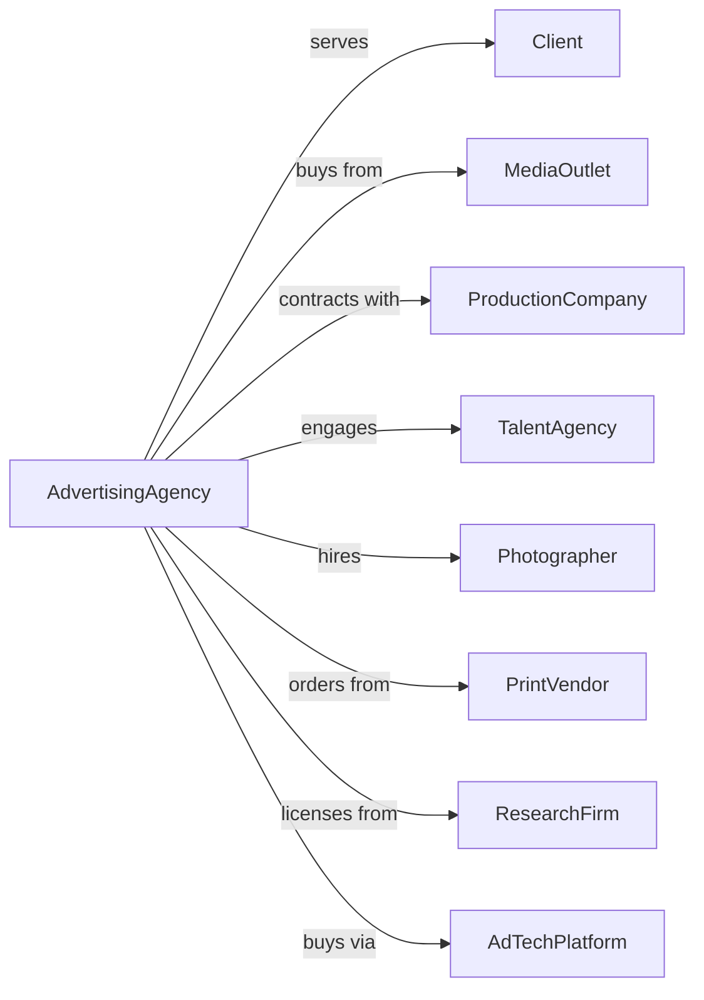

# Advertising Agencies

> Business-as-Code definition for advertising agency operations. Models the complete campaign lifecycle from strategy through media placement and performance analysis.

## Overview

Advertising agencies create and execute advertising campaigns across print, digital, broadcast, and outdoor media. This definition exposes actions for creative development, media planning, and campaign management, with events for client approval, launch tracking, and performance measurement.

## Actors

| Actor | Description |
|-------|-------------|
| Client | Brand or company commissioning advertising services |
| MediaOutlet | Publisher or broadcaster selling advertising inventory |
| ProductionCompany | Firm producing video, audio, or print content |
| TalentAgency | Representative providing actors, models, or voiceover artists |
| Photographer | Professional capturing images for campaigns |
| PrintVendor | Company producing physical advertising materials |
| ResearchFirm | Provider of audience and market data |
| AdTechPlatform | Technology for programmatic media buying |

## Roles

| Role | Description |
|------|-------------|
| AccountDirector | Senior leader managing client relationship |
| CreativeDirector | Leads creative strategy and concept development |
| ArtDirector | Designs visual elements of campaigns |
| Copywriter | Writes advertising copy and scripts |
| MediaPlanner | Develops media strategy and channel allocation |
| AccountExecutive | Day-to-day client liaison and project coordination |

## Entities

| Entity | Description |
|--------|-------------|
| Campaign | Advertising initiative with objectives and budget |
| CreativeBrief | Document defining campaign goals and messaging |
| Concept | Creative idea for campaign execution |
| Asset | Visual, video, or audio content for advertising |
| MediaPlan | Strategy for channel selection and budget allocation |
| Insertion | Placement of ad in specific media outlet |
| Performance | Metrics tracking campaign effectiveness |
| Storyboard | Visual representation of video concept |
| Proof | Review version of creative for client approval |
| Invoice | Billing document for services rendered |

## Actions

| Action | Description |
|--------|-------------|
| developBrief | Create strategic foundation for campaign |
| presentConcepts | Share creative ideas with client for approval |
| produceAssets | Create visual, video, or audio content |
| developMediaPlan | Design channel strategy and budget allocation |
| negotiateRates | Secure favorable pricing from media outlets |
| placeMedia | Execute ad insertions across channels |
| manageProduction | Oversee creation of campaign materials |
| reviewPerformance | Analyze campaign metrics and effectiveness |
| optimizeCampaign | Adjust placements and creative based on results |
| presentResults | Share campaign performance with client |
| reconcileBilling | Verify media charges and process invoices |
| archiveCampaign | Store assets and documentation for future reference |

## Events

| Event | Description |
|-------|-------------|
| briefApproved | Client accepted strategic foundation |
| conceptsPresented | Creative ideas shared with client |
| conceptApproved | Client selected creative direction |
| assetsProduced | Campaign materials completed |
| mediaPlanApproved | Channel strategy accepted by client |
| ratesNegotiated | Media pricing finalized |
| campaignLaunched | Advertising went live |
| performanceReported | Metrics delivered to client |
| campaignOptimized | Adjustments made based on results |
| campaignCompleted | Initiative concluded |
| billingReconciled | Invoices verified and processed |
| campaignArchived | Assets and documentation stored |

## Searches

| Search | Description |
|--------|-------------|
| findCampaigns | List campaigns by client, status, or date |
| getAssets | Retrieve creative materials by campaign |
| searchMediaPlans | Find channel strategies by budget or audience |
| getPerformance | Access campaign metrics and analytics |
| findInsertions | List ad placements by media outlet |
| getBillingStatus | Check invoice and payment status |
| getCreativeBriefs | Retrieve strategic documents by client |

## Workflow



## Actor Relationships



## Usage

### Calling Actions

```typescript
import { advertiseCampaigns } from '@headlessly/advertise-campaigns'

const agency = advertiseCampaigns()

// Develop creative brief
const brief = await agency.developBrief({
  clientId: 'client-123',
  campaignName: 'Summer Product Launch',
  objectives: ['awareness', 'consideration', 'trial'],
  targetAudience: 'millennials-25-34',
  budget: 2500000,
  flightDates: { start: '2024-06-01', end: '2024-08-31' },
  keyMessages: ['innovation', 'sustainability', 'value']
})

// Develop media plan
const mediaPlan = await agency.developMediaPlan({
  campaignId: brief.campaignId,
  channels: [
    { type: 'digital-video', allocation: 0.35 },
    { type: 'social', allocation: 0.30 },
    { type: 'connected-tv', allocation: 0.20 },
    { type: 'display', allocation: 0.15 }
  ],
  targetReach: 0.70,
  targetFrequency: 4.5
})

// Place media buys
await agency.placeMedia({
  campaignId: brief.campaignId,
  mediaPlanId: mediaPlan.id,
  insertions: mediaPlan.recommendedInsertions,
  trafficking: 'programmatic'
})
```

### Event-Driven Automation

```typescript
// Optimize based on performance
agency.performanceReported(async ({ campaignId, metrics }) => {
  const underperformers = metrics.placements.filter(p => p.ctr < 0.002)
  if (underperformers.length > 0) {
    await agency.optimizeCampaign({
      campaignId,
      actions: underperformers.map(p => ({
        placementId: p.id,
        action: 'reduce-budget',
        reallocateTo: 'top-performers'
      }))
    })
  }
})

// Alert on campaign launch
agency.campaignLaunched(async ({ campaignId, clientId, flightStart }) => {
  await agency.notifyClient({
    clientId,
    campaignId,
    message: `Campaign is now live as of ${flightStart}`,
    includeTrackingLinks: true
  })
})
```
