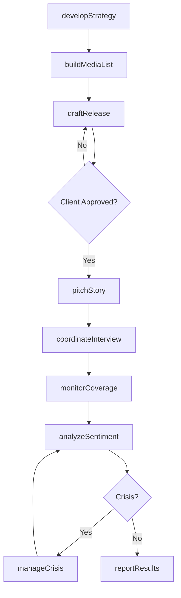
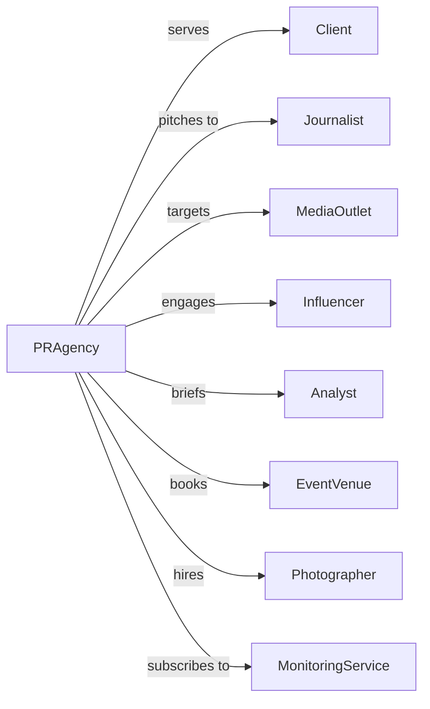

# Public Relations Agencies

> Business-as-Code definition for public relations agency operations. Models campaign development, media relations, and reputation management services.

## Overview

Public relations agencies design and implement communications campaigns to promote client interests, manage reputation, and influence public perception. This definition exposes actions for media outreach, content development, and crisis management, with events for coverage tracking and sentiment analysis.

## Actors

| Actor | Description |
|-------|-------------|
| Client | Organization commissioning PR services |
| Journalist | Reporter covering client news and stories |
| MediaOutlet | Publication, broadcast, or digital news platform |
| Influencer | Social media personality with audience reach |
| Analyst | Industry expert providing third-party validation |
| EventVenue | Location hosting press events and conferences |
| Photographer | Professional capturing event and PR imagery |
| MonitoringService | Provider tracking media coverage and sentiment |

## Roles

| Role | Description |
|------|-------------|
| AccountDirector | Senior leader managing client relationship |
| PublicistSenior | Leads media strategy and journalist relationships |
| MediaRelationsSpecialist | Pitches stories and manages press inquiries |
| ContentStrategist | Develops messaging and content plans |
| SocialMediaManager | Manages digital presence and engagement |
| CrisisConsultant | Handles reputation threats and issues |

## Entities

| Entity | Description |
|--------|-------------|
| Campaign | PR initiative with objectives and timeline |
| PressRelease | Formal announcement for media distribution |
| MediaList | Targeted journalists and outlets for outreach |
| Pitch | Story angle presented to journalists |
| Coverage | Earned media placement in publications |
| PressKit | Collection of materials for media use |
| Event | Press conference, launch, or media gathering |
| SentimentReport | Analysis of public perception and tone |
| TalkingPoints | Key messages for spokesperson use |
| CrisisPlan | Protocol for managing reputation threats |

## Actions

| Action | Description |
|--------|-------------|
| developStrategy | Create communications plan and messaging |
| draftRelease | Write press announcement for distribution |
| buildMediaList | Identify target journalists and outlets |
| pitchStory | Present story angles to journalists |
| coordinateInterview | Arrange media opportunities for spokespeople |
| planEvent | Organize press conferences or media gatherings |
| monitorCoverage | Track earned media placements |
| analyzeSentiment | Assess public perception and tone |
| manageCrisis | Address reputation threats and issues |
| prepareSpokesperson | Train executives for media appearances |
| reportResults | Share coverage and impact metrics with client |
| manageInfluencers | Coordinate partnerships with social personalities |

## Events

| Event | Description |
|-------|-------------|
| strategyApproved | Communications plan accepted by client |
| releaseDistributed | Press announcement sent to media |
| storyPitched | Angle presented to journalist |
| interviewScheduled | Media opportunity arranged |
| coverageSecured | Story published in target outlet |
| eventCompleted | Press gathering concluded |
| sentimentAnalyzed | Perception assessment completed |
| crisisEscalated | Reputation threat identified |
| crisisResolved | Threat successfully managed |
| spokespersonPrepared | Executive trained for media |
| resultsReported | Campaign metrics shared with client |
| influencerActivated | Social personality partnership launched |

## Searches

| Search | Description |
|--------|-------------|
| findCampaigns | List PR initiatives by client or status |
| getCoverage | Retrieve earned media placements |
| searchJournalists | Find reporters by beat or outlet |
| getSentiment | Access perception analysis reports |
| findEvents | List press gatherings by date or type |
| getMediaLists | Retrieve targeted outlet compilations |
| getCrisisHistory | Access past incident documentation |

## Workflow



## Actor Relationships



## Usage

### Calling Actions

```typescript
import { advertiseReputation } from '@headlessly/advertise-reputation'

const pr = advertiseReputation()

// Develop PR strategy
const strategy = await pr.developStrategy({
  clientId: 'client-123',
  campaignName: 'Product Launch PR',
  objectives: ['awareness', 'credibility', 'thought-leadership'],
  targetAudiences: ['trade-media', 'business-press', 'consumer-tech'],
  keyMessages: ['innovation', 'market-leadership', 'customer-value'],
  timeline: { start: '2024-03-01', end: '2024-06-30' }
})

// Build targeted media list
const mediaList = await pr.buildMediaList({
  campaignId: strategy.campaignId,
  beats: ['enterprise-technology', 'business', 'innovation'],
  outlets: ['tier-1-business', 'trade-publications', 'podcasts'],
  targetCount: 150
})

// Pitch story to journalists
await pr.pitchStory({
  campaignId: strategy.campaignId,
  mediaListId: mediaList.id,
  angle: 'industry-disruption',
  exclusiveOffer: true,
  embargoDate: '2024-03-15',
  assets: ['press-release', 'executive-bio', 'product-images']
})
```

### Event-Driven Automation

```typescript
// Track coverage placement
pr.coverageSecured(async ({ campaignId, coverage }) => {
  await pr.updateCoverageReport({
    campaignId,
    placement: coverage,
    calculateReach: true,
    calculateAVE: true
  })

  if (coverage.tier === 1) {
    await pr.notifyClient({
      campaignId,
      message: `Major coverage secured in ${coverage.outlet}`,
      includeLink: true
    })
  }
})

// Respond to crisis signals
pr.sentimentAnalyzed(async ({ campaignId, sentiment }) => {
  if (sentiment.negativeRatio > 0.3) {
    await pr.escalateCrisis({
      campaignId,
      severity: calculateSeverity(sentiment),
      triggers: sentiment.negativeTopics,
      recommendedActions: generateCrisisResponse(sentiment)
    })
  }
})
```
