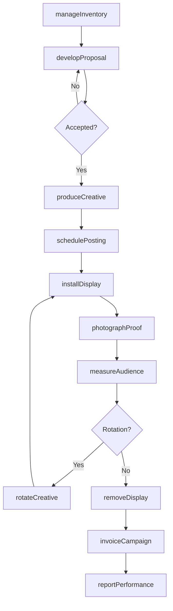
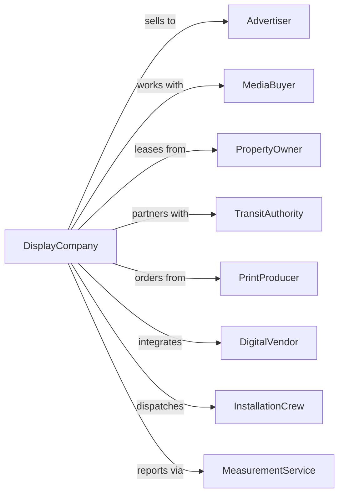

# Indoor and Outdoor Display Advertising

> Business-as-Code definition for out-of-home advertising operations. Models billboard, transit, and place-based display advertising services.

## Overview

Indoor and outdoor display advertising creates and places visual advertising on billboards, transit vehicles, shopping malls, and other public spaces. This definition exposes actions for inventory management, creative production, and campaign execution, with events for installation tracking and audience measurement.

## Actors

| Actor | Description |
|-------|-------------|
| Advertiser | Brand purchasing display advertising |
| MediaBuyer | Agency placing out-of-home media |
| PropertyOwner | Landlord or authority controlling display locations |
| TransitAuthority | Operator of buses, trains, or stations with ad inventory |
| PrintProducer | Company manufacturing printed display materials |
| DigitalVendor | Provider of electronic display technology |
| InstallationCrew | Team mounting or posting advertising materials |
| MeasurementService | Provider of audience and impression data |

## Roles

| Role | Description |
|------|-------------|
| SalesDirector | Senior leader managing advertiser relationships |
| InventoryManager | Oversees available display locations |
| CreativeProducer | Manages design and production of displays |
| FieldOperationsManager | Coordinates installation and maintenance |
| AccountExecutive | Sells display inventory to advertisers |
| TrafficCoordinator | Schedules campaigns and manages materials |

## Entities

| Entity | Description |
|--------|-------------|
| DisplayUnit | Physical location for advertising placement |
| Campaign | Advertising initiative with scheduled placements |
| Creative | Designed artwork for display production |
| Posting | Installation of advertising material on unit |
| Inventory | Available display locations for sale |
| Contract | Agreement with property owner for location rights |
| Proof | Photograph confirming installation |
| Impression | Estimated audience exposure |
| Market | Geographic area with display network |
| Rate | Pricing for display placement |

## Actions

| Action | Description |
|--------|-------------|
| manageInventory | Track available display locations |
| developProposal | Create custom placement package for advertiser |
| produceCreative | Design and manufacture display materials |
| schedulePosting | Plan installation timeline for campaign |
| installDisplay | Mount advertising materials on units |
| photographProof | Document installed advertising |
| measureAudience | Estimate impressions and reach |
| maintainUnit | Service and repair display structures |
| rotateCreative | Change advertising materials per schedule |
| removeDisplay | Take down completed campaign materials |
| invoiceCampaign | Bill advertiser for placements |
| reportPerformance | Share audience metrics with advertiser |

## Events

| Event | Description |
|-------|-------------|
| inventoryUpdated | Available locations refreshed |
| proposalAccepted | Advertiser confirmed package |
| creativeProduced | Display materials manufactured |
| postingScheduled | Installation timeline set |
| displayInstalled | Materials mounted on unit |
| proofCaptured | Installation photograph taken |
| audienceMeasured | Impression estimates generated |
| unitMaintained | Structure serviced or repaired |
| creativeRotated | New materials installed |
| displayRemoved | Campaign materials taken down |
| campaignInvoiced | Billing sent to advertiser |
| performanceReported | Metrics shared with advertiser |

## Searches

| Search | Description |
|--------|-------------|
| findUnits | List display locations by market or type |
| getInventory | Check available units by date |
| searchCampaigns | Find active advertising by advertiser |
| getProofs | Retrieve installation photographs |
| findContracts | List property agreements by status |
| getAudienceData | Access impression and reach estimates |
| getMaintenanceLog | Check unit service history |

## Workflow



## Actor Relationships



## Usage

### Calling Actions

```typescript
import { advertiseDisplays } from '@headlessly/advertise-displays'

const ooh = advertiseDisplays()

// Develop proposal for advertiser
const proposal = await ooh.developProposal({
  advertiserId: 'adv-123',
  markets: ['new-york', 'los-angeles', 'chicago'],
  unitTypes: ['bulletin', 'poster', 'digital-board'],
  flightDates: { start: '2024-06-01', end: '2024-08-31' },
  budget: 450000,
  targetImpressions: 75000000
})

// Produce creative materials
const creative = await ooh.produceCreative({
  campaignId: proposal.campaignId,
  formats: [
    { type: 'bulletin', size: '14x48', quantity: 25 },
    { type: 'poster', size: '12x24', quantity: 150 },
    { type: 'digital', resolution: '1920x1080', quantity: 50 }
  ],
  artwork: 'approved-design-v3.ai',
  productionDeadline: '2024-05-15'
})

// Schedule posting
await ooh.schedulePosting({
  campaignId: proposal.campaignId,
  creativeId: creative.id,
  postingWindow: { start: '2024-05-28', end: '2024-06-01' },
  proofDeadline: '2024-06-03'
})
```

### Event-Driven Automation

```typescript
// Capture and deliver proofs
ooh.displayInstalled(async ({ campaignId, unitId, installDate }) => {
  await ooh.scheduleProofCapture({
    campaignId,
    unitId,
    captureDate: addDays(installDate, 1),
    deliverToClient: true
  })
})

// Alert on maintenance needs
ooh.unitMaintained(async ({ unitId, issue, resolution }) => {
  if (issue.impactsCampaign) {
    await ooh.notifyAffectedAdvertisers({
      unitId,
      issue,
      expectedResolution: resolution.date,
      offerMakegood: true
    })
  }
})
```
