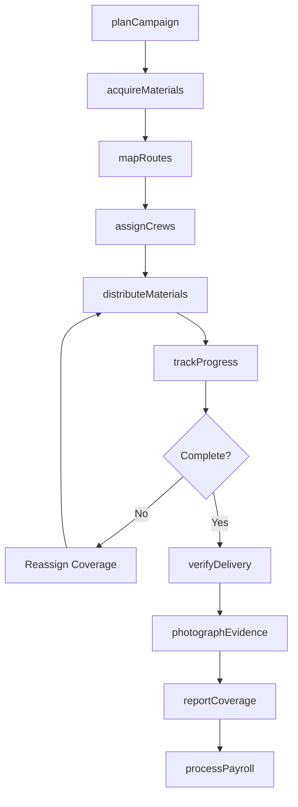
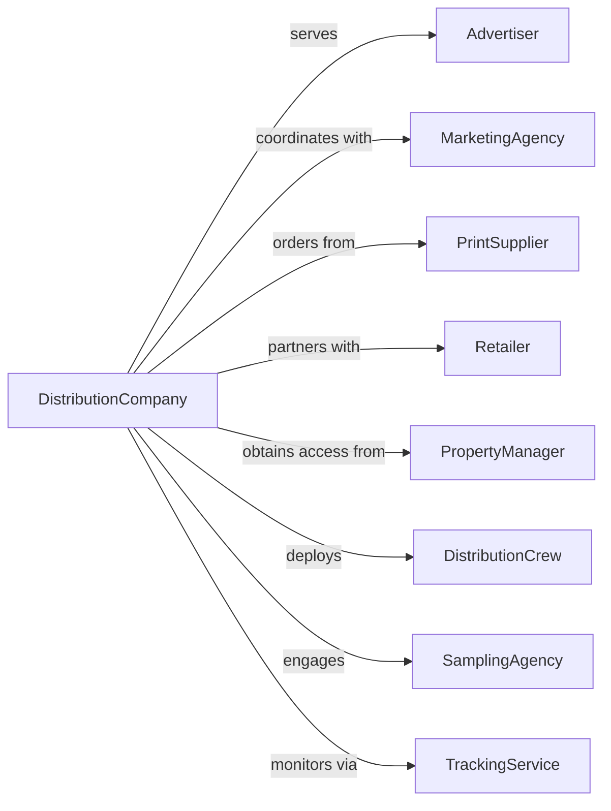

# Advertising Material Distribution Services

> Business-as-Code definition for advertising material distribution operations. Models door-to-door, in-store, and hand-to-hand distribution services.

## Overview

Advertising material distribution services deliver promotional materials directly to consumers through door-to-door delivery, in-store sampling, vehicle placement, and hand-to-hand distribution. This definition exposes actions for campaign planning, distribution execution, and performance tracking, with events for delivery confirmation and coverage reporting.

## Actors

| Actor | Description |
|-------|-------------|
| Advertiser | Brand commissioning distribution services |
| MarketingAgency | Agency coordinating promotional campaigns |
| PrintSupplier | Producer of flyers, coupons, and materials |
| Retailer | Store location hosting in-store distribution |
| PropertyManager | Authority granting distribution access |
| DistributionCrew | Team delivering materials to consumers |
| SamplingAgency | Provider of in-store demonstration staff |
| TrackingService | Technology for monitoring distribution |

## Roles

| Role | Description |
|------|-------------|
| OperationsManager | Oversees distribution logistics |
| FieldSupervisor | Manages distribution crews in field |
| CampaignCoordinator | Plans and schedules distribution activities |
| QualityController | Verifies distribution coverage and accuracy |
| Distributor | Delivers materials door-to-door or in public |
| BrandAmbassador | Engages consumers during sampling events |

## Entities

| Entity | Description |
|--------|-------------|
| Campaign | Distribution initiative with schedule and targets |
| Material | Flyer, coupon, sample, or promotional item |
| Route | Geographic path for door-to-door delivery |
| Distribution | Execution of material delivery |
| Coverage | Geographic area reached by distribution |
| SamplingEvent | In-store or public promotional activation |
| Report | Documentation of distribution completion |
| Inventory | Stock of materials for distribution |
| Zone | Defined area for distribution targeting |
| Verification | Confirmation of delivery completion |

## Actions

| Action | Description |
|--------|-------------|
| planCampaign | Design distribution strategy and coverage |
| acquireMaterials | Obtain promotional items for distribution |
| mapRoutes | Define geographic paths for delivery |
| assignCrews | Deploy distributors to routes |
| distributeMaterials | Deliver items to consumers |
| conductSampling | Execute in-store demonstrations |
| trackProgress | Monitor distribution completion |
| verifyDelivery | Confirm materials reached targets |
| photographEvidence | Document distribution activities |
| reportCoverage | Share completion metrics with client |
| managInventory | Track material stock and usage |
| processPayroll | Compensate distribution workers |

## Events

| Event | Description |
|-------|-------------|
| campaignPlanned | Strategy and schedule defined |
| materialsAcquired | Promotional items received |
| routesMapped | Delivery paths defined |
| crewsAssigned | Distributors deployed |
| materialsDistributed | Items delivered to consumers |
| samplingConducted | In-store event completed |
| progressTracked | Completion status monitored |
| deliveryVerified | Distribution confirmed |
| evidencePhotographed | Activities documented |
| coverageReported | Metrics shared with client |
| inventoryDepleted | Materials exhausted |
| payrollProcessed | Workers compensated |

## Searches

| Search | Description |
|--------|-------------|
| findCampaigns | List projects by client, status, or date |
| getRoutes | Retrieve delivery paths by zone |
| searchMaterials | Find promotional items by campaign |
| getCoverage | Access distribution completion data |
| findEvents | List sampling activations by location |
| getInventory | Check material stock levels |
| getCrewAssignments | View distributor schedules |

## Workflow



## Actor Relationships



## Usage

### Calling Actions

```typescript
import { advertiseMaterials } from '@headlessly/advertise-materials'

const distribution = advertiseMaterials()

// Plan distribution campaign
const campaign = await distribution.planCampaign({
  clientId: 'client-123',
  campaignName: 'Grand Opening Flyer Drop',
  coverage: {
    centerPoint: { lat: 40.7128, lng: -74.0060 },
    radius: 5, // miles
    householdTarget: 50000
  },
  materialType: 'flyer',
  distributionMethod: 'door-to-door',
  startDate: '2024-04-01',
  duration: 7 // days
})

// Map routes for distribution
const routes = await distribution.mapRoutes({
  campaignId: campaign.id,
  zones: campaign.coverage.zones,
  optimizeFor: 'efficiency',
  householdsPerRoute: 500
})

// Assign crews and begin distribution
await distribution.assignCrews({
  campaignId: campaign.id,
  routes: routes.map(r => r.id),
  crewSize: 25,
  shiftHours: 8,
  trackingRequired: true
})
```

### Event-Driven Automation

```typescript
// Monitor completion progress
distribution.materialsDistributed(async ({ campaignId, route, completion }) => {
  if (completion < 0.80) {
    await distribution.flagIncompleteRoute({
      campaignId,
      routeId: route.id,
      completionRate: completion,
      scheduleFollowUp: true
    })
  }
})

// Generate client report
distribution.deliveryVerified(async ({ campaignId, coverage }) => {
  await distribution.generateCoverageReport({
    campaignId,
    totalDelivered: coverage.households,
    geographicSpread: coverage.zones,
    includePhotos: true,
    deliverToClient: true
  })
})
```
