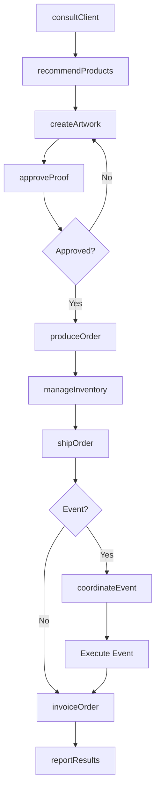
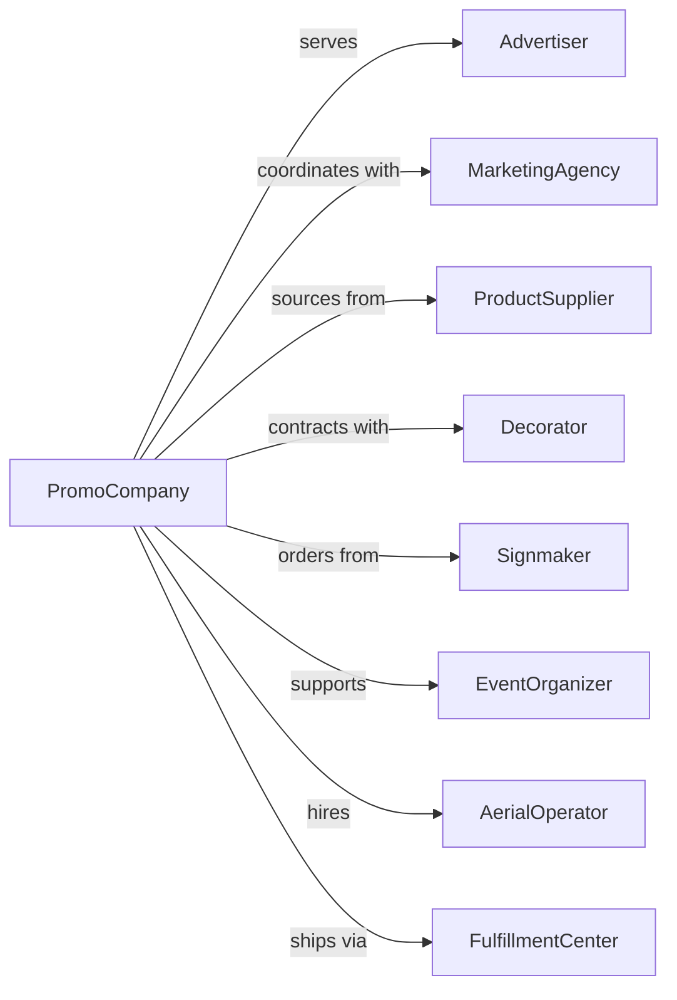

# Other Services Related to Advertising

> Business-as-Code definition for specialized advertising services. Models promotional products, sign production, and specialty advertising operations.

## Overview

Other advertising services include promotional product distribution, sign painting and lettering, aerial advertising, and specialty advertising not classified elsewhere. This definition exposes actions for product customization, production, and distribution, with events for order tracking and campaign execution.

## Actors

| Actor | Description |
|-------|-------------|
| Advertiser | Brand purchasing promotional services |
| MarketingAgency | Agency coordinating promotional campaigns |
| ProductSupplier | Manufacturer of promotional items |
| Decorator | Firm imprinting logos on products |
| Signmaker | Producer of custom signs and lettering |
| EventOrganizer | Coordinator of trade shows and activations |
| AerialOperator | Provider of skywriting or banner towing |
| FulfillmentCenter | Warehouse storing and shipping products |

## Roles

| Role | Description |
|------|-------------|
| AccountManager | Manages client relationships and orders |
| ProductSpecialist | Recommends promotional items for campaigns |
| ProductionCoordinator | Oversees decoration and manufacturing |
| CreativeDesigner | Creates artwork for imprinting |
| FulfillmentManager | Coordinates inventory and shipping |
| EventCoordinator | Plans and executes promotional activations |

## Entities

| Entity | Description |
|--------|-------------|
| Order | Request for promotional products or services |
| Product | Promotional item for customization |
| Artwork | Design for imprinting on products |
| Decoration | Logo or message applied to item |
| Sign | Custom lettering or display signage |
| Campaign | Promotional initiative with distribution plan |
| Inventory | Stock of promotional products |
| Shipment | Delivery of completed orders |
| Event | Trade show or promotional activation |
| Proof | Sample showing decoration before production |

## Actions

| Action | Description |
|--------|-------------|
| consultClient | Understand promotional needs and objectives |
| recommendProducts | Suggest appropriate promotional items |
| createArtwork | Design imprint for product decoration |
| approveProof | Confirm decoration design with client |
| produceOrder | Manufacture and decorate products |
| createSign | Produce custom lettering or signage |
| manageInventory | Track product stock and reorders |
| shipOrder | Deliver completed products to destination |
| coordinateEvent | Plan and execute promotional activations |
| executeAerial | Conduct skywriting or banner campaigns |
| invoiceOrder | Bill client for products and services |
| reportResults | Share campaign outcomes with client |

## Events

| Event | Description |
|-------|-------------|
| clientConsulted | Needs assessment completed |
| productsRecommended | Items suggested to client |
| artworkCreated | Design completed |
| proofApproved | Decoration confirmed by client |
| orderProduced | Products manufactured and decorated |
| signCreated | Custom signage completed |
| inventoryUpdated | Stock levels refreshed |
| orderShipped | Products delivered |
| eventCoordinated | Activation planned |
| eventExecuted | Promotional event completed |
| aerialExecuted | Skywriting or banner campaign completed |
| orderInvoiced | Client billed |

## Searches

| Search | Description |
|--------|-------------|
| findOrders | List orders by client, status, or date |
| searchProducts | Find promotional items by category |
| getArtwork | Retrieve designs by client or campaign |
| getInventory | Check product stock levels |
| findEvents | List activations by date or location |
| getShipments | Track delivery status |
| getProofs | Access pending decoration approvals |

## Workflow



## Actor Relationships



## Usage

### Calling Actions

```typescript
import { advertisePromotions } from '@headlessly/advertise-promotions'

const promo = advertisePromotions()

// Consult on promotional needs
const consultation = await promo.consultClient({
  clientId: 'client-123',
  occasion: 'trade-show-giveaway',
  budget: 15000,
  quantity: 2500,
  deadline: '2024-05-15',
  brandGuidelines: 'brand-standards-v2.pdf'
})

// Recommend products
const recommendation = await promo.recommendProducts({
  consultationId: consultation.id,
  categories: ['tech-accessories', 'drinkware', 'apparel'],
  priceRange: { min: 3, max: 8 },
  ecoFriendly: true,
  topPicks: 5
})

// Produce order with decoration
await promo.produceOrder({
  clientId: 'client-123',
  products: [
    { sku: 'power-bank-5000', quantity: 1000, decoration: 'full-color-print' },
    { sku: 'tumbler-20oz', quantity: 1000, decoration: 'laser-engrave' },
    { sku: 'tshirt-cotton', quantity: 500, decoration: 'screen-print' }
  ],
  artwork: consultation.approvedArtwork,
  shipTo: 'trade-show-venue',
  deliveryDate: '2024-05-12'
})
```

### Event-Driven Automation

```typescript
// Alert on proof approval needed
promo.artworkCreated(async ({ orderId, clientId, artwork }) => {
  await promo.sendProofRequest({
    orderId,
    clientId,
    artwork,
    approvalDeadline: addDays(new Date(), 3),
    productionImpact: 'delays-if-not-approved'
  })
})

// Trigger inventory reorder
promo.orderShipped(async ({ orderId, products }) => {
  for (const product of products) {
    const stock = await promo.getInventory({ sku: product.sku })
    if (stock.available < stock.reorderPoint) {
      await promo.initiateReorder({
        sku: product.sku,
        quantity: stock.reorderQuantity,
        urgency: stock.available < stock.safetyStock ? 'rush' : 'standard'
      })
    }
  }
})
```
