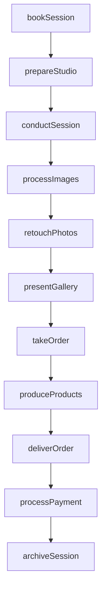
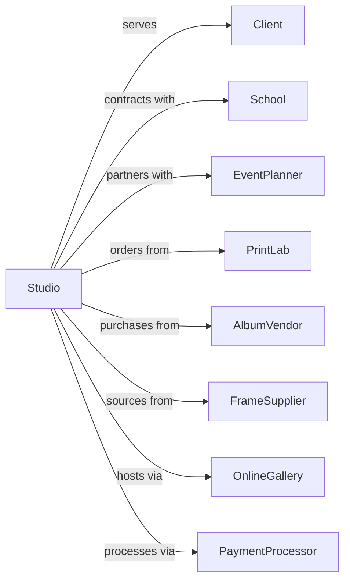

# Photography Studios, Portrait

> Business-as-Code definition for portrait photography studio operations. Models session booking, photography, and print fulfillment services.

## Overview

Portrait photography studios provide still, video, and digital photography services for individuals and families, including school photos, passport photos, and special event coverage. This definition exposes actions for session management, image capture, and product delivery, with events for booking tracking and order fulfillment.

## Actors

| Actor | Description |
|-------|-------------|
| Client | Individual or family commissioning portrait services |
| School | Institution contracting for student photography |
| EventPlanner | Organizer hiring photography for special occasions |
| PrintLab | Facility producing physical prints and products |
| AlbumVendor | Supplier of photo books and albums |
| FrameSupplier | Provider of frames and display products |
| OnlineGallery | Platform hosting and selling digital images |
| PaymentProcessor | Service handling transactions |

## Roles

| Role | Description |
|------|-------------|
| StudioOwner | Operates business and manages client relationships |
| Photographer | Captures portrait images |
| Retoucher | Edits and enhances photographs |
| SalesConsultant | Presents images and sells products |
| SessionCoordinator | Schedules appointments and manages logistics |
| ProductionManager | Oversees print and product fulfillment |

## Entities

| Entity | Description |
|--------|-------------|
| Session | Scheduled photography appointment |
| Portrait | Captured photograph of subject |
| Gallery | Collection of images for client review |
| Order | Purchase of prints and products |
| Print | Physical photograph product |
| Album | Bound collection of photographs |
| DigitalFile | Electronic image for client download |
| Package | Bundled products at set price |
| Retouching | Image enhancement and editing |
| Release | Permission for image use |

## Actions

| Action | Description |
|--------|-------------|
| bookSession | Schedule photography appointment |
| prepareStudio | Set up lighting, backdrop, and equipment |
| conductSession | Photograph subject during appointment |
| processImages | Import and organize captured photographs |
| retouchPhotos | Edit and enhance selected images |
| presentGallery | Show proofs to client for selection |
| takeOrder | Record client purchase selections |
| produceProducts | Create prints, albums, and merchandise |
| deliverOrder | Provide finished products to client |
| archiveSession | Store images for future reprints |
| manageMembership | Track loyalty programs and return clients |
| processPayment | Handle transactions and deposits |

## Events

| Event | Description |
|-------|-------------|
| sessionBooked | Appointment scheduled |
| studioPrepared | Setup completed for session |
| sessionConducted | Photography completed |
| imagesProcessed | Photos imported and organized |
| photosRetouched | Editing completed |
| galleryPresented | Proofs shown to client |
| orderTaken | Purchase recorded |
| productsProduced | Prints and products created |
| orderDelivered | Products provided to client |
| sessionArchived | Images stored for future use |
| membershipUpdated | Loyalty status refreshed |
| paymentProcessed | Transaction completed |

## Searches

| Search | Description |
|--------|-------------|
| findSessions | List appointments by date or client |
| getGalleries | Retrieve image collections by session |
| searchClients | Find clients by name or contact |
| getOrders | List purchases by status or client |
| findProducts | Search available print and product options |
| getArchive | Access stored sessions by date range |
| getRevenue | Retrieve sales by period |

## Workflow



## Actor Relationships



## Usage

### Calling Actions

```typescript
import { consultPortraits } from '@headlessly/consult-portraits'

const studio = consultPortraits()

// Book portrait session
const session = await studio.bookSession({
  clientId: 'client-123',
  sessionType: 'family-portrait',
  date: '2024-10-15',
  time: '10:00',
  duration: 60, // minutes
  subjects: 4,
  location: 'studio',
  package: 'premium-family'
})

// Conduct photography session
await studio.conductSession({
  sessionId: session.id,
  poses: ['formal-group', 'casual-group', 'individual', 'candid'],
  backdrops: ['classic-gray', 'outdoor-scene'],
  estimatedImages: 150
})

// Take order after gallery presentation
await studio.takeOrder({
  sessionId: session.id,
  items: [
    { product: '16x20-canvas', image: 'img-042', quantity: 1 },
    { product: '8x10-print', image: 'img-015', quantity: 4 },
    { product: 'digital-collection', images: 'all-retouched', quantity: 1 }
  ],
  deposit: 150,
  balanceDue: 450
})
```

### Event-Driven Automation

```typescript
// Send reminder before session
studio.sessionBooked(async ({ sessionId, clientId, date }) => {
  await studio.scheduleReminder({
    sessionId,
    clientId,
    reminderDate: addDays(date, -2),
    includePreparationTips: true
  })
})

// Notify when order ready
studio.productsProduced(async ({ orderId, clientId, products }) => {
  await studio.notifyClient({
    clientId,
    orderId,
    message: 'Your portraits are ready for pickup!',
    products: products.map(p => p.description)
  })
})
```
