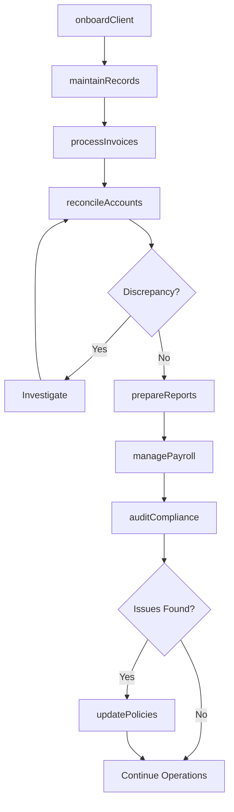
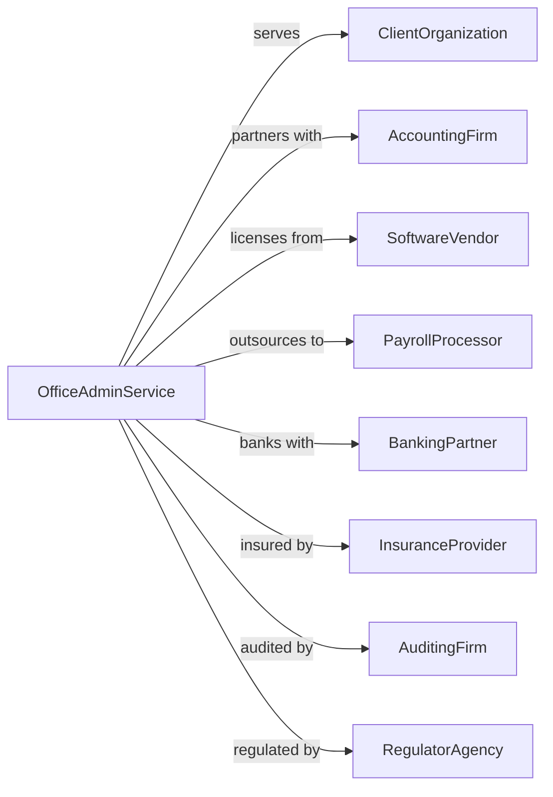

# Office Administrative Services

> Business-as-Code definition for outsourced office administration operations. Models day-to-day administrative functions from financial planning through logistics management.

## Overview

Office administrative services provide comprehensive back-office support including billing, recordkeeping, personnel administration, and logistics coordination on a contract basis. These establishments deliver administrative expertise without supplying operational staff, enabling client organizations to focus on core business functions while maintaining efficient administrative processes.

## Actors

| Actor | Description |
|-------|-------------|
| ClientOrganization | Business or entity contracting for administrative services |
| AccountingFirm | Provides specialized financial and tax services |
| SoftwareVendor | Supplies office management and productivity software |
| PayrollProcessor | Handles payroll calculations and disbursements |
| BankingPartner | Provides business banking and payment processing |
| InsuranceProvider | Offers liability and professional coverage |
| AuditingFirm | Conducts financial audits and compliance reviews |
| RegulatorAgency | Enforces labor and business regulations |

## Roles

| Role | Description |
|------|-------------|
| OfficeManager | Oversees daily administrative operations and client relationships |
| Bookkeeper | Manages accounts payable, receivable, and financial records |
| HRAdministrator | Handles personnel records, benefits, and compliance |
| LogisticsCoordinator | Manages distribution, inventory, and supply chain documentation |
| ExecutiveAssistant | Provides high-level administrative support and scheduling |

## Entities

| Entity | Description |
|--------|-------------|
| ServiceContract | Agreement defining scope, terms, and pricing of services |
| Invoice | Bill for services rendered to client |
| FinancialReport | Periodic statement of financial activity |
| PersonnelFile | Employee records and documentation |
| PolicyDocument | Written procedures and guidelines |
| Workflow | Defined process for completing administrative tasks |
| Correspondence | Business communications managed on behalf of client |
| Calendar | Scheduling system for appointments and deadlines |
| ExpenseReport | Documentation of business expenditures |
| ComplianceRecord | Documentation proving regulatory adherence |

## Actions

| Action | Description |
|--------|-------------|
| onboardClient | Set up new client account with systems and procedures |
| processInvoices | Generate, send, and track client invoices |
| reconcileAccounts | Match and verify financial transactions |
| managePayroll | Process employee compensation and tax withholdings |
| coordinateLogistics | Arrange shipping, receiving, and inventory tracking |
| maintainRecords | Organize and archive business documentation |
| prepareReports | Generate financial and operational reports |
| scheduleAppointments | Manage calendars and coordinate meetings |
| processExpenses | Review and reimburse business expenditures |
| handleCorrespondence | Draft, send, and track business communications |
| auditCompliance | Review processes for regulatory adherence |
| updatePolicies | Revise procedures based on changing requirements |
| trainStaff | Educate team on client-specific procedures |

## Events

| Event | Description |
|-------|-------------|
| clientOnboarded | New client account fully configured and active |
| invoiceProcessed | Invoice generated and sent to recipient |
| accountsReconciled | Financial records verified and balanced |
| payrollCompleted | Employee payments processed and disbursed |
| reportGenerated | Financial or operational report delivered |
| recordArchived | Document stored in compliance with retention policy |
| expenseApproved | Business expenditure verified and reimbursed |
| auditCompleted | Compliance review finished with findings |
| contractRenewed | Service agreement extended for new term |
| policyUpdated | Administrative procedure revised |
| deadlineMet | Required filing or submission completed on time |
| discrepancyDetected | Variance identified requiring investigation |

## Searches

| Search | Description |
|--------|-------------|
| findClients | List client accounts with filters for status, size, or industry |
| getInvoices | Retrieve invoices by date range, status, or amount |
| searchRecords | Locate documents by type, date, or keyword |
| getPayrollHistory | Retrieve payroll records for specified period |
| findOpenTasks | List pending administrative tasks by priority |
| getComplianceStatus | Check regulatory filing status and deadlines |
| searchCorrespondence | Find communications by recipient or subject |

## Workflow



## Actor Relationships



## Usage

### Calling Actions

```typescript
import { administerOfficeAdministrative } from '@headlessly/administer-office-administrative'

const admin = administerOfficeAdministrative()

// Onboard new client
const client = await admin.onboardClient({
  companyName: 'Acme Industries',
  services: ['billing', 'payroll', 'recordkeeping'],
  billingCycle: 'monthly',
  primaryContact: 'jane.smith@acme.com'
})

// Process monthly invoices
const invoices = await admin.processInvoices({
  clientId: client.id,
  period: '2024-03',
  dueDate: '2024-04-15'
})

// Generate financial report
await admin.prepareReports({
  clientId: client.id,
  reportType: 'monthlyFinancial',
  period: '2024-03',
  includeComparison: true
})
```

### Event-Driven Automation

```typescript
// Auto-alert on reconciliation discrepancy
admin.discrepancyDetected(async ({ clientId, amount, accountType }) => {
  await admin.handleCorrespondence({
    clientId,
    type: 'alert',
    subject: `Reconciliation discrepancy: ${accountType}`,
    body: `A variance of $${amount} was detected requiring review.`
  })
})

// Auto-generate reports after payroll
admin.payrollCompleted(async ({ clientId, period }) => {
  await admin.prepareReports({
    clientId,
    reportType: 'payrollSummary',
    period,
    deliveryMethod: 'email'
  })
})
```
