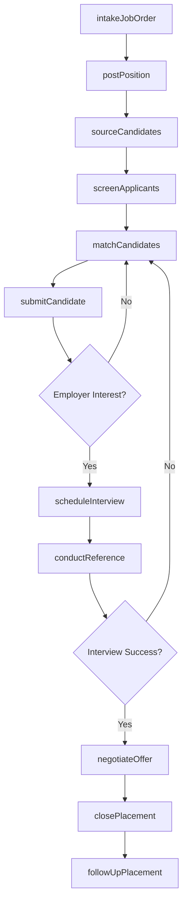
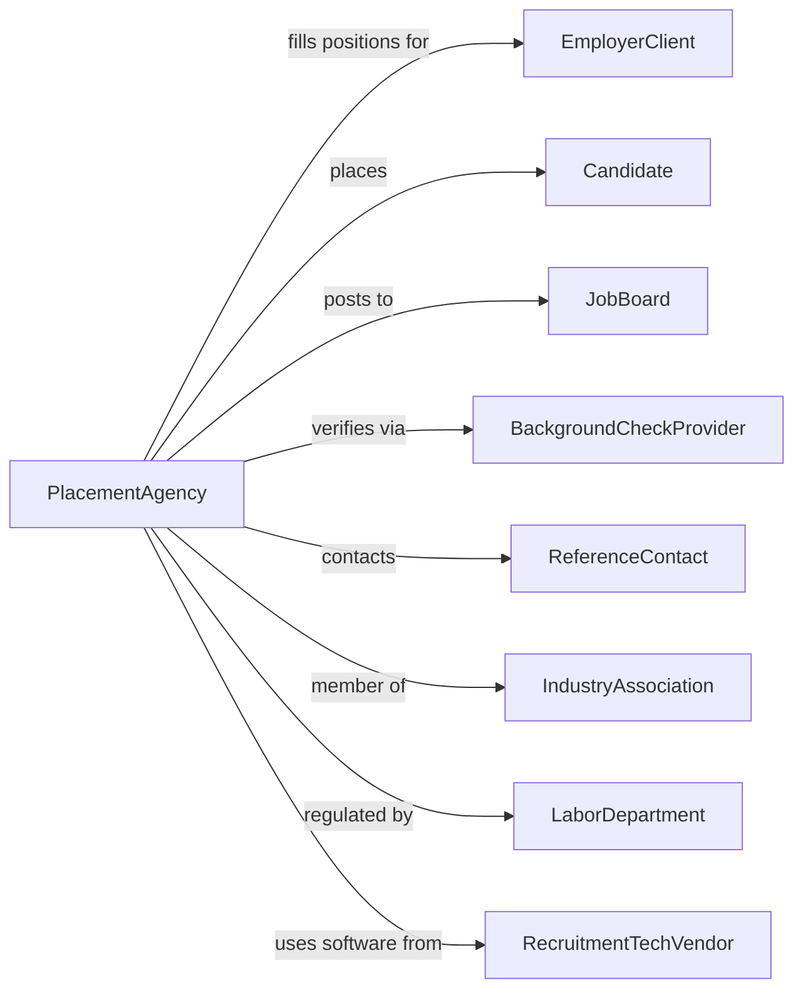

# Employment Placement Agencies

> Business-as-Code definition for employment placement operations. Models the complete recruitment cycle from job posting through candidate placement.

## Overview

Employment placement agencies match job seekers with employers by maintaining job listings, recruiting candidates, and facilitating hiring. Unlike temporary staffing, placed candidates become direct employees of the hiring organization. This industry includes general employment agencies, specialized placement services, casting bureaus, and model registries.

## Actors

| Actor | Description |
|-------|-------------|
| EmployerClient | Organization seeking to fill job vacancies |
| Candidate | Job seeker registered with the agency |
| JobBoard | Online platform for posting and distributing listings |
| BackgroundCheckProvider | Verifies candidate employment history and credentials |
| ReferenceContact | Provides employment or character references |
| IndustryAssociation | Professional body setting placement standards |
| LaborDepartment | Government agency regulating employment practices |
| RecruitmentTechVendor | Provides applicant tracking and CRM software |

## Roles

| Role | Description |
|------|-------------|
| Recruiter | Sources, screens, and matches candidates to positions |
| AccountManager | Manages relationships with employer clients |
| PlacementCoordinator | Handles interview scheduling and offer logistics |
| ResearchAnalyst | Gathers market data on compensation and hiring trends |
| BranchManager | Oversees local office operations and staff |

## Entities

| Entity | Description |
|--------|-------------|
| JobOrder | Employer request to fill a specific position |
| CandidateProfile | Comprehensive record of job seeker qualifications |
| Resume | Candidate document summarizing experience and skills |
| Interview | Scheduled meeting between candidate and employer |
| PlacementFee | Commission earned upon successful hire |
| Offer | Formal employment proposal extended to candidate |
| Contract | Agreement defining placement terms and guarantees |
| Skill | Specific competency or certification sought by employers |
| Referral | Candidate recommendation from existing contact |
| MarketReport | Analysis of hiring trends and compensation data |

## Actions

| Action | Description |
|--------|-------------|
| intakeJobOrder | Receive and document employer hiring requirements |
| postPosition | Publish job listing to boards and networks |
| sourceCandidates | Proactively identify potential applicants |
| screenApplicants | Review resumes and conduct initial interviews |
| matchCandidates | Align qualified candidates with open positions |
| submitCandidate | Present candidate profile to employer |
| scheduleInterview | Coordinate meeting between candidate and employer |
| conductReference | Verify candidate background and references |
| negotiateOffer | Facilitate compensation and terms discussion |
| closePlacement | Finalize hire and process placement fee |
| followUpPlacement | Check on candidate performance post-hire |
| generateReport | Create hiring activity and market analysis reports |
| renewContract | Extend service agreement with employer client |

## Events

| Event | Description |
|-------|-------------|
| jobOrderReceived | New position request documented from employer |
| positionPosted | Job listing published to recruitment channels |
| candidateSourced | New applicant identified and contacted |
| applicantScreened | Initial qualification review completed |
| candidateSubmitted | Profile presented to hiring employer |
| interviewScheduled | Meeting arranged between candidate and employer |
| referenceCompleted | Background verification finished |
| offerExtended | Employer presented compensation proposal |
| offerAccepted | Candidate agreed to employment terms |
| placementClosed | Hire completed and fee invoiced |
| guaranteeExpired | Post-placement warranty period ended |
| placementFailed | Candidate left position within guarantee period |

## Searches

| Search | Description |
|--------|-------------|
| findCandidates | Search candidate database by skills, location, or experience |
| getJobOrders | List open positions by industry, salary, or urgency |
| searchPlacements | Retrieve placement history by client or period |
| getInterviews | List scheduled interviews by date or status |
| findEmployers | Search client accounts by industry or volume |
| getMarketData | Retrieve compensation benchmarks by role and region |
| trackPipeline | View candidates at each stage of recruitment process |

## Workflow



## Actor Relationships



## Usage

### Calling Actions

```typescript
import { staffEmploymentPlacement } from '@headlessly/staff-employment-placement'

const agency = staffEmploymentPlacement()

// Intake new job order from employer
const jobOrder = await agency.intakeJobOrder({
  employerId: 'tech-corp-123',
  title: 'Senior Software Engineer',
  department: 'Engineering',
  salary: { min: 120000, max: 160000 },
  requirements: ['JavaScript', 'React', 'Node.js', '5+ years'],
  urgency: 'high',
  feePercentage: 20
})

// Source and screen candidates
const candidates = await agency.sourceCandidates({
  jobOrderId: jobOrder.id,
  sources: ['database', 'linkedin', 'referrals'],
  targetCount: 10
})

// Submit top candidates to employer
for (const candidate of candidates.slice(0, 3)) {
  await agency.submitCandidate({
    jobOrderId: jobOrder.id,
    candidateId: candidate.id,
    presentationNotes: candidate.highlightSummary
  })
}
```

### Event-Driven Automation

```typescript
// Auto-schedule interviews when employer approves candidate
agency.candidateSubmitted(async ({ jobOrderId, candidateId, employerId }) => {
  const response = await agency.getEmployerResponse({ jobOrderId, candidateId })

  if (response.status === 'interview-requested') {
    await agency.scheduleInterview({
      jobOrderId,
      candidateId,
      interviewType: response.preferredFormat,
      proposedTimes: response.availableSlots
    })
  }
})

// Auto-follow up on placements at 30, 60, 90 days
agency.placementClosed(async ({ placementId, startDate }) => {
  const followUpDays = [30, 60, 90]

  for (const days of followUpDays) {
    await agency.followUpPlacement({
      placementId,
      scheduledDate: addDays(startDate, days),
      checkpoints: ['performance', 'satisfaction', 'retention']
    })
  }
})
```
