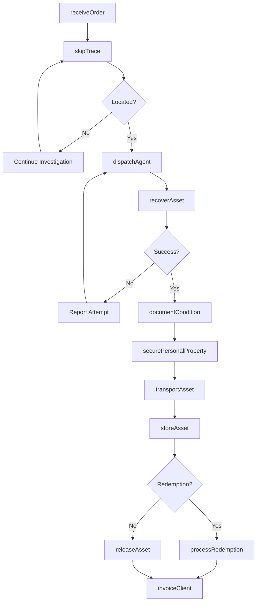
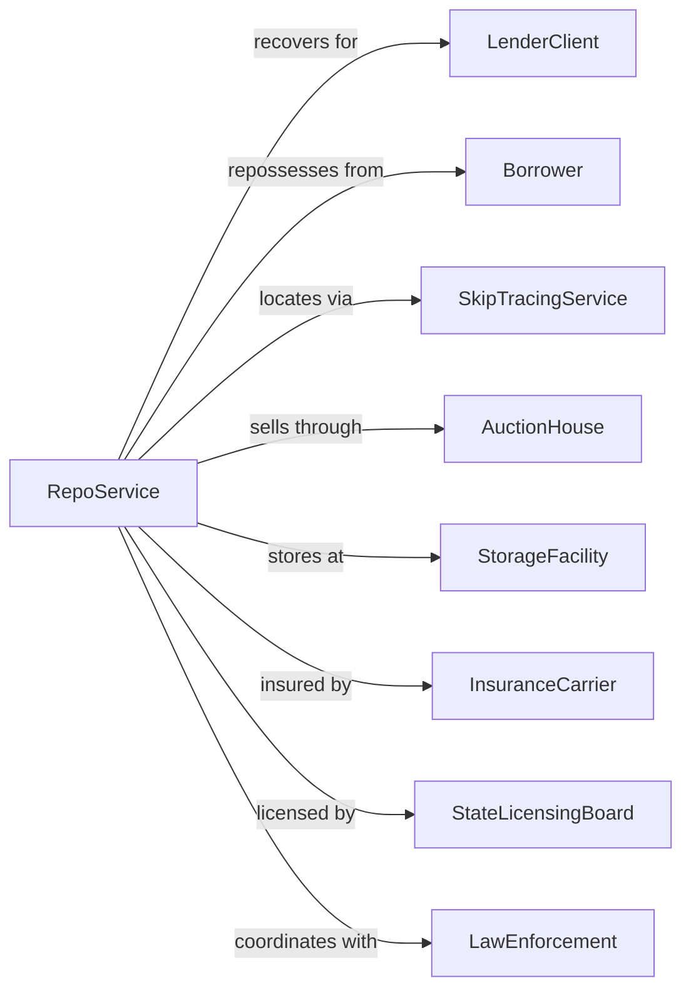

# Repossession Services

> Business-as-Code definition for asset recovery and repossession operations. Models the process of locating and recovering collateral for creditors.

## Overview

Repossession services recover tangible assets including automobiles, boats, equipment, aircraft, and other collateral on behalf of creditors when borrowers default on secured loans. Operating under state licensing requirements and UCC regulations, these establishments locate assets, execute recovery, and transport collateral to designated facilities for resale or return to lenders.

## Actors

| Actor | Description |
|-------|-------------|
| LenderClient | Financial institution ordering asset recovery |
| Borrower | Individual or business in default on secured loan |
| SkipTracingService | Locates assets and borrowers with updated information |
| AuctionHouse | Handles resale of recovered assets |
| StorageFacility | Secures recovered assets pending disposition |
| InsuranceCarrier | Provides liability and cargo coverage |
| StateLicensingBoard | Regulates repossession industry practices |
| LawEnforcement | Provides assistance and breach of peace documentation |

## Roles

| Role | Description |
|------|-------------|
| RecoveryAgent | Locates and recovers assets in the field |
| DispatchCoordinator | Assigns recovery orders and tracks progress |
| SkipTracer | Investigates asset and borrower locations |
| TransportDriver | Moves recovered assets to storage |
| ComplianceManager | Ensures adherence to state and federal regulations |
| ConditionInspector | Documents asset condition at recovery |

## Entities

| Entity | Description |
|--------|-------------|
| RecoveryOrder | Client assignment to repossess specific asset |
| Asset | Collateral being recovered |
| SkipTrace | Investigation to locate asset or borrower |
| ConditionReport | Documentation of asset state at recovery |
| PersonalProperty | Borrower belongings found in asset |
| StorageRecord | Documentation of asset in secure holding |
| ReleaseAuthorization | Permission for borrower to redeem asset |
| InvoiceDetail | Billing for recovery services and fees |
| ComplianceLog | Record of regulatory adherence |
| GPSData | Location tracking information for asset |

## Actions

| Action | Description |
|--------|-------------|
| receiveOrder | Accept recovery assignment from lender |
| skipTrace | Investigate to locate asset current location |
| dispatchAgent | Assign field agent to recovery attempt |
| recoverAsset | Execute physical repossession of collateral |
| documentCondition | Photograph and record asset state |
| securePersonalProperty | Inventory and store borrower belongings |
| transportAsset | Move recovered collateral to storage |
| storeAsset | Secure asset in facility pending disposition |
| processRedemption | Handle borrower payoff and asset return |
| releaseAsset | Transfer recovered collateral to auction or lender |
| invoiceClient | Bill for recovery services rendered |
| reportStatus | Update lender on recovery progress |

## Events

| Event | Description |
|-------|-------------|
| orderReceived | New recovery assignment accepted |
| assetLocated | Skip trace identified asset location |
| agentDispatched | Field agent assigned to recovery |
| assetRecovered | Collateral successfully repossessed |
| conditionDocumented | Asset state photographed and recorded |
| propertySecured | Personal belongings inventoried |
| assetTransported | Collateral moved to storage facility |
| assetStored | Collateral secured pending disposition |
| redemptionProcessed | Borrower paid off and asset returned |
| assetReleased | Collateral transferred for disposition |
| clientInvoiced | Recovery charges billed to lender |
| recoveryFailed | Attempt unsuccessful due to breach or absence |

## Searches

| Search | Description |
|--------|-------------|
| findOrders | List recovery assignments by status or client |
| searchAssets | Locate assets by type, VIN, or serial number |
| getSkipTraces | Retrieve investigation records |
| findAgents | List field agents by availability or location |
| getStorageInventory | View assets in secure holding |
| getRedemptions | Find pending or completed redemption requests |
| trackPerformance | View recovery rates and metrics |
| getComplianceLogs | Access regulatory adherence records |

## Workflow



## Actor Relationships



## Usage

### Calling Actions

```typescript
import { supportRepossession } from '@headlessly/support-repossession'

const repo = supportRepossession()

// Receive recovery order
const order = await repo.receiveOrder({
  clientId: 'auto-finance-corp',
  asset: {
    type: 'automobile',
    vin: '1HGCM82633A004352',
    year: 2020,
    make: 'Honda',
    model: 'Accord',
    color: 'Silver'
  },
  borrower: {
    name: 'John Doe',
    lastKnownAddress: '123 Main St, Anytown, ST 12345',
    phone: '555-1234'
  },
  loanBalance: 18500,
  feeAuthorization: { recovery: 350, storage: 25 },
  priority: 'standard'
})

// Skip trace to locate asset
const trace = await repo.skipTrace({
  orderId: order.id,
  sources: ['dmv', 'utility', 'employment'],
  includeGPS: true
})

// Execute recovery
await repo.recoverAsset({
  orderId: order.id,
  location: trace.confirmedAddress,
  agentId: 'agent-456',
  method: 'self-help',
  timeWindow: 'overnight'
})

// Document condition
await repo.documentCondition({
  orderId: order.id,
  photos: ['front.jpg', 'rear.jpg', 'interior.jpg', 'odometer.jpg'],
  mileage: 45230,
  condition: 'good',
  damage: [],
  keysPresent: false
})
```

### Event-Driven Automation

```typescript
// Auto-notify client on recovery
repo.assetRecovered(async ({ orderId, assetId, clientId }) => {
  await repo.reportStatus({
    orderId,
    clientId,
    status: 'recovered',
    includePhotos: true,
    estimatedDelivery: calculateDeliveryDate()
  })
})

// Auto-process personal property notice
repo.propertySecured(async ({ orderId, inventory, borrowerContact }) => {
  await repo.notifyBorrower({
    orderId,
    method: 'certified-mail',
    notice: 'personal-property',
    inventory,
    claimDeadline: addDays(new Date(), 30),
    storageLocation: 'main-facility'
  })
})
```
