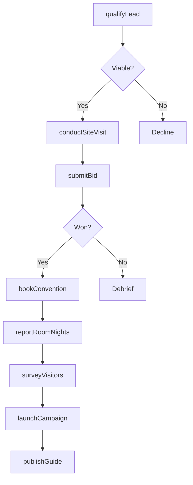
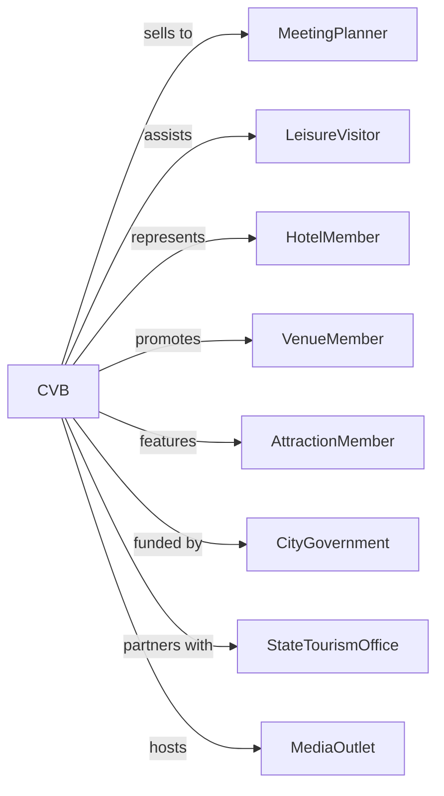

# Convention and Visitors Bureaus

> Business-as-Code definition for destination marketing organization operations. Models convention sales, visitor services, and tourism promotion activities.

## Overview

Convention and visitors bureaus market and promote destinations to business and leisure travelers through convention sales, visitor information services, and tourism promotion. These typically nonprofit organizations help meeting planners locate venues, provide travel information on attractions and accommodations, and coordinate group tours. Funding often comes from hotel taxes and membership dues.

## Actors

| Actor | Description |
|-------|-------------|
| MeetingPlanner | Professional seeking convention or meeting space |
| LeisureVisitor | Tourist seeking destination information |
| HotelMember | Lodging property participating in bureau programs |
| VenueMember | Convention center or meeting facility |
| AttractionMember | Tourism site or experience provider |
| CityGovernment | Municipal authority providing funding and oversight |
| StateTourismOffice | Regional tourism promotion partner |
| MediaOutlet | Travel press and content creators |

## Roles

| Role | Description |
|------|-------------|
| ConventionSalesManager | Pursues and books group business for destination |
| VisitorServicesCoordinator | Assists travelers with information and planning |
| MarketingDirector | Oversees destination promotion and branding |
| MemberServicesRep | Supports bureau member businesses |
| ResearchAnalyst | Tracks tourism statistics and trends |
| EventCoordinator | Organizes familiarization tours and events |

## Entities

| Entity | Description |
|--------|-------------|
| ConventionLead | Potential group meeting opportunity |
| SiteVisit | In-person destination inspection by planner |
| Bid | Proposal to host convention or event |
| VisitorGuide | Printed or digital destination information |
| RoomNightReport | Tracking of hotel bookings from convention business |
| MemberListing | Directory entry for participating business |
| FamTour | Familiarization trip for planners or media |
| TourismResearch | Statistics on visitor volume and spending |
| MarketingCampaign | Promotional initiative for destination |
| ServiceRequest | Visitor inquiry for information or assistance |

## Actions

| Action | Description |
|--------|-------------|
| qualifyLead | Assess potential convention opportunity |
| submitBid | Present proposal to host meeting or event |
| conductSiteVisit | Arrange destination inspection for planner |
| bookConvention | Secure commitment for group to meet in destination |
| provideInformation | Assist visitor with travel planning resources |
| coordinateTour | Arrange group tour of destination attractions |
| launchCampaign | Execute destination marketing initiative |
| hostFamTour | Conduct familiarization trip for planners or media |
| reportRoomNights | Track hotel bookings generated by bureau |
| surveyVisitors | Collect feedback on destination experience |
| recruitMembers | Enroll new businesses in bureau programs |
| publishGuide | Produce and distribute visitor information |

## Events

| Event | Description |
|-------|-------------|
| leadQualified | Convention opportunity assessed as viable |
| bidSubmitted | Proposal delivered to meeting planner |
| siteVisitConducted | Destination inspection completed |
| conventionBooked | Group committed to meet in destination |
| informationProvided | Visitor received requested assistance |
| tourCoordinated | Group tour completed |
| campaignLaunched | Marketing initiative activated |
| famTourHosted | Familiarization trip completed |
| roomNightsReported | Hotel booking data compiled |
| visitorsSurveyed | Destination feedback collected |
| memberRecruited | New business joined bureau |
| guidePublished | Visitor information released |

## Searches

| Search | Description |
|--------|-------------|
| findLeads | Search convention opportunities by size, sector, or date |
| getConventions | List booked groups by date or attendance |
| searchMembers | Find participating businesses by category |
| getVenues | List meeting facilities by capacity or features |
| findAttractions | Search tourism experiences by type |
| getRoomNights | Retrieve hotel booking data by event |
| getResearch | Access tourism statistics and reports |
| searchCampaigns | Find marketing initiatives by status or channel |

## Workflow



## Actor Relationships



## Usage

### Calling Actions

```typescript
import { bookConventionVisitors } from '@headlessly/book-convention-visitors'

const cvb = bookConventionVisitors()

// Qualify convention lead
const lead = await cvb.qualifyLead({
  organization: 'National Medical Association',
  eventName: 'Annual Conference 2026',
  attendance: 3500,
  roomNights: 8000,
  meetingSpace: 150000,
  preferredDates: ['2026-04-15', '2026-04-22'],
  decisionTimeline: '2024-09-01'
})

// Conduct site visit
await cvb.conductSiteVisit({
  leadId: lead.id,
  visitDates: ['2024-05-10', '2024-05-12'],
  attendees: [
    { name: 'Dr. Sarah Johnson', role: 'Meeting Planner' },
    { name: 'Mike Williams', role: 'Executive Director' }
  ],
  venueInspections: ['convention-center', 'marriott', 'hilton'],
  includeDinner: true,
  arrangeTransportation: true
})

// Submit competitive bid
await cvb.submitBid({
  leadId: lead.id,
  proposal: {
    primaryVenue: 'city-convention-center',
    hotelBlock: [
      { property: 'marriott-downtown', rooms: 500, rate: 189 },
      { property: 'hilton-city', rooms: 400, rate: 179 }
    ],
    incentives: ['welcome-reception', 'transportation-subsidy', 'marketing-support'],
    economicImpact: 12500000
  },
  submissionDeadline: '2024-07-15'
})
```

### Event-Driven Automation

```typescript
// Auto-report room nights after convention
cvb.conventionBooked(async ({ conventionId, hotelBlock }) => {
  await cvb.scheduleRoomNightReporting({
    conventionId,
    hotels: hotelBlock.map(h => h.propertyId),
    reportingDates: ['peak-night', 'post-event'],
    includePickup: true
  })
})

// Auto-survey attendees post-event
cvb.roomNightsReported(async ({ conventionId, actualAttendance }) => {
  await cvb.surveyVisitors({
    conventionId,
    surveyType: 'convention-attendee',
    distribution: 'email',
    sampleSize: Math.min(1000, actualAttendance * 0.25),
    topics: ['destination-satisfaction', 'return-intent', 'spending']
  })
})
```
