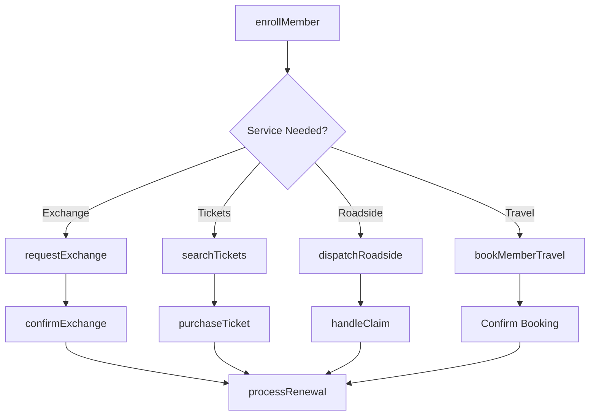
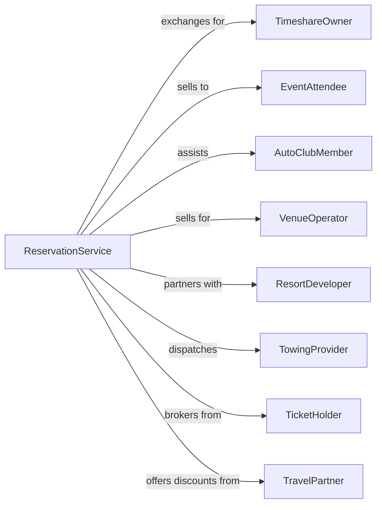

# All Other Travel Arrangement and Reservation Services

> Business-as-Code definition for specialized reservation and ticketing operations. Models services including timeshare exchange, ticket agencies, and automobile clubs.

## Overview

All other travel arrangement and reservation services encompass specialized booking operations including timeshare vacation exchange, event and entertainment ticket agencies, automobile club road services, and centralized reservation systems. These establishments facilitate access to travel-adjacent services distinct from traditional agency, tour operator, and convention bureau functions.

## Actors

| Actor | Description |
|-------|-------------|
| TimeshareOwner | Property owner seeking vacation exchange |
| EventAttendee | Individual purchasing entertainment tickets |
| AutoClubMember | Subscriber to roadside assistance services |
| VenueOperator | Stadium, theater, or arena selling tickets |
| ResortDeveloper | Timeshare property participating in exchange network |
| TowingProvider | Service partner for roadside assistance |
| TicketHolder | Secondary market seller of event tickets |
| TravelPartner | Hotel or rental car offering member discounts |

## Roles

| Role | Description |
|------|-------------|
| ExchangeCoordinator | Facilitates timeshare vacation swaps |
| TicketAgent | Processes event ticket sales and exchanges |
| MemberServicesRep | Handles automobile club member requests |
| RoadsideDispatcher | Coordinates emergency assistance calls |
| ReservationSpecialist | Books member travel benefits |
| InventoryManager | Controls ticket and exchange availability |

## Entities

| Entity | Description |
|--------|-------------|
| ExchangeRequest | Timeshare owner request to swap vacation |
| EventTicket | Admission credential for entertainment event |
| Membership | Automobile club subscriber account |
| RoadsideCall | Request for emergency road assistance |
| TowDispatch | Assignment of service provider to stranded member |
| TicketInventory | Available seats or credentials for event |
| ExchangeCredit | Value available for timeshare swap |
| TripPlanner | Route and travel information service |
| MemberBenefit | Discount or service included with membership |
| ServiceCall | Completed roadside assistance event |

## Actions

| Action | Description |
|--------|-------------|
| requestExchange | Submit timeshare vacation swap request |
| confirmExchange | Finalize vacation exchange booking |
| searchTickets | Query available event admission |
| purchaseTicket | Complete ticket transaction |
| enrollMember | Sign up new automobile club subscriber |
| dispatchRoadside | Send assistance to stranded member |
| planRoute | Generate driving directions and trip information |
| bookMemberTravel | Reserve hotel or car using member benefits |
| processRenewal | Extend membership for additional term |
| handleClaim | Process roadside service reimbursement |
| resellTicket | List ticket on secondary marketplace |
| verifyTicket | Authenticate event admission credential |

## Events

| Event | Description |
|-------|-------------|
| exchangeRequested | Timeshare swap request submitted |
| exchangeConfirmed | Vacation exchange finalized |
| ticketsSearched | Event availability query completed |
| ticketPurchased | Event admission transaction completed |
| memberEnrolled | New automobile club subscription activated |
| roadsideDispatched | Assistance sent to member |
| routePlanned | Driving directions generated |
| memberTravelBooked | Discounted reservation confirmed |
| renewalProcessed | Membership extended |
| claimHandled | Roadside reimbursement completed |
| ticketResold | Secondary sale completed |
| ticketVerified | Admission credential authenticated |

## Searches

| Search | Description |
|--------|-------------|
| findExchanges | Search available timeshare properties |
| getTickets | List available event admissions |
| searchMembers | Find automobile club accounts |
| findProviders | Locate roadside service partners |
| getRoutes | Retrieve saved trip plans |
| searchEvents | Find upcoming entertainment by type or date |
| getMemberBenefits | List discounts available to subscriber |
| getServiceHistory | Retrieve roadside assistance records |

## Workflow



## Actor Relationships



## Usage

### Calling Actions

```typescript
import { bookTravelArrangement } from '@headlessly/book-travel-arrangement'

const service = bookTravelArrangement()

// Request timeshare exchange
const exchange = await service.requestExchange({
  memberId: 'owner-123',
  depositedWeek: {
    resort: 'beachside-villas',
    unit: '2BR-oceanview',
    week: '2024-06-15'
  },
  desiredDestination: 'Hawaii',
  flexibleDates: ['2024-12-01', '2025-01-31'],
  preferredSize: '2BR-minimum'
})

// Search and purchase event tickets
const tickets = await service.searchTickets({
  event: 'hamilton-broadway',
  date: '2024-08-15',
  quantity: 2,
  priceRange: { min: 100, max: 300 },
  section: 'orchestra'
})

await service.purchaseTicket({
  eventId: tickets.results[0].eventId,
  seats: tickets.results[0].availableSeats.slice(0, 2),
  delivery: 'mobile-transfer'
})

// Dispatch roadside assistance
await service.dispatchRoadside({
  memberId: 'auto-club-456',
  location: {
    lat: 34.0522,
    lng: -118.2437,
    address: 'I-405 Northbound, Mile Marker 42'
  },
  serviceType: 'tow',
  vehicleInfo: { make: 'Toyota', model: 'Camry', year: 2020 },
  issue: 'engine-failure'
})
```

### Event-Driven Automation

```typescript
// Auto-confirm exchange when match found
service.exchangeRequested(async ({ requestId, preferences }) => {
  const matches = await service.findExchanges({
    destination: preferences.destination,
    dates: preferences.flexibleDates,
    minSize: preferences.preferredSize
  })

  if (matches.length > 0) {
    await service.confirmExchange({
      requestId,
      matchedProperty: matches[0].id,
      notifyMember: true
    })
  }
})

// Auto-process roadside claim after service
service.roadsideDispatched(async ({ callId, memberId, serviceType }) => {
  const serviceComplete = await service.awaitServiceCompletion({ callId })

  if (serviceComplete.status === 'completed') {
    await service.handleClaim({
      callId,
      memberId,
      serviceType,
      providerInvoice: serviceComplete.invoice,
      memberCopay: calculateCopay(serviceType)
    })
  }
})
```
