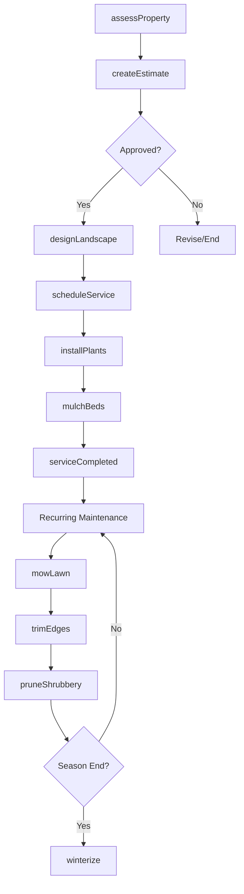
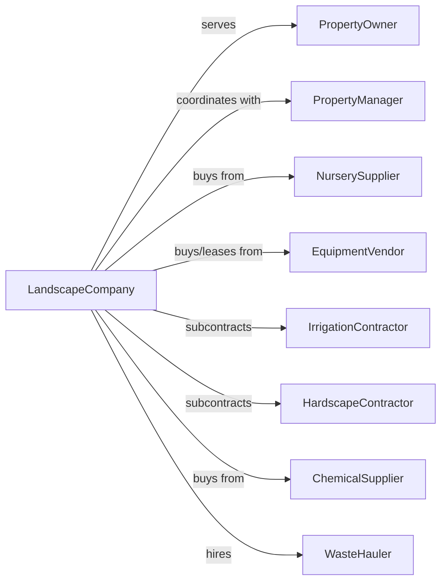

# Landscaping Services

> Business-as-Code definition for landscaping operations. Models the complete service lifecycle from client consultation through maintenance and seasonal care.

## Overview

Landscaping services encompass lawn care, garden maintenance, plant installation, and landscape design for residential and commercial properties. This definition exposes actions for service delivery, events for workflow automation, and searches for client and project management.

## Actors

| Actor | Description |
|-------|-------------|
| PropertyOwner | Residential or commercial client requesting landscape services |
| PropertyManager | Manages multiple properties and coordinates service schedules |
| NurserySupplier | Provides plants, trees, shrubs, and landscaping materials |
| EquipmentVendor | Sells and services mowers, trimmers, and landscape machinery |
| IrrigationContractor | Installs and maintains sprinkler and drip systems |
| HardscapeContractor | Builds patios, walkways, retaining walls, and outdoor structures |
| ChemicalSupplier | Provides fertilizers, pesticides, and herbicides |
| WasteHauler | Removes yard debris and green waste |

## Roles

| Role | Description |
|------|-------------|
| CompanyOwner | Owns the business and sets strategic direction |
| OperationsManager | Oversees daily operations and crew scheduling |
| LandscapeDesigner | Creates landscape plans and plant selections |
| CrewLeader | Supervises field crew and ensures quality work |
| GroundsWorker | Performs mowing, trimming, planting, and maintenance |
| Estimator | Prepares project bids and cost estimates |
| AccountManager | Maintains client relationships and handles service requests |

## Entities

| Entity | Description |
|--------|-------------|
| Property | A residential or commercial site receiving services |
| ServiceContract | Agreement defining services, frequency, and pricing |
| WorkOrder | Specific task or visit to be completed |
| LandscapePlan | Design document with plant layouts and hardscape elements |
| Plant | Trees, shrubs, flowers, and groundcover installed or maintained |
| Equipment | Mowers, trimmers, blowers, and other machinery |
| Material | Mulch, soil, fertilizer, and other supplies used |
| Crew | Team of workers assigned to a property or route |
| Route | Scheduled sequence of properties for service visits |
| Invoice | Bill for services rendered |
| Estimate | Proposed cost for requested work |
| Season | Time period affecting service types and schedules |

## Actions

| Action | Description |
|--------|-------------|
| assessProperty | Evaluate site conditions and client needs |
| createEstimate | Prepare cost proposal for requested services |
| designLandscape | Develop planting plan and hardscape layout |
| scheduleService | Assign work orders to crews and routes |
| mowLawn | Cut grass to specified height |
| trimEdges | Edge sidewalks, driveways, and beds |
| installPlants | Plant trees, shrubs, flowers, or sod |
| applyFertilizer | Spread nutrients for lawn and plant health |
| applyTreatment | Apply pesticide or herbicide as needed |
| irrigate | Water plants and lawns manually or via system |
| mulchBeds | Spread mulch around plants and in beds |
| pruneShrubbery | Shape and maintain shrubs and small trees |
| removeDebris | Collect and haul away yard waste |
| winterize | Prepare landscape for cold weather |

## Events

| Event | Description |
|-------|-------------|
| propertyAssessed | Site evaluation completed |
| estimateCreated | Cost proposal prepared and sent |
| estimateApproved | Client accepted the estimate |
| contractSigned | Service agreement executed |
| serviceScheduled | Work order assigned to crew and date |
| serviceCompleted | Work order finished at property |
| invoiceSent | Bill sent to client |
| paymentReceived | Client payment processed |
| issueReported | Client reported problem or complaint |
| seasonChanged | Service schedule updated for new season |
| plantWarrantyExpired | Warranty period ended for installed plants |
| equipmentServiced | Machinery maintenance completed |

## Searches

| Search | Description |
|--------|-------------|
| findProperties | List properties with filters for location, type, or contract status |
| getWorkOrders | Retrieve work orders by date, crew, or status |
| getContracts | List active service contracts and terms |
| findCrews | Get available crews and their current assignments |
| getInvoices | Retrieve invoices by client, date, or payment status |
| checkSchedule | View route schedule for specific dates |
| getPlantInventory | List available plants from suppliers |
| findOpenEstimates | Get pending estimates awaiting approval |

## Workflow



## Actor Relationships



## Usage

### Calling Actions

```typescript
import { landscapeProperty } from '@headlessly/landscape-property'

const landscape = landscapeProperty()

// Assess a new property
const assessment = await landscape.assessProperty({
  propertyId: 'prop-123',
  address: '456 Oak Lane',
  propertyType: 'residential',
  features: ['frontYard', 'backYard', 'sideLot']
})

// Create an estimate for services
const estimate = await landscape.createEstimate({
  propertyId: 'prop-123',
  services: ['weeklyMowing', 'monthlyEdging', 'seasonalFertilizer'],
  frequency: 'weekly',
  startDate: '2024-04-01'
})

// Schedule regular maintenance
await landscape.scheduleService({
  propertyId: 'prop-123',
  crewId: 'crew-alpha',
  serviceType: 'weeklyMaintenance',
  dayOfWeek: 'tuesday',
  routePosition: 3
})
```

### Event-Driven Automation

```typescript
// Auto-schedule follow-up after service
landscape.serviceCompleted(async ({ workOrderId, propertyId }) => {
  const contract = await landscape.getContracts({ propertyId })

  if (contract.frequency === 'weekly') {
    await landscape.scheduleService({
      propertyId,
      nextDate: addDays(new Date(), 7)
    })
  }
})

// Handle seasonal transitions
landscape.seasonChanged(async ({ newSeason, properties }) => {
  for (const propertyId of properties) {
    if (newSeason === 'winter') {
      await landscape.winterize({ propertyId })
    }
  }
})
```

## Related

- [Carpet and Upholstery Cleaning Services](./561740-CarpetAndUpholsteryCleaningServices.mdx)
- [Other Services to Buildings and Dwellings](./561790-OtherServicesToBuildingsAndDwellings.mdx)
