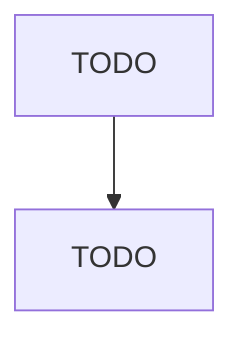

# Other Services to Buildings and Dwellings

> TODO: Business-as-Code definition

## Overview

This industry comprises establishments primarily engaged in providing services to buildings and dwellings (except exterminating and pest control; janitorial; landscaping care and maintenance; and carpet and upholstery cleaning). Illustrative Examples: Building exterior cleaning services (except sandblasting, window cleaning) Swimming pool cleaning and maintenance services Chimney cleaning services Ventilation duct cleaning services Drain or gutter cleaning services Cross-References. Establishmen

## Actors

| Actor | Description |
|-------|-------------|
| TODO | TODO |

## Entities

| Entity | Description |
|--------|-------------|
| TODO | TODO |

## Actions

| Action | Description |
|--------|-------------|
| TODO | TODO |

## Events

| Event | Description |
|-------|-------------|
| TODO | TODO |

## Searches

| Search | Description |
|--------|-------------|
| TODO | TODO |

## Workflow

## Actor Relationships

