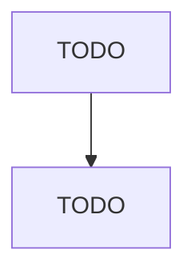

# Convention and Trade Show Organizers

> TODO: Business-as-Code definition

## Overview

This industry comprises establishments primarily engaged in organizing, promoting, and/or managing events, such as business and trade shows, conventions, conferences, and meetings (whether or not they manage and provide the staff to operate the facilities in which these events take place). Cross-References.

## Actors

| Actor | Description |
|-------|-------------|
| TODO | TODO |

## Entities

| Entity | Description |
|--------|-------------|
| TODO | TODO |

## Actions

| Action | Description |
|--------|-------------|
| TODO | TODO |

## Events

| Event | Description |
|-------|-------------|
| TODO | TODO |

## Searches

| Search | Description |
|--------|-------------|
| TODO | TODO |

## Workflow

## Actor Relationships

