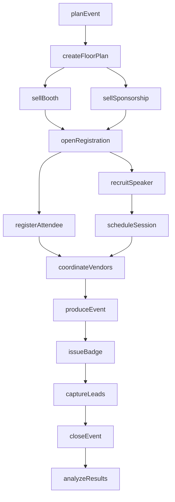
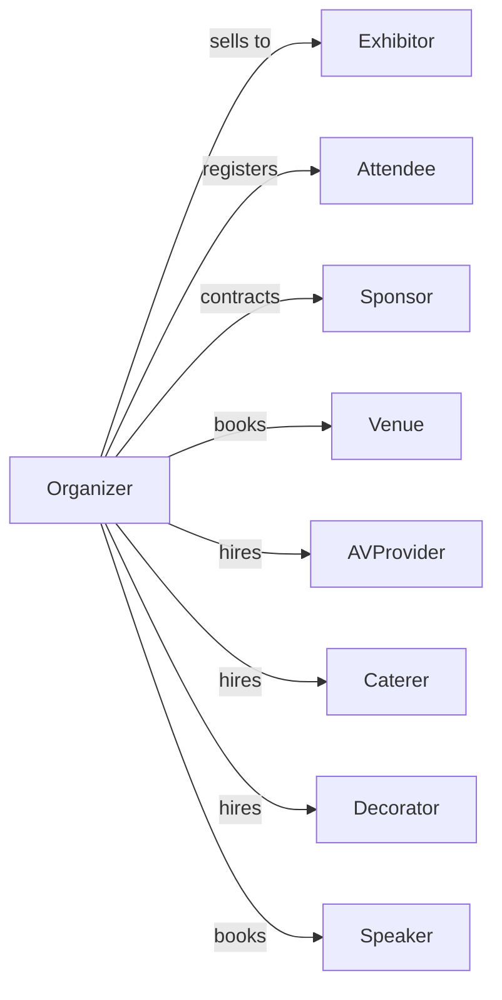

# Convention and Trade Show Organizers

> Business-as-Code definition for convention and trade show management. Models the complete event lifecycle from planning through execution and post-event analysis.

## Overview

Convention and trade show organizers plan, promote, and manage business events including trade shows, conventions, conferences, and corporate meetings. This definition exposes actions for event management, events for workflow automation, and searches for registration and vendor coordination.

## Actors

| Actor | Description |
|-------|-------------|
| Exhibitor | Company purchasing booth space at shows |
| Attendee | Individual registering to attend events |
| Sponsor | Company providing funding for event elements |
| Venue | Facility hosting the event |
| AVProvider | Supplies audio-visual equipment and services |
| Caterer | Provides food and beverage services |
| Decorator | Builds booths and installs event signage |
| Speaker | Presents sessions or keynotes |

## Roles

| Role | Description |
|------|-------------|
| EventDirector | Leads overall event strategy and execution |
| SalesManager | Sells booth space and sponsorships |
| MarketingManager | Promotes event and drives attendance |
| OperationsManager | Coordinates logistics and vendor management |
| RegistrationManager | Oversees attendee and exhibitor registration |
| OnSiteCoordinator | Manages event execution during show |
| SpeakerCoordinator | Recruits and manages presenters |
| FinanceManager | Handles budgeting and billing |

## Entities

| Entity | Description |
|--------|-------------|
| Event | Trade show, convention, or conference being organized |
| Booth | Exhibit space sold to exhibitors |
| Registration | Attendee or exhibitor sign-up record |
| Sponsorship | Funding package with associated benefits |
| Session | Educational or networking program element |
| FloorPlan | Layout of exhibit hall and booth assignments |
| Badge | Credential issued to attendees and exhibitors |
| Lead | Sales opportunity captured at event |
| Contract | Agreement with exhibitor, sponsor, or vendor |
| Budget | Financial plan and tracking for event |
| Schedule | Timeline of sessions and activities |
| Venue | Location hosting the event |

## Actions

| Action | Description |
|--------|-------------|
| planEvent | Define event concept, dates, and venue |
| createFloorPlan | Design exhibit hall layout and booth inventory |
| sellBooth | Contract exhibitor for booth space |
| sellSponsorship | Contract sponsor for event support |
| openRegistration | Launch attendee registration system |
| registerAttendee | Process individual registration |
| recruitSpeaker | Invite and confirm session presenters |
| scheduleSession | Assign speakers and topics to time slots |
| coordinateVendors | Manage contracts with service providers |
| produceEvent | Execute on-site event operations |
| issueBadge | Generate and distribute credentials |
| captureLeads | Collect attendee contact information |
| closeEvent | Wrap up on-site operations |
| analyzeResults | Compile attendance and satisfaction metrics |

## Events

| Event | Description |
|-------|-------------|
| eventPlanned | Event details finalized |
| floorPlanPublished | Booth layout available for sales |
| boothSold | Exhibitor contract signed |
| sponsorshipSold | Sponsor agreement executed |
| registrationOpened | Attendee sign-up began |
| attendeeRegistered | Individual registration completed |
| speakerConfirmed | Presenter committed to session |
| sessionScheduled | Program slot assigned |
| eventStarted | Show opened to attendees |
| eventEnded | Show concluded |
| leadsDelivered | Contact data sent to exhibitors |
| invoiceSent | Bill sent to customer |
| paymentReceived | Payment processed |
| surveyCompleted | Attendee feedback collected |

## Searches

| Search | Description |
|--------|-------------|
| findEvents | List events by date, type, or status |
| getExhibitors | Retrieve exhibitors for an event |
| getAttendees | List registered attendees with filters |
| getSponsors | View sponsors and their benefit packages |
| checkBoothAvailability | Find available booth spaces |
| getSessions | List scheduled sessions and speakers |
| getRegistrationStats | View registration counts and trends |
| findLeads | Retrieve captured leads by exhibitor |

## Workflow



## Actor Relationships



## Usage

### Calling Actions

```typescript
import { organizeEvent } from '@headlessly/organize-event'

const events = organizeEvent()

// Plan a new trade show
const tradeShow = await events.planEvent({
  name: 'TechConnect 2024',
  type: 'tradeShow',
  industry: 'technology',
  dates: { start: '2024-09-15', end: '2024-09-17' },
  venueId: 'venue-convention-center',
  expectedAttendees: 5000
})

// Create floor plan with booth inventory
await events.createFloorPlan({
  eventId: tradeShow.id,
  booths: [
    { type: 'island', size: '20x20', quantity: 10, price: 15000 },
    { type: 'inline', size: '10x10', quantity: 100, price: 3500 },
    { type: 'corner', size: '10x10', quantity: 20, price: 4500 }
  ]
})

// Sell booth to exhibitor
await events.sellBooth({
  eventId: tradeShow.id,
  exhibitorId: 'company-abc',
  boothNumber: 'A-101',
  boothType: 'island',
  addOns: ['electricPackage', 'leadRetrieval']
})
```

### Event-Driven Automation

```typescript
// Send confirmation when attendee registers
events.attendeeRegistered(async ({ attendeeId, eventId, registrationType }) => {
  const attendee = await events.getAttendees({ id: attendeeId })
  await sendEmail({
    to: attendee.email,
    template: 'registration-confirmation',
    data: { eventName: eventId, badgeType: registrationType }
  })
})

// Deliver leads after event ends
events.eventEnded(async ({ eventId }) => {
  const exhibitors = await events.getExhibitors({ eventId })

  for (const exhibitor of exhibitors) {
    const leads = await events.findLeads({ eventId, exhibitorId: exhibitor.id })
    await deliverLeadReport({
      exhibitorId: exhibitor.id,
      leads,
      format: 'csv'
    })
  }
})
```

## Related

- [Packaging and Labeling Services](./561910-PackagingAndLabelingServices.mdx)
- [All Other Support Services](./561990-AllOtherSupportServices.mdx)
