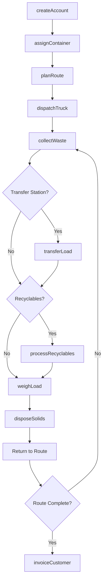
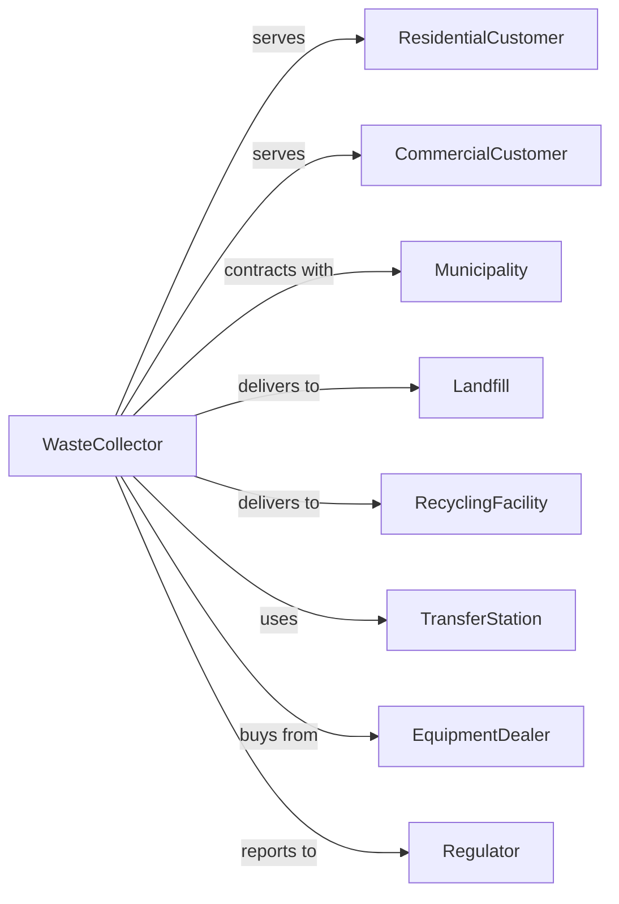

# Solid Waste Collection

> Business-as-Code definition for solid waste collection operations. Models the complete service lifecycle from route planning through collection, transfer, and disposal coordination.

## Overview

Solid waste collection involves collecting and hauling nonhazardous garbage, operating transfer stations, and collecting recyclable materials. This definition exposes actions for route management, events for operational automation, and searches for service tracking and compliance.

## Actors

| Actor | Description |
|-------|-------------|
| ResidentialCustomer | Homeowner subscribing to curbside collection |
| CommercialCustomer | Business requiring dumpster service |
| Municipality | Government entity contracting collection services |
| Landfill | Disposal facility receiving collected waste |
| RecyclingFacility | Processes recyclable materials |
| TransferStation | Intermediate facility for waste consolidation |
| EquipmentDealer | Provides trucks, containers, and parts |
| Regulator | Environmental agency overseeing operations |

## Roles

| Role | Description |
|------|-------------|
| Owner | Owns the company and sets strategic direction |
| OperationsManager | Oversees daily collection activities |
| RouteManager | Plans and optimizes collection routes |
| Driver | Operates collection vehicles |
| Helper | Assists driver with container handling |
| Dispatcher | Coordinates trucks and responds to issues |
| CustomerService | Handles account inquiries and service requests |
| MechanicTechnician | Maintains and repairs collection vehicles |

## Entities

| Entity | Description |
|--------|-------------|
| ServiceAccount | Customer subscription for collection |
| Route | Planned sequence of collection stops |
| CollectionVehicle | Truck used for waste pickup |
| Container | Cart, dumpster, or roll-off for waste storage |
| Pickup | Individual collection event at a stop |
| Ticket | Documentation of disposal at landfill |
| Invoice | Bill for collection services |
| ServiceRequest | Customer request for extra pickup or issue |
| TransferLoad | Waste consolidated at transfer station |
| RecyclingLoad | Recyclables separated for processing |
| MaintenanceRecord | Vehicle service and repair history |
| ComplianceReport | Regulatory documentation and filings |

## Actions

| Action | Description |
|--------|-------------|
| createAccount | Set up new customer for collection service |
| assignContainer | Deliver and assign cart or dumpster to customer |
| planRoute | Create optimized sequence of collection stops |
| dispatchTruck | Send vehicle on collection route |
| collectWaste | Pick up waste at customer location |
| weighLoad | Record weight at disposal or transfer facility |
| transferLoad | Move waste from collection truck to transfer trailer |
| disposeSolids | Deliver waste to landfill for disposal |
| processRecyclables | Deliver recyclables to processing facility |
| handleRequest | Respond to customer service inquiry |
| invoiceCustomer | Bill customer for services |
| maintainVehicle | Service or repair collection truck |
| reportCompliance | Submit regulatory filings |
| auditRoute | Evaluate route efficiency and adjust |

## Events

| Event | Description |
|-------|-------------|
| accountCreated | New customer account established |
| containerDelivered | Cart or dumpster placed at customer site |
| routeDispatched | Truck departed on collection route |
| pickupCompleted | Waste collected at customer location |
| pickupMissed | Collection not completed at scheduled stop |
| loadWeighed | Weight recorded at scale |
| loadDisposed | Waste delivered to landfill |
| recyclablesProcessed | Recyclables delivered to facility |
| serviceRequested | Customer submitted request |
| invoiceSent | Bill sent to customer |
| paymentReceived | Customer payment processed |
| vehicleBreakdown | Truck experienced mechanical failure |
| complianceFiled | Regulatory report submitted |

## Searches

| Search | Description |
|--------|-------------|
| findAccounts | List customers with filters for service type |
| getRoutes | Retrieve routes by day, driver, or area |
| getPickups | List collection events by date or status |
| findContainers | Locate containers by customer or type |
| getTickets | Retrieve disposal tickets by date or facility |
| checkServiceRequests | List open customer requests |
| getVehicleStatus | View truck locations and status |
| getComplianceHistory | Retrieve regulatory filings |

## Workflow



## Actor Relationships



## Usage

### Calling Actions

```typescript
import { collectSolidWaste } from '@headlessly/collect-solid-waste'

const waste = collectSolidWaste()

// Create new residential account
const account = await waste.createAccount({
  customerId: 'cust-123',
  type: 'residential',
  address: '456 Oak Street',
  serviceLevel: 'weekly',
  containerSize: '96-gallon'
})

// Assign container to customer
await waste.assignContainer({
  accountId: account.id,
  containerType: 'cart',
  size: '96-gallon',
  deliveryDate: '2024-04-01'
})

// Plan collection route
const route = await waste.planRoute({
  day: 'monday',
  zone: 'north-district',
  vehicleId: 'truck-42',
  driverId: 'driver-007'
})
```

### Event-Driven Automation

```typescript
// Handle missed pickups
waste.pickupMissed(async ({ accountId, routeId, reason }) => {
  await waste.handleRequest({
    type: 'missedPickup',
    accountId,
    priority: 'high',
    scheduledReturn: addDays(new Date(), 1)
  })

  await notifyCustomer({
    accountId,
    message: 'We missed your pickup and will return tomorrow'
  })
})

// Auto-dispatch replacement on breakdown
waste.vehicleBreakdown(async ({ vehicleId, routeId, location }) => {
  const backupTruck = await waste.getVehicleStatus({ status: 'available' })

  await waste.dispatchTruck({
    vehicleId: backupTruck.id,
    routeId,
    startLocation: location
  })
})
```

## Related

- [Hazardous Waste Collection](./562112-HazardousWasteCollection.mdx)
- [Other Waste Collection](./562119-OtherWasteCollection.mdx)
