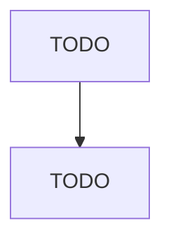

# Hazardous Waste Collection

> TODO: Business-as-Code definition

## Overview

This U.S. industry comprises establishments primarily engaged in collecting and/or hauling hazardous waste within a local area and/or operating hazardous waste transfer stations. Hazardous waste collection establishments may be responsible for the identification, treatment, packaging, and labeling of waste for the purposes of transport. Cross-References. Establishments primarily engaged in--

## Actors

| Actor | Description |
|-------|-------------|
| TODO | TODO |

## Entities

| Entity | Description |
|--------|-------------|
| TODO | TODO |

## Actions

| Action | Description |
|--------|-------------|
| TODO | TODO |

## Events

| Event | Description |
|-------|-------------|
| TODO | TODO |

## Searches

| Search | Description |
|--------|-------------|
| TODO | TODO |

## Workflow

## Actor Relationships

