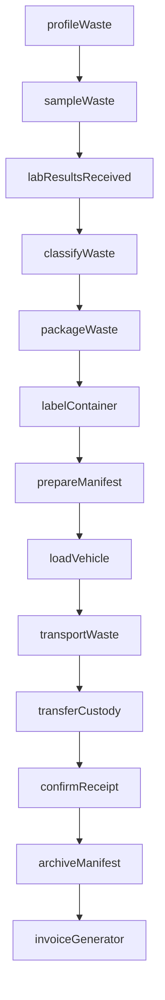
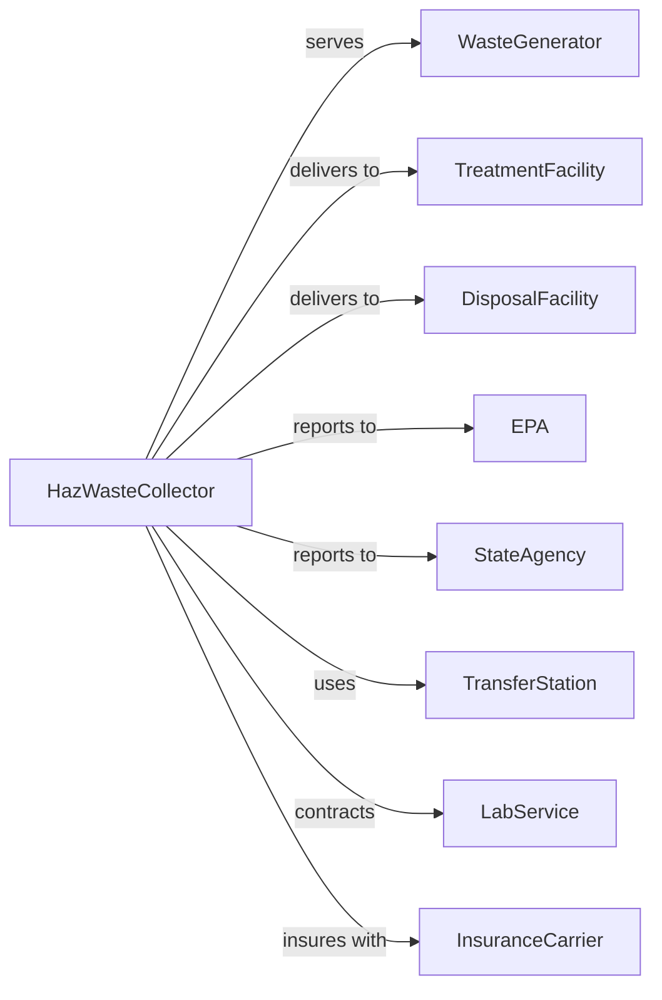

# Hazardous Waste Collection

> Business-as-Code definition for hazardous waste collection operations. Models the regulated lifecycle from waste characterization through compliant packaging, transport, and delivery to treatment facilities.

## Overview

Hazardous waste collection involves collecting, identifying, packaging, and transporting regulated hazardous materials to treatment and disposal facilities. This definition exposes actions for compliant handling, events for tracking and documentation, and searches for manifest and regulatory management.

## Actors

| Actor | Description |
|-------|-------------|
| WasteGenerator | Industrial or commercial entity producing hazardous waste |
| TreatmentFacility | RCRA-permitted facility treating hazardous waste |
| DisposalFacility | Permitted facility for final waste disposal |
| EPA | Federal environmental regulator |
| StateAgency | State environmental regulatory authority |
| TransferStation | Permitted facility for waste consolidation |
| LabService | Analyzes waste for characterization |
| InsuranceCarrier | Provides environmental liability coverage |

## Roles

| Role | Description |
|------|-------------|
| Owner | Owns the company and holds permits |
| ComplianceManager | Ensures regulatory adherence |
| OperationsManager | Oversees daily collection activities |
| HazmatDriver | CDL driver with hazmat endorsement |
| ChemistTechnician | Characterizes and packages waste |
| ManifestClerk | Prepares shipping documents |
| SafetyOfficer | Manages health and safety protocols |
| FieldTechnician | Collects waste at generator sites |

## Entities

| Entity | Description |
|--------|-------------|
| WasteProfile | Characterization of waste stream properties |
| Manifest | EPA hazardous waste tracking document |
| Container | Drum, tote, or tank for waste storage |
| Shipment | Transport of waste from generator to facility |
| LabAnalysis | Chemical analysis of waste sample |
| Permit | Regulatory authorization for operations |
| TransportVehicle | Truck configured for hazardous cargo |
| EmergencyResponse | Plan for spill or incident handling |
| LandDisposalRestriction | Treatment standards for disposal |
| Invoice | Bill for collection and transport services |
| Certificate | Proof of destruction or treatment |
| AuditReport | Compliance inspection documentation |

## Actions

| Action | Description |
|--------|-------------|
| profileWaste | Characterize waste stream properties |
| sampleWaste | Collect sample for laboratory analysis |
| classifyWaste | Determine EPA waste codes and DOT class |
| packageWaste | Place waste in compliant containers |
| labelContainer | Apply required hazard labels and markings |
| prepareManifest | Create EPA tracking document |
| loadVehicle | Safely load containers onto transport |
| transportWaste | Deliver waste to treatment or disposal facility |
| transferCustody | Hand off waste with signed manifest |
| confirmReceipt | Verify destination received shipment |
| archiveManifest | Store completed manifest records |
| conductAudit | Perform compliance inspection |
| respondIncident | Execute emergency response plan |
| invoiceGenerator | Bill customer for services |

## Events

| Event | Description |
|-------|-------------|
| wasteProfiled | Characterization completed |
| sampleCollected | Waste sample taken for analysis |
| labResultsReceived | Analysis completed |
| wasteClassified | EPA codes assigned |
| containerPackaged | Waste placed in compliant container |
| manifestPrepared | Tracking document created |
| shipmentLoaded | Containers loaded on vehicle |
| shipmentDeparted | Transport left generator site |
| shipmentDelivered | Waste arrived at destination |
| manifestSigned | Receiving facility confirmed receipt |
| manifestArchived | Documentation stored for retention |
| incidentReported | Spill or release documented |
| auditCompleted | Compliance inspection finished |
| invoiceSent | Bill sent to generator |

## Searches

| Search | Description |
|--------|-------------|
| findProfiles | List waste profiles by generator or type |
| getManifests | Retrieve manifests by date or status |
| findShipments | List shipments by generator or destination |
| getContainers | Track containers by location or contents |
| checkPermits | View permit status and expiration dates |
| getLabResults | Retrieve analysis results by sample |
| findIncidents | List reported spills or releases |
| getComplianceHistory | Retrieve audit records and violations |

## Workflow



## Actor Relationships



## Usage

### Calling Actions

```typescript
import { collectHazardousWaste } from '@headlessly/collect-hazardous-waste'

const hazwaste = collectHazardousWaste()

// Profile a new waste stream
const profile = await hazwaste.profileWaste({
  generatorId: 'gen-EPA123',
  wasteDescription: 'Spent solvent from degreasing',
  physicalState: 'liquid',
  hazardCharacteristics: ['ignitable', 'toxic']
})

// Classify waste with EPA codes
const classification = await hazwaste.classifyWaste({
  profileId: profile.id,
  labAnalysisId: 'lab-456',
  wasteCodes: ['F001', 'D001'],
  dotClass: '3',
  packingGroup: 'II'
})

// Prepare manifest for shipment
const manifest = await hazwaste.prepareManifest({
  generatorId: 'gen-EPA123',
  destinationId: 'tsdf-789',
  containers: [
    { type: '55-gallon drum', quantity: 4, wasteCode: 'F001' }
  ],
  transporterId: 'trans-001'
})
```

### Event-Driven Automation

```typescript
// Auto-archive manifest when signed
hazwaste.manifestSigned(async ({ manifestId, signatureDate }) => {
  await hazwaste.archiveManifest({
    manifestId,
    retentionYears: 3,
    signedDate: signatureDate
  })
})

// Alert on incident
hazwaste.incidentReported(async ({ incidentId, location, severity }) => {
  if (severity === 'major') {
    await hazwaste.respondIncident({
      incidentId,
      responseTeam: 'hazmat-alpha',
      notifyRegulator: true
    })

    await notifyAgency({
      agency: 'EPA',
      type: 'spill-notification',
      incidentId
    })
  }
})
```

## Related

- [Solid Waste Collection](./562111-SolidWasteCollection.mdx)
- [Other Waste Collection](./562119-OtherWasteCollection.mdx)
