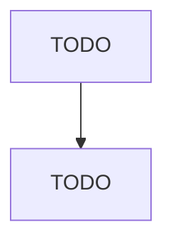

# Hazardous Waste Treatment and Disposal

> TODO: Business-as-Code definition

## Overview

This U.S. industry comprises establishments primarily engaged in (1) operating treatment and/or disposal facilities for hazardous waste or (2) the combined activity of collecting and/or hauling of hazardous waste materials within a local area and operating treatment or disposal facilities for hazardous waste. Cross-References. Establishments primarily engaged in--

## Actors

| Actor | Description |
|-------|-------------|
| TODO | TODO |

## Entities

| Entity | Description |
|--------|-------------|
| TODO | TODO |

## Actions

| Action | Description |
|--------|-------------|
| TODO | TODO |

## Events

| Event | Description |
|-------|-------------|
| TODO | TODO |

## Searches

| Search | Description |
|--------|-------------|
| TODO | TODO |

## Workflow

## Actor Relationships

