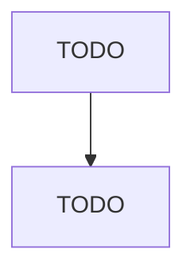

# Solid Waste Combustors and Incinerators

> TODO: Business-as-Code definition

## Overview

This U.S. industry comprises establishments primarily engaged in operating combustors and incinerators for the disposal of nonhazardous solid waste. These establishments may produce byproducts, such as electricity and steam. Cross-References. Establishments primarily engaged in--

## Actors

| Actor | Description |
|-------|-------------|
| TODO | TODO |

## Entities

| Entity | Description |
|--------|-------------|
| TODO | TODO |

## Actions

| Action | Description |
|--------|-------------|
| TODO | TODO |

## Events

| Event | Description |
|-------|-------------|
| TODO | TODO |

## Searches

| Search | Description |
|--------|-------------|
| TODO | TODO |

## Workflow

## Actor Relationships

