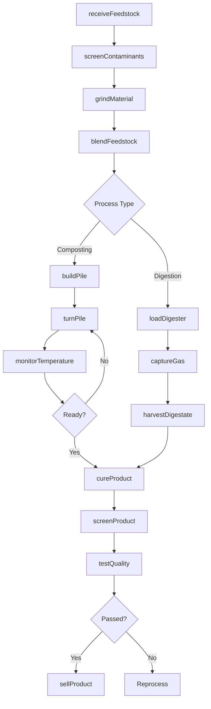
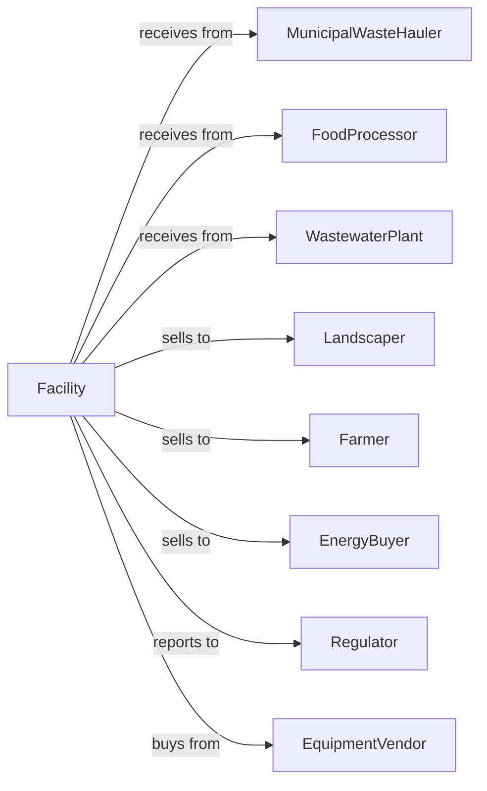

# Other Nonhazardous Waste Treatment and Disposal

> Business-as-Code definition for alternative waste treatment operations. Models composting, anaerobic digestion, and other processing facilities for organic and specialty waste streams.

## Overview

Other nonhazardous waste treatment includes composting facilities, anaerobic digesters, and specialized treatment operations for organic waste, biosolids, and other materials. This definition exposes actions for processing operations, events for quality monitoring, and searches for feedstock and product management.

## Actors

| Actor | Description |
|-------|-------------|
| MunicipalWasteHauler | Delivers food waste and yard trimmings |
| FoodProcessor | Generates organic processing byproducts |
| WastewaterPlant | Supplies biosolids for treatment |
| Landscaper | Purchases finished compost |
| Farmer | Uses compost or digestate as soil amendment |
| EnergyBuyer | Purchases biogas from digesters |
| Regulator | Environmental agency overseeing operations |
| EquipmentVendor | Provides processing machinery |

## Roles

| Role | Description |
|------|-------------|
| FacilityManager | Oversees overall operations |
| OperationsManager | Coordinates daily processing activities |
| CompostOperator | Manages windrow and pile operations |
| DigesterOperator | Runs anaerobic systems |
| QualityTechnician | Tests feedstock and finished products |
| EquipmentOperator | Runs grinders, screeners, and turners |
| SalesRepresentative | Markets finished products |
| ComplianceOfficer | Manages permits and regulatory filings |

## Entities

| Entity | Description |
|--------|-------------|
| Feedstock | Incoming organic material |
| CompostPile | Active decomposition windrow or pile |
| Digester | Anaerobic processing vessel |
| Biogas | Methane produced from digestion |
| Digestate | Residue from anaerobic process |
| FinishedCompost | Cured and screened product |
| QualityTest | Analysis of product parameters |
| WeightTicket | Scale receipt for incoming material |
| ProcessingBay | Area for receiving and grinding |
| CuringArea | Space for product maturation |
| Permit | Operating authorization |
| Invoice | Bill for services or product sales |

## Actions

| Action | Description |
|--------|-------------|
| receiveFeedstock | Accept incoming organic material |
| screenContaminants | Remove non-organic materials |
| grindMaterial | Reduce particle size |
| blendFeedstock | Mix materials for optimal composition |
| buildPile | Create composting windrow |
| turnPile | Aerate composting material |
| monitorTemperature | Track pile heat levels |
| loadDigester | Feed organic material to vessel |
| captureGas | Collect biogas from digestion |
| harvestDigestate | Remove processed material |
| cureProduct | Allow compost to mature |
| screenProduct | Size finished material |
| testQuality | Analyze product parameters |
| sellProduct | Market compost or digestate |

## Events

| Event | Description |
|-------|-------------|
| feedstockReceived | Organic material accepted |
| contaminantsRemoved | Non-organics screened out |
| pileBuilt | Windrow constructed |
| pileTurned | Compost aerated |
| temperaturePeaked | Thermophilic phase achieved |
| digesterLoaded | Material fed to vessel |
| gasCaptured | Biogas collected |
| digestateHarvested | Processed material removed |
| productCured | Compost matured |
| productScreened | Finished material sized |
| qualityApproved | Testing passed standards |
| productSold | Compost or digestate purchased |
| invoiceSent | Bill sent to customer |
| complianceFiled | Regulatory report submitted |

## Searches

| Search | Description |
|--------|-------------|
| findFeedstocks | List incoming materials by source |
| getPileStatus | View composting progress by pile |
| getDigesterMetrics | Retrieve anaerobic process data |
| getGasProduction | View biogas output |
| getProductInventory | Check finished product stock |
| getQualityResults | Retrieve test data |
| findCustomers | List product buyers |
| getComplianceHistory | Retrieve regulatory filings |

## Workflow



## Actor Relationships



## Usage

### Calling Actions

```typescript
import { treatOrganicWaste } from '@headlessly/treat-organic-waste'

const facility = treatOrganicWaste()

// Receive food waste feedstock
const receipt = await facility.receiveFeedstock({
  sourceId: 'foodprocessor-123',
  materialType: 'foodWaste',
  weight: 15000,
  moistureContent: 65,
  contaminationLevel: 'low'
})

// Screen and grind material
await facility.screenContaminants({
  receiptId: receipt.id,
  screenSize: '2-inch',
  contaminantsRemoved: 150
})

await facility.grindMaterial({
  receiptId: receipt.id,
  targetSize: '1-inch'
})

// Build composting pile
const pile = await facility.buildPile({
  materials: [receipt.id, 'yardWaste-456'],
  carbonNitrogenRatio: 30,
  location: 'row-7'
})
```

### Event-Driven Automation

```typescript
// Auto-turn pile when temperature drops
facility.temperatureDropped(async ({ pileId, currentTemp, targetTemp }) => {
  if (currentTemp < targetTemp - 10) {
    await facility.turnPile({
      pileId,
      reason: 'temperatureMaintenance'
    })
  }
})

// Notify when product ready for sale
facility.qualityApproved(async ({ batchId, testResults }) => {
  await facility.updateProductInventory({
    batchId,
    status: 'available',
    parameters: testResults
  })

  await notifyCustomers({
    productType: 'premiumCompost',
    quantity: testResults.volume,
    specs: testResults.parameters
  })
})
```

## Related

- [Solid Waste Landfill](./562212-SolidWasteLandfill.mdx)
- [Solid Waste Combustors and Incinerators](./562213-SolidWasteCombustorsAndIncinerators.mdx)
