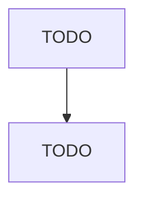

# Other Nonhazardous Waste Treatment and Disposal

> TODO: Business-as-Code definition

## Overview

This U.S. industry comprises establishments primarily engaged in (1) operating nonhazardous waste treatment and disposal facilities (except landfills, combustors, incinerators, and sewer systems or sewage treatment facilities) or (2) the combined activity of collecting and/or hauling of nonhazardous waste materials within a local area and operating waste treatment or disposal facilities (except landfills, combustors, incinerators, and sewer systems or sewage treatment facilities). Compost dumps 

## Actors

| Actor | Description |
|-------|-------------|
| TODO | TODO |

## Entities

| Entity | Description |
|--------|-------------|
| TODO | TODO |

## Actions

| Action | Description |
|--------|-------------|
| TODO | TODO |

## Events

| Event | Description |
|-------|-------------|
| TODO | TODO |

## Searches

| Search | Description |
|--------|-------------|
| TODO | TODO |

## Workflow

## Actor Relationships

