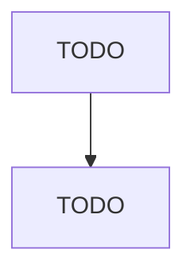

# Remediation Services

> TODO: Business-as-Code definition

## Overview

This industry comprises establishments primarily engaged in one or more of the following: (1) remediation and cleanup of contaminated buildings, mine sites, soil, or ground water; (2) integrated mine reclamation activities, including demolition, soil remediation, waste water treatment, hazardous material removal, contouring land, and revegetation; and (3) asbestos, lead paint, and other toxic material abatement. Cross-References. Establishments primarily engaged in--

## Actors

| Actor | Description |
|-------|-------------|
| TODO | TODO |

## Entities

| Entity | Description |
|--------|-------------|
| TODO | TODO |

## Actions

| Action | Description |
|--------|-------------|
| TODO | TODO |

## Events

| Event | Description |
|-------|-------------|
| TODO | TODO |

## Searches

| Search | Description |
|--------|-------------|
| TODO | TODO |

## Workflow

## Actor Relationships

