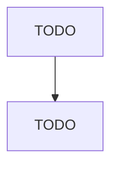

# Septic Tank and Related Services

> TODO: Business-as-Code definition

## Overview

This U.S. industry comprises establishments primarily engaged in (1) pumping (i.e., cleaning) septic tanks and cesspools and/or (2) renting and/or servicing portable toilets. Cross-References. Establishments primarily engaged in--

## Actors

| Actor | Description |
|-------|-------------|
| TODO | TODO |

## Entities

| Entity | Description |
|--------|-------------|
| TODO | TODO |

## Actions

| Action | Description |
|--------|-------------|
| TODO | TODO |

## Events

| Event | Description |
|-------|-------------|
| TODO | TODO |

## Searches

| Search | Description |
|--------|-------------|
| TODO | TODO |

## Workflow

## Actor Relationships

