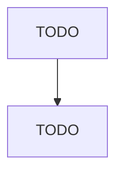

# All Other Miscellaneous Waste Management Services

> TODO: Business-as-Code definition

## Overview

This U.S. industry comprises establishments primarily engaged in providing waste management services (except waste collection, waste treatment and disposal, remediation, operation of materials recovery facilities, septic tank pumping and related services, and waste management consulting services). Illustrative Examples: Beach cleaning and maintenance services Sewer or storm basin cleanout services Catch basin cleaning services Tank cleaning and disposal services, commercial or industrial Sewer c

## Actors

| Actor | Description |
|-------|-------------|
| TODO | TODO |

## Entities

| Entity | Description |
|--------|-------------|
| TODO | TODO |

## Actions

| Action | Description |
|--------|-------------|
| TODO | TODO |

## Events

| Event | Description |
|-------|-------------|
| TODO | TODO |

## Searches

| Search | Description |
|--------|-------------|
| TODO | TODO |

## Workflow

## Actor Relationships

