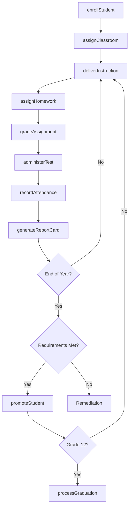
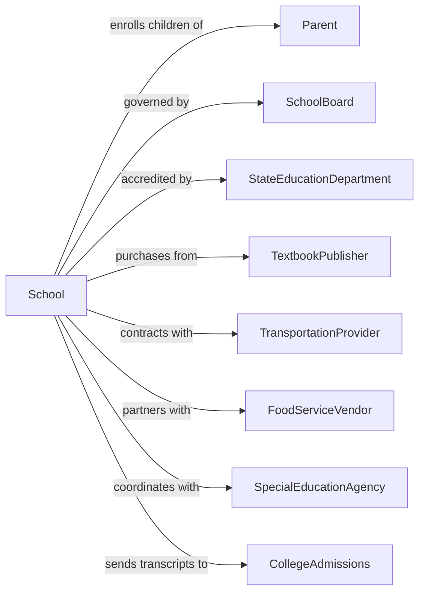

# Elementary and Secondary Schools

> Business-as-Code definition for K-12 educational institutions. Models the complete academic lifecycle from enrollment through graduation.

## Overview

Elementary and secondary schools provide foundational academic education from kindergarten through 12th grade, including public, private, charter, and parochial institutions. This definition exposes actions for student enrollment, curriculum delivery, assessment, and graduation, along with events for workflow automation and searches for data retrieval.

## Actors

| Actor | Description |
|-------|-------------|
| Parent | Legal guardian responsible for student enrollment and consent |
| SchoolBoard | Governing body setting policy and approving budgets |
| StateEducationDepartment | Oversees standards, testing, and school accreditation |
| TextbookPublisher | Provides curriculum materials and educational resources |
| TransportationProvider | Operates school bus services for student transport |
| FoodServiceVendor | Supplies cafeteria meals and nutrition programs |
| SpecialEducationAgency | Provides assessments and services for students with disabilities |
| CollegeAdmissions | Receives transcripts and evaluates graduates for admission |
| CommunityPartner | Local organizations providing enrichment and support programs |

## Roles

| Role | Description |
|------|-------------|
| Principal | Leads the school and oversees all operations |
| Teacher | Delivers instruction and assesses student learning |
| Counselor | Provides academic and social-emotional guidance |
| SpecialEducationCoordinator | Manages IEPs and accommodations for students with disabilities |
| Registrar | Maintains student records and processes enrollments |
| ParaprofessionalAide | Supports teachers in classroom instruction |

## Entities

| Entity | Description |
|--------|-------------|
| Student | Individual enrolled in the educational program |
| Course | Academic subject with defined curriculum and standards |
| Enrollment | Record of student registration in a school year |
| Transcript | Official record of courses completed and grades earned |
| GradeLevel | Classification of student progress (K-12) |
| Classroom | Physical or virtual space for instruction |
| Assignment | Work assigned to students for learning and assessment |
| Assessment | Test or evaluation measuring student achievement |
| IEP | Individualized Education Program for special needs students |
| AttendanceRecord | Daily log of student presence or absence |
| ReportCard | Periodic summary of student academic performance |
| Diploma | Credential awarded upon successful program completion |

## Actions

| Action | Description |
|--------|-------------|
| enrollStudent | Register a new student with required documentation |
| assignClassroom | Place student in appropriate grade and section |
| createCurriculum | Develop course content aligned with state standards |
| deliverInstruction | Teach lessons according to curriculum plan |
| assignHomework | Create and distribute assignments for student practice |
| gradeAssignment | Evaluate student work and record scores |
| administerTest | Conduct standardized or classroom assessments |
| recordAttendance | Log daily student presence and absences |
| generateReportCard | Compile grades into periodic progress reports |
| conductParentConference | Meet with parents to discuss student progress |
| developIEP | Create individualized plan for special needs student |
| promoteStudent | Advance student to next grade level |
| processGraduation | Verify requirements and issue diplomas |
| transferRecords | Send student files to receiving school |
| scheduleTransportation | Assign bus routes and pickup times |

## Events

| Event | Description |
|-------|-------------|
| studentEnrolled | New student registration completed |
| classroomAssigned | Student placed in grade and section |
| instructionDelivered | Lesson completed for a class period |
| assignmentSubmitted | Student work turned in for grading |
| assignmentGraded | Score recorded for student work |
| testAdministered | Assessment completed by students |
| attendanceRecorded | Daily presence logged for class |
| reportCardGenerated | Grades compiled and ready for distribution |
| parentConferenceScheduled | Meeting set with parent or guardian |
| iepDeveloped | Special education plan finalized |
| studentPromoted | Grade level advancement approved |
| graduationProcessed | Diploma requirements verified |
| recordsTransferred | Student files sent to new school |
| disciplineIncidentLogged | Behavioral issue documented |
| standardsAssessmentCompleted | State testing results received |

## Searches

| Search | Description |
|--------|-------------|
| findStudents | Query students by grade, classroom, or status |
| getEnrollments | Retrieve enrollment records for a school year |
| getTranscript | Fetch complete academic history for a student |
| getAttendance | Query attendance records by date range |
| findTeachers | List teachers by subject or grade level |
| getAssessmentResults | Retrieve test scores by student or class |
| getIEPStudents | Find students with active special education plans |
| getCourseRoster | List all students enrolled in a specific course |

## Workflow



## Actor Relationships



## Usage

### Calling Actions

```typescript
import { teachK12 } from '@headlessly/teach-k12'

const school = teachK12()

// Enroll a new student
const enrollment = await school.enrollStudent({
  firstName: 'Emily',
  lastName: 'Johnson',
  dateOfBirth: '2015-03-15',
  gradeLevel: 3,
  guardianId: 'parent-456',
  documents: ['birthCertificate', 'immunizationRecord', 'proofOfResidency']
})

// Assign to classroom
await school.assignClassroom({
  studentId: enrollment.studentId,
  classroomId: 'room-203',
  teacherId: 'teacher-789',
  schoolYear: '2025-2026'
})

// Record daily attendance
await school.recordAttendance({
  classroomId: 'room-203',
  date: '2025-09-15',
  records: [
    { studentId: enrollment.studentId, status: 'present' },
    { studentId: 'student-002', status: 'absent', reason: 'illness' }
  ]
})
```

### Event-Driven Automation

```typescript
// Notify parents when report cards are ready
school.reportCardGenerated(async ({ studentId, gradingPeriod }) => {
  const student = await school.findStudents({ id: studentId })
  const guardian = await getGuardian(student.guardianId)

  await sendNotification({
    to: guardian.email,
    subject: `Report Card Available - ${gradingPeriod}`,
    template: 'report-card-ready'
  })
})

// Flag attendance concerns automatically
school.attendanceRecorded(async ({ studentId, status }) => {
  if (status === 'absent') {
    const attendance = await school.getAttendance({
      studentId,
      dateRange: 'last-30-days'
    })

    if (attendance.absentCount >= 5) {
      await school.conductParentConference({
        studentId,
        reason: 'attendance-concern',
        priority: 'high'
      })
    }
  }
})
```
