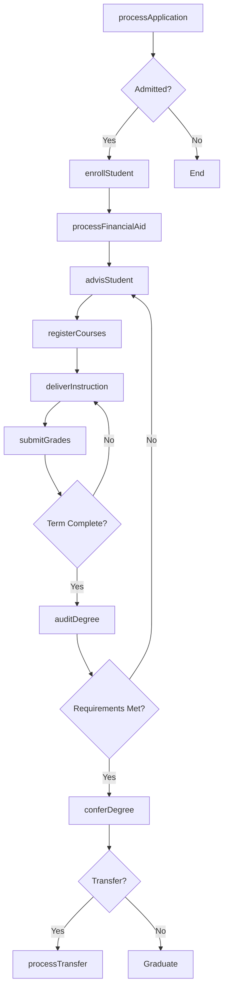
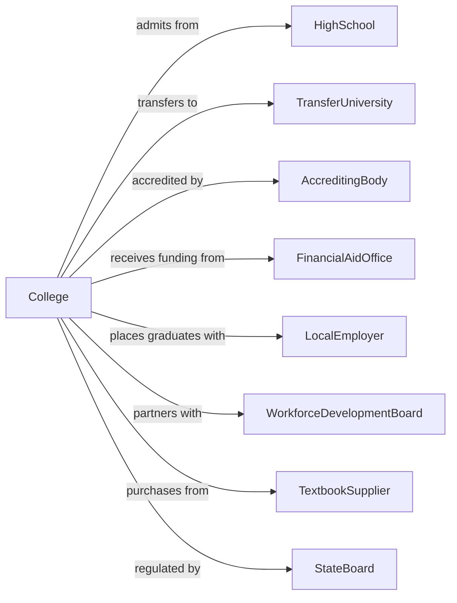

# Junior Colleges

> Business-as-Code definition for community and junior college operations. Models the academic pathway from admission through associate degree completion or transfer.

## Overview

Junior colleges provide two-year academic and vocational programs leading to associate degrees, certificates, and transfer preparation to four-year institutions. This definition exposes actions for admissions, course registration, academic advising, and credential conferral, along with events for workflow automation and searches for institutional data.

## Actors

| Actor | Description |
|-------|-------------|
| ProspectiveStudent | Individual seeking admission to the college |
| TransferUniversity | Four-year institution accepting transfer students |
| AccreditingBody | Regional agency ensuring educational quality standards |
| FinancialAidOffice | Federal and state agencies providing student funding |
| LocalEmployer | Businesses hiring graduates and sponsoring programs |
| WorkforceDevelopmentBoard | Government agency funding career training programs |
| HighSchool | Feeder institution for dual enrollment and recruitment |
| TextbookSupplier | Provides course materials and digital resources |
| StateBoard | Government body overseeing community college systems |

## Roles

| Role | Description |
|------|-------------|
| President | Chief executive leading the institution |
| Dean | Academic leader overseeing divisions or departments |
| Professor | Faculty member delivering instruction and advising |
| AcademicAdvisor | Guides students on course selection and transfer planning |
| Registrar | Manages enrollment, records, and credential processing |
| FinancialAidCounselor | Assists students with funding and scholarship applications |

## Entities

| Entity | Description |
|--------|-------------|
| Student | Individual enrolled in college programs |
| Course | Academic class with defined credits and outcomes |
| Program | Degree or certificate pathway with required courses |
| Enrollment | Record of student registration in a term |
| Transcript | Official record of courses and grades |
| Degree | Associate credential awarded upon completion |
| Certificate | Vocational credential for specialized training |
| TransferAgreement | Articulation with four-year institution |
| FinancialAidAward | Grants, loans, and scholarships for a student |
| Schedule | Student's registered courses for a term |
| Catalog | Published courses, programs, and policies |
| Faculty | Teaching staff with credentials and assignments |

## Actions

| Action | Description |
|--------|-------------|
| processApplication | Review and decide on admission application |
| enrollStudent | Complete registration for admitted student |
| registerCourses | Add courses to student schedule for term |
| dropCourse | Remove course from student schedule with refund calculation |
| advisStudent | Provide academic guidance and degree planning |
| deliverInstruction | Teach class sessions and labs |
| submitGrades | Record final grades for enrolled students |
| processFinancialAid | Award grants, loans, and scholarships |
| evaluateTransferCredits | Assess prior coursework for equivalency |
| auditDegree | Verify completion of program requirements |
| conferDegree | Award associate degree or certificate |
| processTransfer | Send transcripts to receiving university |
| scheduleClasses | Build term course offerings and sections |
| hireFaculty | Recruit and onboard teaching staff |
| maintainAccreditation | Prepare reports and host site visits |

## Events

| Event | Description |
|-------|-------------|
| applicationReceived | Admission application submitted |
| studentAdmitted | Admission decision rendered |
| studentEnrolled | Registration completed for term |
| courseRegistered | Student added to class roster |
| courseDropped | Student removed from class |
| gradesSubmitted | Final grades posted for course |
| financialAidAwarded | Funding package finalized |
| transferCreditsEvaluated | Prior coursework assessed |
| degreeAudited | Program requirements reviewed |
| degreeConferred | Credential officially awarded |
| transcriptRequested | Official record requested for transfer |
| classScheduled | Course section added to term offerings |
| facultyHired | New instructor onboarded |
| accreditationReviewed | Quality assessment completed |
| advisingSessionCompleted | Student guidance meeting concluded |

## Searches

| Search | Description |
|--------|-------------|
| findStudents | Query students by program, status, or demographics |
| getCourses | List courses by subject, term, or instructor |
| getPrograms | Retrieve degree and certificate offerings |
| getEnrollments | Fetch registration records by term |
| getTranscript | Retrieve official academic record |
| findFaculty | List instructors by department or credentials |
| getFinancialAid | Query aid awards by student or type |
| getTransferAgreements | List articulation agreements with universities |

## Workflow



## Actor Relationships



## Usage

### Calling Actions

```typescript
import { teachAssociates } from '@headlessly/teach-associates'

const college = teachAssociates()

// Process a new application
const admission = await college.processApplication({
  applicantId: 'app-12345',
  program: 'associate-science-nursing',
  term: 'Fall 2025',
  transcripts: ['high-school-transcript.pdf'],
  testScores: { accuplacer: { reading: 250, writing: 245, math: 263 } }
})

// Register for courses after admission
await college.registerCourses({
  studentId: admission.studentId,
  term: 'Fall 2025',
  courses: ['BIO-201', 'ENG-101', 'MATH-120', 'NUR-100']
})

// Submit grades at end of term
await college.submitGrades({
  courseId: 'BIO-201',
  term: 'Fall 2025',
  grades: [
    { studentId: admission.studentId, grade: 'A', credits: 4 },
    { studentId: 'student-002', grade: 'B+', credits: 4 }
  ]
})
```

### Event-Driven Automation

```typescript
// Auto-notify students of financial aid awards
college.financialAidAwarded(async ({ studentId, awardPackage }) => {
  const student = await college.findStudents({ id: studentId })

  await sendNotification({
    to: student.email,
    subject: 'Your Financial Aid Award is Ready',
    template: 'financial-aid-award',
    data: { totalAward: awardPackage.total, breakdown: awardPackage.items }
  })
})

// Trigger degree audit when credits threshold reached
college.gradesSubmitted(async ({ studentId }) => {
  const transcript = await college.getTranscript({ studentId })

  if (transcript.totalCredits >= 55) {
    await college.auditDegree({
      studentId,
      programId: transcript.programId
    })
  }
})
```
