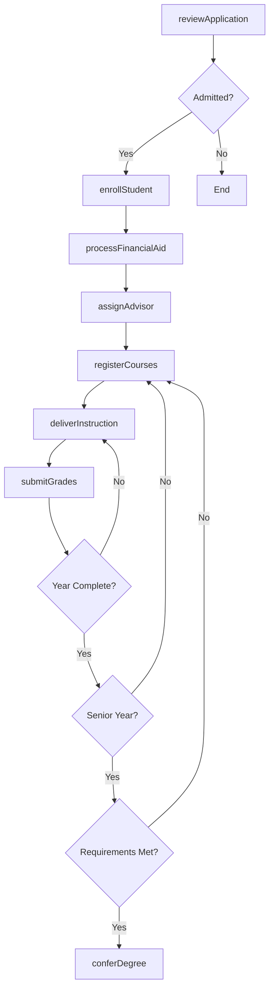
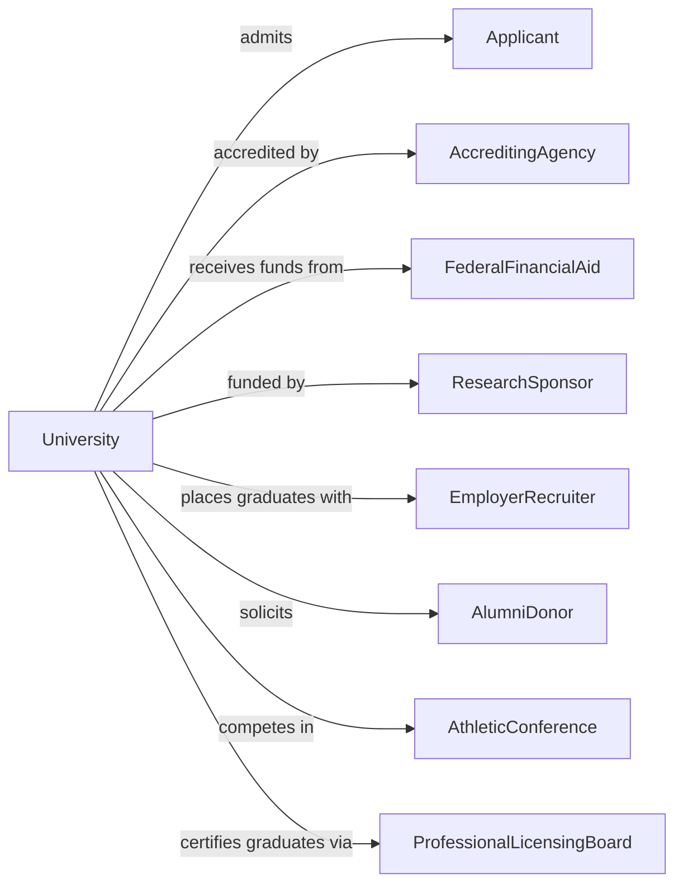

# Colleges, Universities, and Professional Schools

> Business-as-Code definition for four-year institutions and professional schools. Models the complete academic lifecycle from undergraduate admission through graduate degree conferral.

## Overview

Colleges and universities provide baccalaureate, graduate, and professional degree programs across diverse academic disciplines. This definition exposes actions for admissions, enrollment management, research administration, and degree conferral, along with events for workflow automation and searches for institutional data.

## Actors

| Actor | Description |
|-------|-------------|
| Applicant | Prospective student seeking admission |
| AccreditingAgency | Organization certifying institutional and program quality |
| FederalFinancialAid | Government agency administering student loans and grants |
| ResearchSponsor | Foundations and agencies funding academic research |
| EmployerRecruiter | Companies hiring graduates for professional positions |
| AlumniDonor | Graduates contributing financially to the institution |
| AthleticConference | Governing body for intercollegiate sports |
| GraduateSchool | Internal or external programs for advanced degrees |
| ProfessionalLicensingBoard | Bodies certifying graduates for professional practice |

## Roles

| Role | Description |
|------|-------------|
| President | Chief executive of the institution |
| Provost | Chief academic officer overseeing faculty and curriculum |
| Dean | Leader of an academic college or school |
| Professor | Faculty member teaching and conducting research |
| AcademicAdvisor | Staff guiding students on degree requirements |
| ResearchAdministrator | Manages grants, compliance, and sponsored programs |

## Entities

| Entity | Description |
|--------|-------------|
| Student | Individual enrolled in degree programs |
| Course | Academic class with credits and learning outcomes |
| Program | Degree pathway with required coursework |
| Department | Academic unit within a college or school |
| Transcript | Official academic record of courses and grades |
| Degree | Credential awarded upon program completion |
| ResearchGrant | Funded project with deliverables and timeline |
| Dissertation | Original research required for doctoral degrees |
| Faculty | Teaching and research staff with academic rank |
| Enrollment | Student registration record for a term |
| Tuition | Fees charged for academic instruction |
| Housing | On-campus residential accommodations |

## Actions

| Action | Description |
|--------|-------------|
| reviewApplication | Evaluate admission materials and render decision |
| enrollStudent | Complete matriculation for admitted student |
| registerCourses | Add classes to student schedule for term |
| assignAdvisor | Match student with faculty or staff advisor |
| deliverInstruction | Conduct classes, seminars, and labs |
| submitGrades | Post final grades for enrolled students |
| processFinancialAid | Determine and award funding packages |
| conductResearch | Execute funded research projects |
| submitGrant | Apply for research funding from sponsors |
| reviewDissertation | Evaluate doctoral thesis for completion |
| conferDegree | Award bachelor, master, or doctoral degree |
| processTranscript | Generate official academic records |
| manageHousing | Assign and administer residential facilities |
| recruitAthletes | Identify and admit student athletes |
| engageAlumni | Cultivate relationships with graduates |

## Events

| Event | Description |
|-------|-------------|
| applicationSubmitted | Admission application received |
| admissionDecided | Accept, deny, or waitlist decision rendered |
| studentEnrolled | Matriculation completed |
| coursesRegistered | Classes added to student schedule |
| gradesPosted | Final course grades submitted |
| financialAidDisbursed | Funds released to student account |
| grantAwarded | Research funding approved |
| researchCompleted | Study findings submitted |
| dissertationDefended | Doctoral thesis successfully presented |
| degreeConferred | Credential officially awarded |
| transcriptIssued | Official record released |
| housingAssigned | Room assignment confirmed |
| athleteRecruited | Student athlete committed to institution |
| alumniEngaged | Graduate participation recorded |
| accreditationRenewed | Institutional approval extended |

## Searches

| Search | Description |
|--------|-------------|
| findStudents | Query students by program, year, or status |
| getCourses | List courses by department, level, or term |
| getPrograms | Retrieve degree offerings by college |
| getFaculty | List professors by department or research area |
| getGrants | Query active research funding by sponsor or PI |
| getTranscript | Fetch official academic record for student |
| getEnrollments | Retrieve registration data by term |
| getAlumni | Search graduates by year, major, or location |

## Workflow



## Actor Relationships



## Usage

### Calling Actions

```typescript
import { teachDegrees } from '@headlessly/teach-degrees'

const university = teachDegrees()

// Review undergraduate application
const decision = await university.reviewApplication({
  applicantId: 'app-78901',
  program: 'bs-computer-science',
  gpa: 3.85,
  satScore: 1420,
  essays: ['personal-statement.pdf'],
  recommendations: ['teacher-rec-1.pdf', 'counselor-rec.pdf']
})

// Enroll admitted student
const enrollment = await university.enrollStudent({
  applicantId: decision.applicantId,
  term: 'Fall 2025',
  program: 'bs-computer-science',
  residency: 'in-state'
})

// Submit research grant application
const grant = await university.submitGrant({
  principalInvestigator: 'faculty-456',
  sponsor: 'NSF',
  title: 'Machine Learning for Climate Modeling',
  amount: 750000,
  duration: '3-years',
  proposal: 'nsf-proposal-2025.pdf'
})
```

### Event-Driven Automation

```typescript
// Notify admitted students automatically
university.admissionDecided(async ({ applicantId, decision, program }) => {
  const applicant = await getApplicant(applicantId)

  if (decision === 'admitted') {
    await sendNotification({
      to: applicant.email,
      subject: 'Congratulations on Your Admission!',
      template: 'admission-offer',
      data: { program, deadline: '2025-05-01' }
    })
  }
})

// Process degree conferral when requirements complete
university.gradesPosted(async ({ studentId, term }) => {
  const student = await university.findStudents({ id: studentId })

  if (student.year === 'senior' && term === 'Spring') {
    const audit = await auditDegreeRequirements(studentId)

    if (audit.complete) {
      await university.conferDegree({
        studentId,
        degree: audit.program,
        honors: calculateHonors(student.gpa),
        conferralDate: '2025-05-15'
      })
    }
  }
})
```
