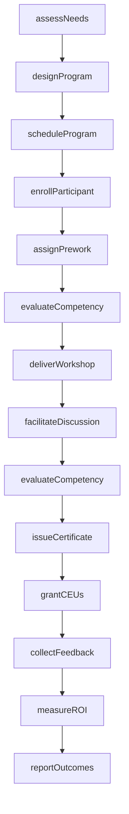
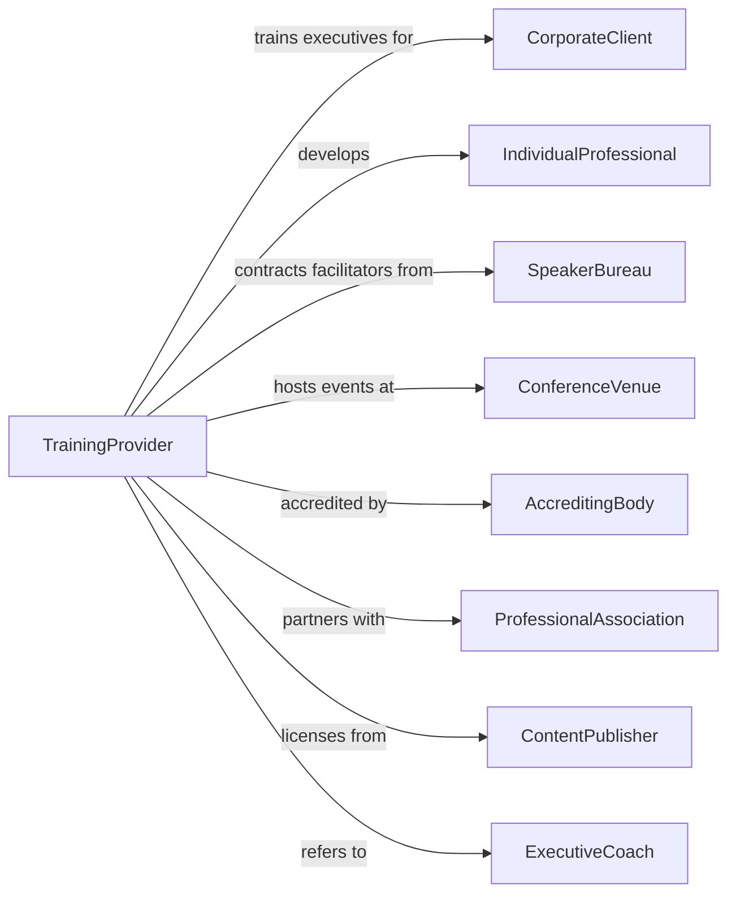

# Professional and Management Development Training

> Business-as-Code definition for executive education and leadership development providers. Models the complete training lifecycle from needs assessment through program delivery and ROI measurement.

## Overview

Professional and management development training establishments provide short-duration courses and seminars in leadership, communication, project management, and other business skills for working professionals and executives. This definition exposes actions for corporate engagement, program customization, delivery, and outcomes measurement, along with events for workflow automation and searches for program data.

## Actors

| Actor | Description |
|-------|-------------|
| CorporateClient | Organization sponsoring executive development |
| IndividualProfessional | Self-funded participant seeking career advancement |
| SpeakerBureau | Agency providing expert facilitators and keynotes |
| ConferenceVenue | Facility hosting in-person training events |
| AccreditingBody | Organization certifying continuing education credits |
| ProfessionalAssociation | Industry group requiring member development |
| ContentPublisher | Provider of training materials and case studies |
| LMSVendor | Learning management system provider |
| ExecutiveCoach | Individual providing one-on-one leadership coaching |

## Roles

| Role | Description |
|------|-------------|
| ProgramDirector | Oversees curriculum design and delivery |
| LeadFacilitator | Delivers training sessions and workshops |
| ClientManager | Manages relationships with corporate clients |
| CurriculumDesigner | Creates and customizes training content |
| EventCoordinator | Handles logistics for in-person programs |
| AssessmentSpecialist | Designs and administers competency evaluations |

## Entities

| Entity | Description |
|--------|-------------|
| Participant | Individual enrolled in training programs |
| Program | Structured course with learning objectives |
| Workshop | Single-session or multi-day training event |
| Seminar | Brief presentation or discussion on specific topic |
| Enrollment | Record of participant registration |
| Competency | Leadership or professional skill being developed |
| Assessment | Evaluation of participant knowledge or behavior |
| Certificate | Credential awarded for program completion |
| CEU | Continuing education unit for professional credits |
| Contract | Agreement with corporate client for training services |
| Feedback | Participant evaluation of training effectiveness |
| Material | Workbooks, slides, and resources for training |

## Actions

| Action | Description |
|--------|-------------|
| assessNeeds | Evaluate client training requirements |
| designProgram | Create customized curriculum and materials |
| enrollParticipant | Register individual for program or workshop |
| deliverWorkshop | Conduct in-person or virtual training session |
| facilitateDiscussion | Lead group activities and case study analysis |
| assignPrework | Distribute materials for advance preparation |
| evaluateCompetency | Assess participant skills before and after training |
| issueCertificate | Award credential for program completion |
| grantCEUs | Record continuing education credits earned |
| collectFeedback | Gather participant evaluations of training |
| measureROI | Assess business impact of training investment |
| manageContract | Handle corporate agreements and billing |
| scheduleProgram | Set dates and logistics for training delivery |
| engageCoach | Arrange individual coaching sessions |
| reportOutcomes | Provide client with completion and impact data |

## Events

| Event | Description |
|-------|-------------|
| needsAssessed | Training requirements documented |
| programDesigned | Curriculum and materials finalized |
| participantEnrolled | Registration completed |
| workshopDelivered | Training session conducted |
| discussionFacilitated | Group activity completed |
| preworkAssigned | Advance materials distributed |
| competencyEvaluated | Skills assessment completed |
| certificateIssued | Completion credential awarded |
| ceusGranted | Education credits recorded |
| feedbackCollected | Participant evaluations received |
| roiMeasured | Business impact calculated |
| contractManaged | Agreement created or renewed |
| programScheduled | Training dates confirmed |
| coachEngaged | Coaching relationship established |
| outcomesReported | Client report delivered |

## Searches

| Search | Description |
|--------|-------------|
| findParticipants | Query enrollees by program, company, or status |
| getPrograms | List available training offerings |
| getWorkshops | Find scheduled sessions by topic or date |
| getEnrollments | Query registrations by program or client |
| getCertificates | List credentials issued to participants |
| getFeedback | Retrieve evaluations by program or facilitator |
| getContracts | Find active corporate agreements |
| getCompetencyAssessments | Query skills evaluations by participant |

## Workflow



## Actor Relationships



## Usage

### Calling Actions

```typescript
import { trainManagers } from '@headlessly/train-managers'

const provider = trainManagers()

// Assess corporate training needs
const assessment = await provider.assessNeeds({
  clientId: 'corp-789',
  stakeholders: ['ceo', 'chro', 'learning-director'],
  competencies: ['leadership', 'change-management', 'strategic-thinking'],
  targetAudience: 'senior-managers',
  budget: 150000
})

// Design custom program
const program = await provider.designProgram({
  assessmentId: assessment.id,
  title: 'Executive Leadership Accelerator',
  duration: '6-months',
  modules: ['strategic-vision', 'leading-change', 'executive-presence'],
  format: 'blended',
  cohortSize: 25
})

// Enroll participant
await provider.enrollParticipant({
  programId: program.id,
  participantId: 'exec-456',
  sponsorId: 'corp-789',
  cohort: 'spring-2025'
})
```

### Event-Driven Automation

```typescript
// Send pre-work when enrollment confirmed
provider.participantEnrolled(async ({ participantId, programId }) => {
  const program = await provider.getPrograms({ id: programId })

  await provider.assignPrework({
    participantId,
    materials: program.preworkMaterials,
    dueDate: subtractDays(program.startDate, 7)
  })
})

// Calculate and report ROI after program completion
provider.feedbackCollected(async ({ programId, cohortId }) => {
  const enrollments = await provider.getEnrollments({
    programId,
    cohortId,
    status: 'completed'
  })

  if (enrollments.every(e => e.feedbackSubmitted)) {
    const roi = await provider.measureROI({
      programId,
      cohortId,
      metrics: ['engagement-scores', 'promotion-rate', 'retention-rate']
    })

    await provider.reportOutcomes({
      clientId: enrollments[0].sponsorId,
      programId,
      cohortId,
      roi,
      recommendations: generateRecommendations(roi)
    })
  }
})
```
