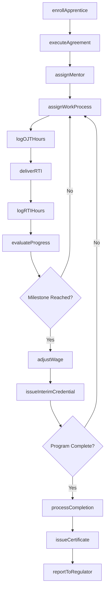
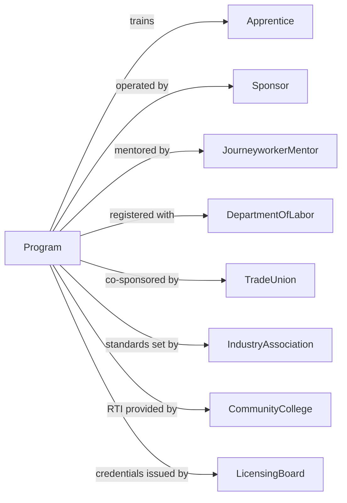

# Apprenticeship Training

> Business-as-Code definition for registered apprenticeship programs. Models the complete training lifecycle from enrollment through journeyworker certification.

## Overview

Apprenticeship training establishments provide structured programs combining on-the-job training with related technical instruction for skilled trades. This definition exposes actions for apprentice enrollment, work-based learning coordination, technical instruction, and competency certification, along with events for workflow automation and searches for program data.

## Actors

| Actor | Description |
|-------|-------------|
| Apprentice | Individual enrolled in structured training program |
| Sponsor | Employer or joint committee operating the program |
| JourneyworkerMentor | Experienced tradesperson supervising apprentice work |
| DepartmentOfLabor | Federal or state agency registering programs |
| TradeUnion | Labor organization co-sponsoring training |
| IndustryAssociation | Professional group setting skill standards |
| CommunityCollege | Institution providing related technical instruction |
| EquipmentSupplier | Provider of tools and training materials |
| LicensingBoard | Authority issuing trade credentials |

## Roles

| Role | Description |
|------|-------------|
| ProgramCoordinator | Manages apprenticeship operations and compliance |
| TrainingDirector | Oversees curriculum and instruction quality |
| WorkplaceSuperviser | Assigns and monitors on-the-job training |
| RTIInstructor | Delivers related technical instruction courses |
| ComplianceSpecialist | Ensures regulatory requirements are met |
| RecruitmentOfficer | Identifies and enrolls new apprentices |

## Entities

| Entity | Description |
|--------|-------------|
| Apprentice | Individual in registered training program |
| Program | Registered apprenticeship with defined standards |
| OJTHours | On-the-job training time logged |
| RTIHours | Related technical instruction time completed |
| Competency | Measurable skill or knowledge area |
| WorkProcess | Defined on-the-job learning activity |
| RTICourse | Classroom or online technical instruction |
| Evaluation | Assessment of apprentice progress |
| WageProgression | Scheduled pay increases based on progress |
| Certificate | Credential awarded upon program completion |
| Sponsor | Employer or consortium operating program |
| Agreement | Contract between apprentice and sponsor |

## Actions

| Action | Description |
|--------|-------------|
| enrollApprentice | Register individual in apprenticeship program |
| executeAgreement | Formalize contract between apprentice and sponsor |
| assignMentor | Match apprentice with journeyworker supervisor |
| assignWorkProcess | Schedule on-the-job training activities |
| logOJTHours | Record supervised work experience time |
| deliverRTI | Conduct related technical instruction |
| logRTIHours | Record classroom instruction time |
| evaluateProgress | Assess competency achievement |
| adjustWage | Process scheduled pay progression |
| issueInterimCredential | Award milestone completion recognition |
| processCompletion | Verify all requirements for program finish |
| issueCertificate | Award journeyworker credential |
| reportToRegulator | Submit required data to Department of Labor |
| recruitCandidates | Identify and attract prospective apprentices |
| partnerWithEmployer | Establish new sponsor relationship |

## Events

| Event | Description |
|-------|-------------|
| apprenticeEnrolled | Registration completed for program |
| agreementExecuted | Contract formalized |
| mentorAssigned | Journeyworker paired with apprentice |
| workProcessAssigned | OJT activity scheduled |
| ojtHoursLogged | Work experience time recorded |
| rtiDelivered | Technical instruction completed |
| rtiHoursLogged | Classroom time recorded |
| progressEvaluated | Competency assessment completed |
| wageAdjusted | Pay increase processed |
| interimCredentialIssued | Milestone recognition awarded |
| completionProcessed | Program finish verified |
| certificateIssued | Journeyworker credential awarded |
| regulatorReported | Compliance data submitted |
| candidateRecruited | Prospective apprentice identified |
| employerPartnered | New sponsor relationship established |

## Searches

| Search | Description |
|--------|-------------|
| findApprentices | Query apprentices by trade, sponsor, or progress |
| getOJTHours | Retrieve on-the-job training records |
| getRTIHours | Query related technical instruction records |
| getCompetencies | List skills achieved by apprentice |
| getWageProgressions | Track pay increase history |
| getSponsors | Find registered program sponsors |
| getPrograms | List available apprenticeship programs |
| getEvaluations | Query progress assessments by apprentice |

## Workflow



## Actor Relationships



## Usage

### Calling Actions

```typescript
import { trainApprentices } from '@headlessly/train-apprentices'

const program = trainApprentices()

// Enroll a new apprentice
const enrollment = await program.enrollApprentice({
  firstName: 'Carlos',
  lastName: 'Martinez',
  tradeId: 'electrician-inside-wireman',
  sponsorId: 'jatc-local-11',
  startDate: '2025-09-01',
  startingWage: 18.50
})

// Execute apprenticeship agreement
await program.executeAgreement({
  apprenticeId: enrollment.apprenticeId,
  sponsorId: 'jatc-local-11',
  termYears: 5,
  ojtHoursRequired: 8000,
  rtiHoursRequired: 900,
  wageSchedule: [0.45, 0.50, 0.60, 0.75, 0.90]
})

// Log on-the-job training hours
await program.logOJTHours({
  apprenticeId: enrollment.apprenticeId,
  date: '2025-10-15',
  hours: 8,
  workProcess: 'conduit-bending',
  mentorId: 'jw-456',
  location: 'jobsite-789'
})
```

### Event-Driven Automation

```typescript
// Process wage increase when milestone reached
program.progressEvaluated(async ({ apprenticeId, competenciesAchieved }) => {
  const apprentice = await program.findApprentices({ id: apprenticeId })
  const milestones = getMilestones(apprentice.tradeId)

  for (const milestone of milestones) {
    if (competenciesAchieved.includes(milestone.competency)) {
      await program.adjustWage({
        apprenticeId,
        newRate: calculateNewWage(apprentice.startingWage, milestone.percentage),
        effectiveDate: new Date().toISOString()
      })

      await program.issueInterimCredential({
        apprenticeId,
        credential: milestone.credential,
        issueDate: new Date().toISOString()
      })
    }
  }
})

// Report completions to Department of Labor
program.certificateIssued(async ({ apprenticeId, certificateId }) => {
  const apprentice = await program.findApprentices({ id: apprenticeId })

  await program.reportToRegulator({
    apprenticeId,
    certificateId,
    completionDate: new Date().toISOString(),
    trade: apprentice.tradeId,
    sponsor: apprentice.sponsorId,
    totalOJTHours: apprentice.ojtHoursLogged,
    totalRTIHours: apprentice.rtiHoursLogged
  })
})
```
