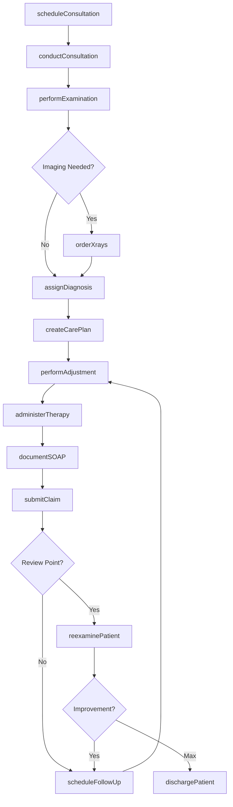
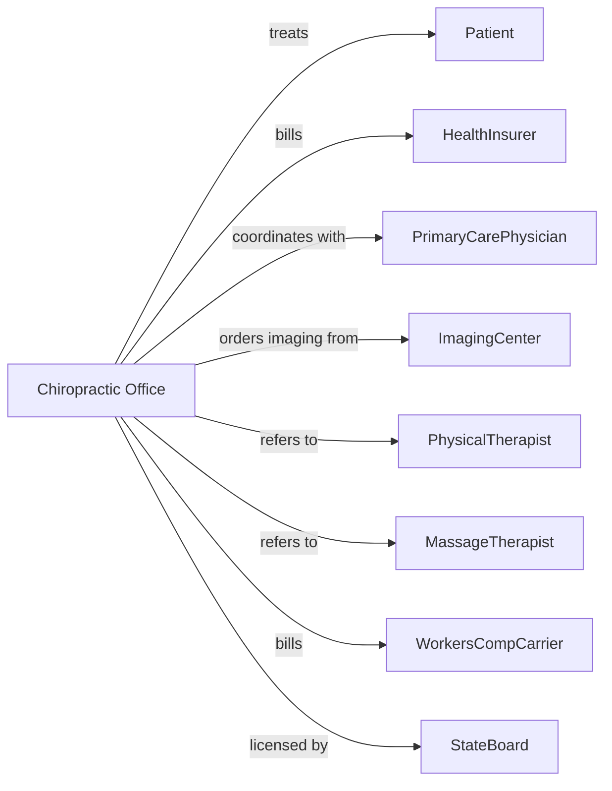

# Offices of Chiropractors

> Business-as-Code definition for chiropractic practice operations. Models the complete patient care lifecycle from initial consultation through wellness maintenance.

## Overview

Chiropractic offices provide neuromusculoskeletal care including spinal adjustments, therapeutic exercises, and soft tissue treatments. This definition exposes actions for patient assessment, treatment delivery, and care plan management, with events for scheduling and insurance coordination.

## Actors

| Actor | Description |
|-------|-------------|
| Patient | Individual seeking chiropractic care for pain or wellness |
| HealthInsurer | Provides coverage and reimburses for chiropractic services |
| PrimaryCarePhysician | Refers patients and coordinates medical care |
| ImagingCenter | Provides X-rays and MRI studies for diagnosis |
| PhysicalTherapist | Provides complementary rehabilitation services |
| MassageTherapist | Provides soft tissue therapy services |
| WorkersCompCarrier | Covers work-related injuries |
| AttorneyLienHolder | Represents patients in personal injury cases |
| StateBoard | Licenses chiropractors and regulates practice |

## Roles

| Role | Description |
|------|-------------|
| Chiropractor | Diagnoses conditions and performs spinal adjustments |
| ChiropracticAssistant | Assists with patient care and therapy administration |
| FrontDesk | Manages scheduling and patient check-in |
| Biller | Handles claims submission and payment processing |
| PracticeManager | Oversees operations and compliance |

## Entities

| Entity | Description |
|--------|-------------|
| Patient | Individual receiving chiropractic care |
| Appointment | Scheduled chiropractic visit |
| Consultation | Initial patient evaluation and history |
| Examination | Physical and neurological assessment findings |
| Diagnosis | Identified condition using ICD codes |
| CarePlan | Treatment protocol with visit frequency and goals |
| Adjustment | Spinal manipulation treatment record |
| Xray | Radiographic images for diagnosis |
| SOAP | Visit documentation with subjective and objective findings |
| Claim | Insurance billing submission |
| Referral | Authorization from physician or self-referral |
| Outcome | Measured improvement in condition |

## Actions

| Action | Description |
|--------|-------------|
| scheduleConsultation | Book initial evaluation appointment |
| conductConsultation | Gather patient history and chief complaints |
| performExamination | Conduct physical and neurological assessment |
| orderXrays | Request radiographic imaging for diagnosis |
| assignDiagnosis | Identify condition and assign ICD codes |
| createCarePlan | Develop treatment protocol with frequency and duration |
| performAdjustment | Execute spinal manipulation treatment |
| administerTherapy | Apply heat, ice, electrical stimulation, or ultrasound |
| prescribeExercises | Assign home exercises for rehabilitation |
| documentSOAP | Record visit notes with findings and treatment |
| submitClaim | Send billing claim to insurance payer |
| reexaminePatient | Conduct periodic assessment of progress |
| scheduleFollowUp | Book next treatment appointment |
| dischargePatient | Complete care plan and document outcomes |
| requestReferral | Obtain authorization for continued care |

## Events

| Event | Description |
|-------|-------------|
| consultationScheduled | Initial evaluation has been booked |
| consultationCompleted | Patient history has been gathered |
| examinationCompleted | Physical assessment has been performed |
| xraysCompleted | Radiographic images have been captured |
| diagnosisAssigned | Condition has been identified |
| carePlanCreated | Treatment protocol has been established |
| adjustmentPerformed | Spinal manipulation has been delivered |
| therapyAdministered | Modality treatment has been applied |
| claimSubmitted | Billing claim has been sent |
| reexamCompleted | Progress assessment has been performed |
| maxImprovementReached | Patient has achieved optimal outcome |
| carePlanCompleted | Treatment protocol has been finished |
| paymentReceived | Payment has been collected |

## Searches

| Search | Description |
|--------|-------------|
| findPatients | List patients with filters for condition or status |
| getAppointments | Retrieve scheduled visits by date or provider |
| getActiveCarePlans | Find patients with ongoing treatment protocols |
| getPendingClaims | List claims awaiting payment |
| getDueForReexam | Find patients due for progress assessment |
| getVisitHistory | Retrieve treatment history for patient |
| getOpenSlots | Get available appointment times |
| getOutcomeMetrics | Retrieve improvement statistics |

## Workflow



## Actor Relationships



## Usage

### Calling Actions

```typescript
import { treatSpines } from '@headlessly/treat-spines'

const practice = treatSpines()

// Schedule initial consultation
const consultation = await practice.scheduleConsultation({
  patientId: 'pat-23456',
  providerId: 'dr-johnson',
  dateTime: '2024-03-19T09:00:00',
  duration: 45,
  chiefComplaint: 'Lower back pain radiating to left leg'
})

// Conduct examination and establish diagnosis
await practice.performExamination({
  patientId: 'pat-23456',
  findings: {
    rangeOfMotion: { lumbar: 'restricted', cervical: 'normal' },
    orthopedicTests: { straightLegRaise: 'positive-left' },
    palpation: { subluxation: ['L4', 'L5'] }
  }
})

await practice.assignDiagnosis({
  patientId: 'pat-23456',
  icdCodes: ['M54.5', 'M99.03'],
  description: 'Low back pain with lumbar subluxation'
})

// Create care plan
await practice.createCarePlan({
  patientId: 'pat-23456',
  frequency: '3x/week',
  duration: '4 weeks',
  goals: ['Reduce pain to 3/10', 'Restore lumbar ROM'],
  modalities: ['adjustment', 'electrical-stimulation', 'ice']
})
```

### Event-Driven Automation

```typescript
// Schedule reexam at appropriate interval
practice.carePlanCreated(async ({ patientId, duration }) => {
  const reexamDate = calculateReexamDate(duration)

  await practice.scheduleFollowUp({
    patientId,
    appointmentType: 'reexamination',
    dateTime: reexamDate
  })
})

// Alert for patients reaching visit limits
practice.claimSubmitted(async ({ patientId, visitCount }) => {
  const carePlan = await practice.getActiveCarePlans({ patientId })

  if (visitCount >= carePlan.authorizedVisits - 2) {
    await practice.requestReferral({
      patientId,
      reason: 'Additional visits required',
      documentation: carePlan.progressNotes
    })
  }
})

// Document outcomes at discharge
practice.maxImprovementReached(async ({ patientId }) => {
  await practice.dischargePatient({
    patientId,
    outcome: 'goals-met',
    recommendations: 'Monthly maintenance adjustments'
  })
})
```
