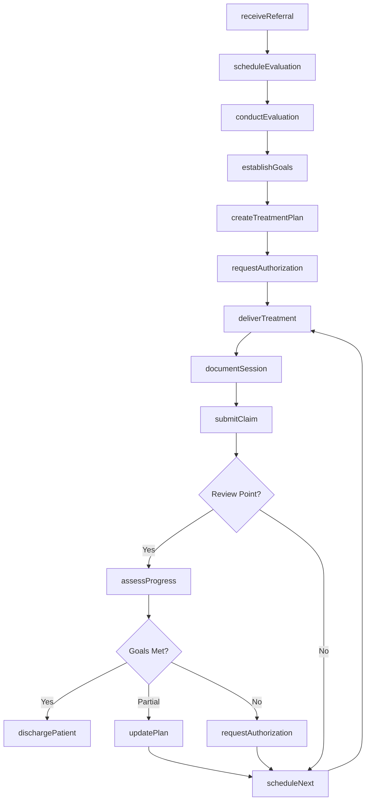
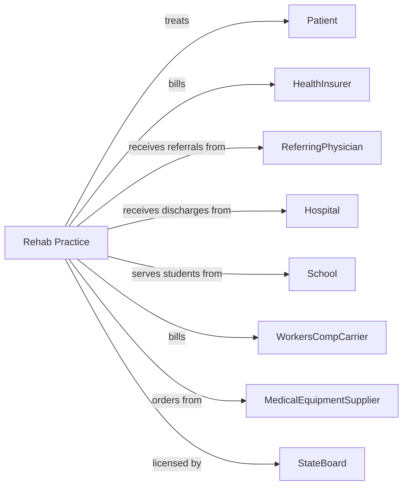

# Offices of Physical, Occupational and Speech Therapists, and Audiologists

> Business-as-Code definition for rehabilitation therapy practice operations. Models the complete rehabilitation lifecycle from evaluation through discharge with functional outcomes.

## Overview

Rehabilitation therapy offices provide physical therapy, occupational therapy, speech-language pathology, and audiology services to restore function and improve quality of life. This definition exposes actions for patient evaluation, treatment delivery, and outcome measurement, with events for care coordination and authorization management.

## Actors

| Actor | Description |
|-------|-------------|
| Patient | Individual seeking rehabilitation services |
| HealthInsurer | Provides coverage and reimburses for therapy services |
| ReferringPhysician | Prescribes therapy and monitors medical progress |
| Hospital | Discharges patients requiring outpatient therapy |
| School | Refers students for speech and developmental services |
| WorkersCompCarrier | Covers work-related injuries |
| MedicalEquipmentSupplier | Provides assistive devices and equipment |
| HearingAidManufacturer | Supplies hearing instruments and accessories |
| StateBoard | Licenses therapists and regulates practice |

## Roles

| Role | Description |
|------|-------------|
| PhysicalTherapist | Evaluates and treats movement disorders |
| OccupationalTherapist | Addresses daily living and functional skills |
| SpeechPathologist | Treats communication and swallowing disorders |
| Audiologist | Evaluates hearing and fits amplification devices |
| TherapyAssistant | Delivers treatment under therapist supervision |
| FrontDesk | Manages scheduling and patient coordination |
| Biller | Handles claims submission and authorizations |

## Entities

| Entity | Description |
|--------|-------------|
| Patient | Individual receiving rehabilitation services |
| Referral | Physician order for therapy evaluation |
| Evaluation | Comprehensive functional assessment |
| Diagnosis | Condition using ICD codes |
| TreatmentPlan | Goals, interventions, and frequency |
| Session | Documented therapy visit |
| FunctionalGoal | Measurable objective with target and timeline |
| ProgressNote | Visit documentation with objective measures |
| Outcome | Measured functional improvement |
| Authorization | Insurer approval for therapy visits |
| HearingTest | Audiological evaluation results |
| Equipment | Assistive device or hearing aid |

## Actions

| Action | Description |
|--------|-------------|
| receiveReferral | Process physician order for therapy |
| scheduleEvaluation | Book initial assessment appointment |
| conductEvaluation | Perform comprehensive functional assessment |
| establishGoals | Set measurable functional objectives |
| createTreatmentPlan | Develop intervention strategy and frequency |
| deliverTreatment | Execute therapeutic interventions |
| documentSession | Record treatment notes and measurements |
| assessProgress | Evaluate advancement toward goals |
| requestAuthorization | Obtain insurer approval for visits |
| conductHearingTest | Perform audiological evaluation |
| fitHearingAid | Program and dispense hearing instrument |
| orderEquipment | Request assistive device or supply |
| updatePlan | Modify treatment approach based on progress |
| submitClaim | Send billing claim to payer |
| dischargePatient | Complete care and document outcomes |

## Events

| Event | Description |
|-------|-------------|
| referralReceived | Physician order has been processed |
| evaluationScheduled | Initial assessment has been booked |
| evaluationCompleted | Functional assessment has been performed |
| goalsEstablished | Measurable objectives have been set |
| treatmentPlanCreated | Intervention strategy has been documented |
| sessionCompleted | Therapy visit has been delivered |
| progressAssessed | Advancement has been evaluated |
| goalAchieved | Functional objective has been met |
| authorizationReceived | Insurer has approved visits |
| authorizationExpiring | Approval is nearing expiration |
| hearingTestCompleted | Audiological evaluation has been performed |
| equipmentOrdered | Assistive device has been requested |
| equipmentDelivered | Device has been provided to patient |
| patientDischarged | Care has been completed |

## Searches

| Search | Description |
|--------|-------------|
| findPatients | List patients with filters for diagnosis or therapist |
| getAppointments | Retrieve scheduled sessions by date or provider |
| getPendingEvaluations | Find referrals awaiting initial assessment |
| getActiveCases | List patients with ongoing treatment |
| getExpiringAuthorizations | Find authorizations nearing expiration |
| getGoalProgress | Retrieve outcome data for patient |
| getPendingClaims | List claims awaiting payment |
| getEquipmentOrders | Find pending device orders |

## Workflow



## Actor Relationships



## Usage

### Calling Actions

```typescript
import { treatRehabilitation } from '@headlessly/treat-rehabilitation'

const practice = treatRehabilitation()

// Process referral and schedule evaluation
await practice.receiveReferral({
  patientId: 'pat-56789',
  referringPhysician: 'dr-chen',
  diagnosis: 'M54.5',
  therapyType: 'physical-therapy',
  frequency: '2-3x/week for 6 weeks'
})

const evaluation = await practice.scheduleEvaluation({
  patientId: 'pat-56789',
  therapistId: 'pt-anderson',
  dateTime: '2024-03-25T10:00:00',
  duration: 60
})

// Conduct evaluation and establish plan
await practice.conductEvaluation({
  patientId: 'pat-56789',
  findings: {
    rangeOfMotion: { lumbarFlexion: 40, extension: 10 },
    strength: { coreStability: '3/5' },
    functionalLimitations: ['Unable to sit > 30 min', 'Difficulty bending']
  },
  painLevel: 7
})

await practice.establishGoals({
  patientId: 'pat-56789',
  goals: [
    { objective: 'Increase lumbar flexion to 60 degrees', timeline: '4 weeks' },
    { objective: 'Sit tolerance 2 hours', timeline: '6 weeks' },
    { objective: 'Return to work without restrictions', timeline: '8 weeks' }
  ]
})

// Request authorization
await practice.requestAuthorization({
  patientId: 'pat-56789',
  visitsRequested: 18,
  frequency: '3x/week',
  justification: 'Post-surgical lumbar rehabilitation'
})
```

### Event-Driven Automation

```typescript
// Alert for expiring authorizations
practice.authorizationExpiring(async ({ patientId, visitsRemaining }) => {
  if (visitsRemaining <= 3) {
    const progress = await practice.getGoalProgress({ patientId })

    await practice.requestAuthorization({
      patientId,
      visitsRequested: 12,
      documentation: progress.summary
    })
  }
})

// Schedule follow-up after goal achievement
practice.goalAchieved(async ({ patientId, goal }) => {
  const remaining = await practice.getActiveCases({ patientId })

  if (remaining.goals.length === 0) {
    await practice.dischargePatient({
      patientId,
      outcome: 'all-goals-met',
      recommendations: 'Home exercise program'
    })
  }
})

// Auto-submit claims after session documentation
practice.sessionCompleted(async ({ patientId, sessionId, procedures }) => {
  await practice.submitClaim({
    patientId,
    sessionId,
    procedures,
    units: calculateUnits(procedures)
  })
})
```
